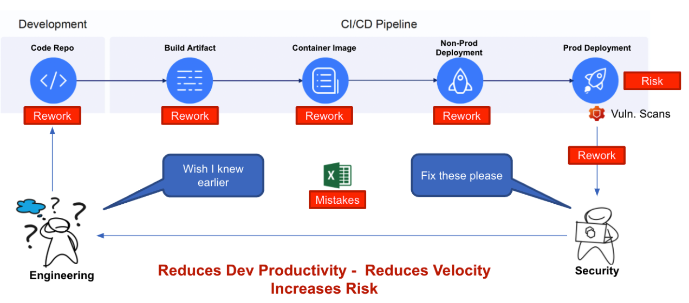
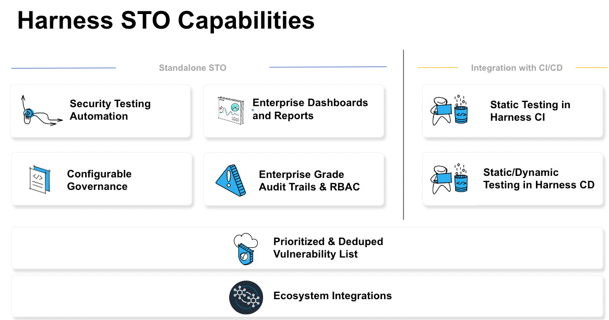
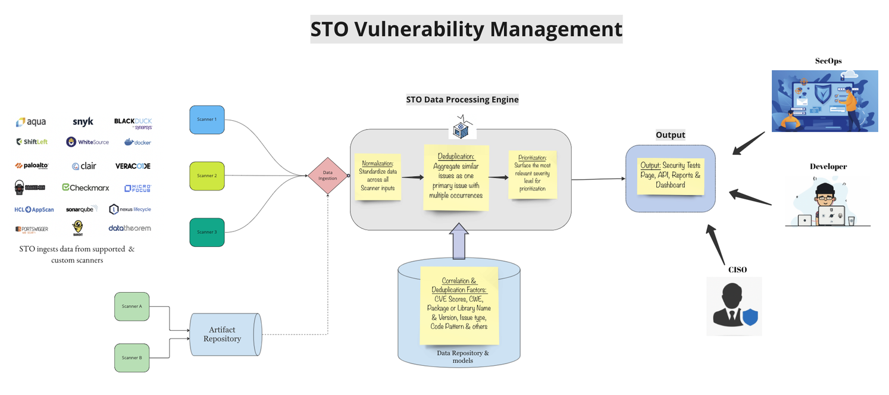

This article addresses some frequently asked questions about Security Testing Orchestration (STO).

In this topic:

<!-- TOC start -->
- [What is a security scanner?](#what-is-a-security-scanner)
- [How many scanners does STO support?](#how-many-scanners-does-sto-support)
- [Do similar category tools show identical issues?](#do-similar-category-tools-show-identical-issues)
- [What is an STO Target?](#what-is-an-sto-target)
- [Can I use STO with custom or unsupported scanners?](#can-i-use-sto-with-custom-or-unsupported-scanners)
- [How does STO identify new issues and display them in the UI?](#how-does-sto-identify-new-issues-and-display-them-in-the-ui)
- [Why do I need to use Docker-in-Docker? Why is root privilege required?](#why-do-i-need-to-use-docker-in-docker-why-is-root-privilege-required)
- [What RBAC roles does STO support?](#what-rbac-roles-does-sto-support)
- [How do I set up a  CheckMarx scan step in YAML?](#how-do-i-set-up-a--checkmarx-scan-step-in-yaml)
- [What is the purpose of the “Security Review” tab in STO?](#what-is-the-purpose-of-the-security-review-tab-in-sto)
- [What open-source scanner integrations does STO support?](#what-open-source-scanner-integrations-does-sto-support)
- [What is the difference between an STO pipeline, a CD pipeline, and a CI pipeline?](#what-is-the-difference-between-an-sto-pipeline-a-cd-pipeline-and-a-ci-pipeline)
- [Does STO require Harness CI or Harness CD?](#does-sto-require-harness-ci-or-harness-cd)
- [What infrastructure does STO support for running scans?](#what-infrastructure-does-sto-support-for-running-scans)
- [How does STO deduplicate detected issues?](#how-does-sto-deduplicate-detected-issues)
- [I don't have any scanner licenses and I'm just getting started with security scanning. Where do I begin?](#i-dont-have-any-scanner-licenses-and-im-just-getting-started-with-security-scanning-where-do-i-begin)
- [Why don't I see results from specific scans in the Security Testing Dashboard?](#why-dont-i-see-results-from-specific-scans-in-the-security-testing-dashboard)
- [How does STO ensure High Availability and data protection for my scan data and vulnerability information?](#how-does-sto-ensure-high-availability-and-data-protection-for-my-scan-data-and-vulnerability-information)
<!-- TOC end -->

### What is a security scanner?  

A _security scanner_ is a tool that scans a software target and detects security issues and vulnerabilities. Examples of target types include code repos, container images, and websites. Developers, DevOps engineers, SecOps engineers, and others often include scanners at different phases of the software development life cycle. A wide variety of scan tools are available, such as:

* Static Application Security Testing (SAST) tools that scan source code, binaries, or byte code. 
* Dynamic Application Security Testing (DAST) tools that scan running applications.
* Software composition analysis (SCA) tools that scan the open source software in used in code repos.
* Container scanning tools that detect issues in running containers. 

The following pictorial highlights a typical SDLC process.

**Proactive security testing**



### How many scanners does STO support?
STO supports many popular scanners. For a list of all supported tools, go to the [Security Step Settings Reference](/docs/security-testing-orchestration/sto-techref-category/security-step-settings-reference.md#scanners-target-types-and-scan-approach). 

### Do similar category tools show identical issues?

In theory, similar scanners should identify similar issues for the same target. In practice, however, different scanners often identify different vulnerabilities for the same target. Even similar scanners can produce results that have no similar issues.  

### What is an STO Target? 

Every instance of a scanner has a specific _target_, which is the object or software/code artifact it is set up to scan. It might be a repo, a container, or an instance and for some scanner categories, an artifact maybe collection of configuration files.  A _baseline target_ refers to a master branch or foundational/baseline software artifact against which developers wants to compare new/incremental code. 

STO supports the following test targets and form factors:
* Repository
* Container
* Instance
* Configuration 

The following table specifies where the target to be tested is located.

<table>
  <tr>
    <th>Target name</th>
    <th>Target type</th>
  </tr>
   <tr>
    <td>azure</td>
    <td>repository</td>
  </tr>
  <tr>
    <td>bitbucket</td>
    <td>repository</td>
  </tr>
  <tr>
    <td>github</td>
    <td>repository</td>
  </tr>
  <tr>
    <td>gitlab</td>
    <td>repository</td>
  </tr>
  <tr>
    <td>local_image</td>
    <td>container</td>
  </tr>
  <tr>
    <td>docker_v2</td>
    <td>container</td>
  </tr>
  <tr>
    <td>jfrog_artifactory</td>
    <td>container</td>
  </tr>
  <tr>
    <td>aws_ecr</td>
    <td>container</td>
  </tr>
  <tr>
    <td>website</td>
    <td>instance</td>
  </tr>
</table>

### Can I use STO with custom or unsupported scanners? 

Yes. STO supports a generic JSON format for ingesting results from custom or unsupported scanners. See [Ingest Scan Results into an STO Pipeline](/docs/security-testing-orchestration/use-sto/orchestrate-and-ingest/ingesting-issues-from-other-scanners.md). 

By ingesting your custom issues, you can benefit from STO's refinement, deduplication, and correlation features. Harness handles your issue data the same way as data from supported scanners.

### How does STO identify new issues and display them in the UI? 

You can define _baseline_ for each target. The baseline is the object that you want to update. For example, your scan target might be a codebase for a specific service that you're looking to update. You specify the main branch as the baseline target. You run scans on the main branch and any number of non-main branches. Each scan has its own set of identified issues. 

STO identifies an issue as "new" like this:

* If you're scanning the baseline, or if the target has no baseline, any issue found in the latest scan but not in a previous scan is considered new.

* If you're scanning a non-basline object, such as a feature branch, any issue found in that object but not in the baseline is considered new.
  
  Suppose you introduce a new library with known vulnerabilities into your feature branch. STO shows those issues as new if the scanner found them in the feature branch only, not in the baseline. When you merge your feature branch into main, any vulnerabilities that get merged in are no longer considered new.   

### Why do I need to use Docker-in-Docker? Why is root privilege required?

When Harness acquired ZeroNorth in 2021, the STO development team used Docker-in-Docker to speed up the integration between the ZeroNorth and Harness platforms. Some scanners explicitly require Docker-in-Docker, which requires Privileged mode. 

On March 14, 2023, Harness introduced a set of new UIs (step palettes) for Aqua Trivy, Bandit, SonarQube, and other popular scanners. These steps do not require Docker-in-Docker *unless* you are scanning a container image. For more information, go to [What's new: Improved UIs and set-up workflows for popular scanners](/docs/security-testing-orchestration/sto-techref-category/security-step-settings-reference#whats-new-improved-uis-and-set-up-workflows-for-popular-scanners).

:::info note 
Harness is currently working to remove this requirement for other scanners that don't need it and to provide other ways to orchestrate scans. 
:::

### What RBAC roles does STO support? 

Harness  supports two RBAC roles specifically for STO users. You can customize these roles as needed in the Harness platform. 

* **Developer** role — Permissions needed for developer workflows. These workflows are described in [Create a standalone STO pipeline](/tutorials/security-tests/standalone-pipeline).

* **SecOps** role — Permissions needed for Security Operations staff. This role includes all Developer permissions and also allows users to approve security exemptions. These workflows are covered in [Create an integrated STO/CI pipeline](/tutorials/security-tests/cicd-integrated-pipeline).

### How do I set up a  CheckMarx scan step in YAML?

Here's an example. See also the [Checkmarx scanner reference](/docs/security-testing-orchestration/sto-techref-category/checkmarx-scanner-reference).

```yaml
- step:
  type: Security
  name: Checkmarx Scan
  identifier: Checkmarx_Scan
  spec:
    privileged: true
    settings:
      policy_type: orchestratedScan
      scan_type: repository
      product_name: checkmarx
      product_config_name: default
      product_team_name: /its/in/this/format
      product_domain: https://codescan.example.com
      product_access_id: <+secrets.getValue("account.checkmarx_access_id")>
      product_access_token: <+secrets.getValue("account.checkmarx_access_password")>
      product_project_name: <redacted>
      repository_branch: <+codebase.branch>
      fail_on_severity: HIGH 
    failureStrategies: []
```

### What is the purpose of the “Security Review” tab in STO? 
The page (or tab) exists to grant and manage security exemptions. For more information, go to [Exemptions (Ignore Rules) for Specific Issues](/docs/security-testing-orchestration/use-sto/stop-builds-based-on-scan-results/exemption-workflows). 

### What open-source scanner integrations does STO support? 

For detailed information about supported scanners, both open-source and commercial, go to [Harness STO scanner support](/docs/security-testing-orchestration/sto-techref-category/security-step-settings-reference#harness-sto-scanner-support).

### What is the difference between an STO pipeline, a CD pipeline, and a CI pipeline?

In Harness NextGen, there are no hard distinctions between CI, CD, and STO pipelines. You can create integrated pipelines that implement any mix of CI, CD, and STO use cases. Harness platform components are generic to all three modules: you can use and reuse delegates, connectors, secrets, and other components across across multiple stages and pipelines. 

You can easily include scans in CI workflows. To run a scan, you add a standalone Security stage or a Security step to a CI Build stage. The pipeline uses the same platform components to build code and run scans. 

For CD workflows, Harness recommends that you add a standalone Security stage (for static scans) before the deployment and another stage (for dynamic scans) after the deployment. 

### Does STO require Harness CI or Harness CD?

No, you can run STO as a standalone product. STO supports integrations with with external tools using standard triggers and webhooks. Thus you can use STO to add security scans to your CI and CD workflows if you're using an external tool such as GitHub. 



### What infrastructure does STO support for running scans?

STO supports running scans using Kubernetes clusters and Docker delegates on VMs. When STO is used as a Security step in a CI Build stage, the stage runs scans and builds using the same infrastructure. See [Set Up Build Infrastructure](/docs/category/set-up-build-infrastructure) in the CI docs.

### How does STO deduplicate detected issues? 

The following diagram illustrates the three stages in the STO deduplication pipeline:

1) **Normalization:** The pipeline normalizes the "raw" scan results using STO-defined parameters and attributes that are common across supported scanners. 

2) **Deduplication:** The pipeline deduplicates based on CVE, CWE, package name, and other reference identifiers found in the scan results.

3) **Prioritization:** For each issue, the pipeline calculates a Severity score  based on the [NIST Common Vulnerability Scoring System (CVSS) version 3.0](https://nvd.nist.gov/vuln-metrics/cvss).



### I don't have any scanner licenses and I'm just getting started with security scanning. Where do I begin? 

STO maintains its own set of container images pre-installed with open-source scanners such as Bandit, OWASP, Zap, Prowler, and Aqua Trivy. This makes it easy to get started running scans and generating results. The STO UI uses one format to report all detected issues and includes in-depth information about each detected issue: location, severity, and links to in-depth information, and so on. 

To get started, go to [Get started with STO](/docs/category/get-started-with-sto). 
        
### Why don't I see results from specific scans in the Security Testing Dashboard? 

The most likely reason is that the scanned target does not have a baseline defined. The [Security Testing Dashboard](/docs/security-testing-orchestration/use-sto/view-and-troubleshoot-vulnerabilities/security-testing-dashboard.md) is intended to show vulnerabilities that potentially affect production-ready artifacts. For this reason, the dashboard shows detected vulnerabilities for targets that have baselines defined. 

### How does STO ensure High Availability and data protection for my scan data and vulnerability information?

Harness and STO adopt the highest standards towards [data privacy](https://www.harness.io/legal/privacy) and [data security](https://www.harness.io/security). To see the general operational status of Harness production environments, go to [Harness Status](https://status.harness.io). 

All of our Cloud SQL Prod databases (including STO) have both an HA and DR instance, as well as point-in-time recovery to any moment in the previous seven days. The HA instance is in a different Google Cloud Platform zone in the same region, and the DR instance is in a different region. Backups are retained for seven days.

Harness Engineering has a roadmap plan to support a similar infrastructure for Self-Managed Enterprise Edition.
