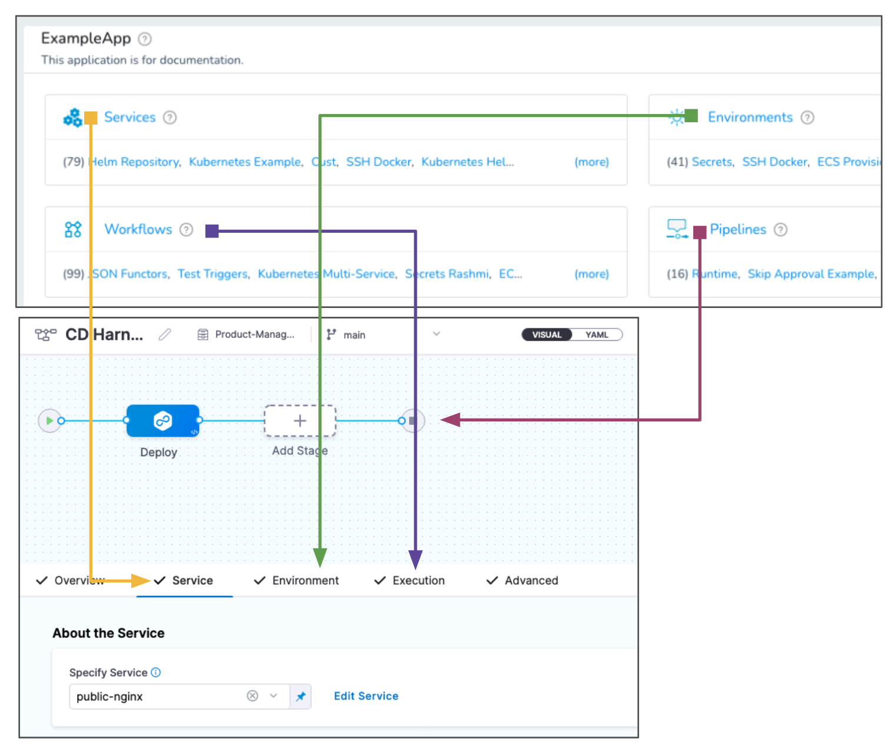

Harness has two versions of its product suite.

**Harness NextGen** is Harness' new version with a redesigned experience and new Continuous Integration, Feature Flags, Security Testing Orchestration, Service Reliability Management, Cloud Cost Management, and Chaos Engineering modules.

 If possible, sign up with Harness NextGen. Eventually, all Harness FirstGen accounts will migrate to Harness NextGen.
 
 **Harness FirstGen** is the Harness version that's been around for years, covering all of the common platforms.

Documentation for FirstGen features is located under the [FirstGen Docs](/docs/first-gen) section of docs.harness.io. The documentation in all other sections applies only to NextGen features. Review the following supported platforms and technologies topics to see which version to use today:

* [FirstGen Supported Platforms and Technologies](../first-gen/starthere-firstgen/supported-platforms.md)
* [NextGen Supported Platforms and Technologies](supported-platforms-and-technologies.md#continuous-delivery-cd)

### Mapping FirstGen to NextGen entities

Here's a diagram that shows how FirstGen entities like Services, Environments, Workflows, and Pipelines are represented in NextGen:

The following table maps the entities based on how you use them for deployment:

|  | FirstGen | NextGen |
| --- | --- | --- |
| **What I'm deploying.** | Service | Service |
| **Where I'm deploying it.** | Environment | Environment |
| **How I'm deploying it.** | Workflow | Execution |
| **My release process.** | Pipelines | Pipelines |
