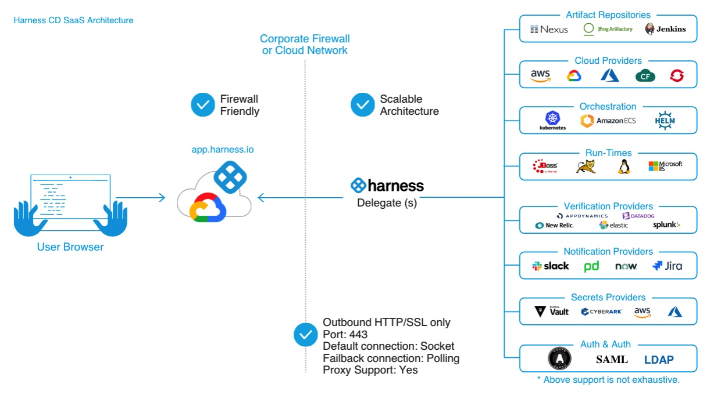

The Harness Platform is a self-service CI/CD platform that enables end-to-end software delivery. The Platform includes the following modules to help you build, test, deploy, and verify software:

* Continuous Delivery
* Continuous Integration
* Feature Flags
* Cloud Cost Management
* Service Reliability Management
* Security Testing Orchestration
* Chaos Engineering

Watch the following video to learn about some of the Harness modules:

#### Harness Platform components

The Harness Platform has two components:

* **Harness Manager:** Harness Manager is where your CI/CD and other configurations are stored and your pipelines are managed. Your pipelines can be managed purely through Git as well.  
Pipelines are triggered manually in the Harness Manager or automatically in response to Git events, schedules, new artifacts, and so on.  
Harness Manager is available either as SaaS (running in the Harness cloud) or as self-managed (running in your infrastructure).
* **Harness Delegate:** The Harness Delegate is a software service you install in your environment. It connects to the Harness Manager and performs tasks using your container orchestration platforms, artifact repositories, monitoring systems, etc. The Delegate is key to enabling Harness to perform CI/CD tasks, but you don't need to install it right away. You can install the Delegate as part of the flow when setting up your Pipelines or Connectors. For more information, go to [Delegates Overview](https://docs.harness.io/article/2k7lnc7lvl-delegates-overview).

### Harness editions

Harness is available in the following editions to meet different users' needs:

* **Enterprise:** This is our enterprise version, licensed by annual subscription based on your usage needs. It supports flexible scaling, custom integrations, and extended data analysis. It includes 24/7 support.
* **Team****:** Designed for growing teams, this version provides most Harness Enterprise features at lower per-usage pricing. It limits or excludes some integrations and enterprise security features, and limits real-time support to standard business hours.
* **Free**: This is a free-forever edition with almost all Harness Enterprise features (excluding unlimited Services and license-based service Instances scaling).
* **Community**: This version is a free-forever, open, on-premises edition. It does not have RBAC, audit trails, governance, or advanced security. See [Harness CD Community Edition Overview](https://docs.harness.io/article/yhyyq0v0y4-harness-community-edition-overview).  
If you move from the full-featured Enterprise trial to the free Community Edition, you might need to remove or adjust any premium features you've configured. For these migrations, please [contact Harness](https://harness.io/company/contact-sales).Support for Harness Community is available through the [Harness Community Forum](https://community.harness.io/).

For a detailed comparison of the Harness editions, see the [Harness Pricing](https://harness.io/pricing/?module=cd) page.

