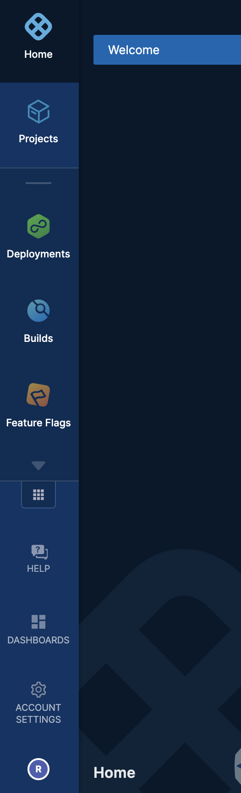
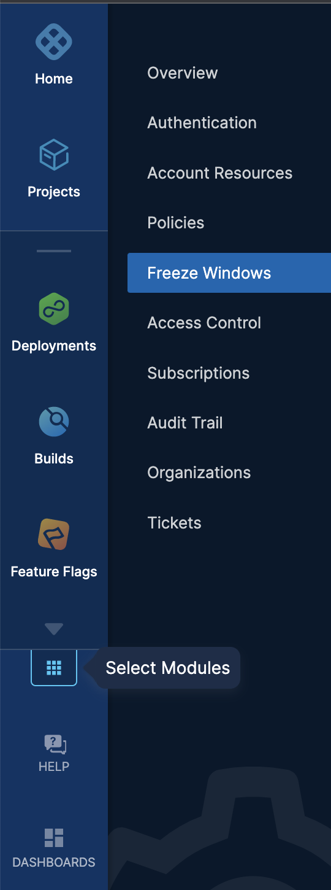
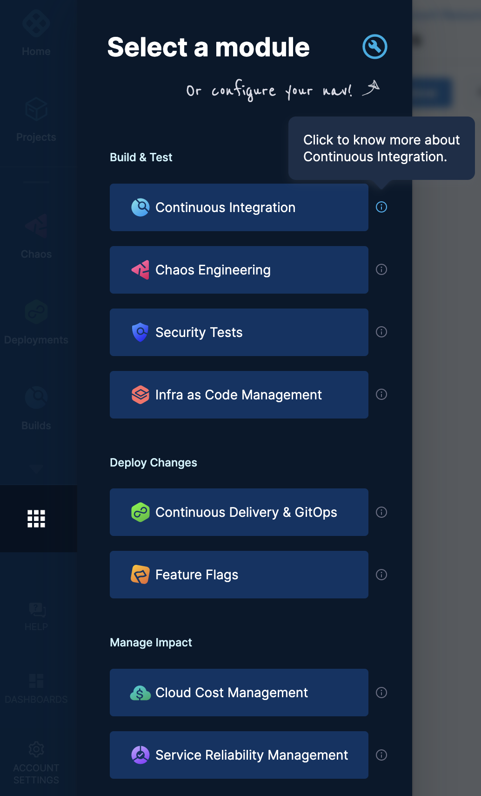
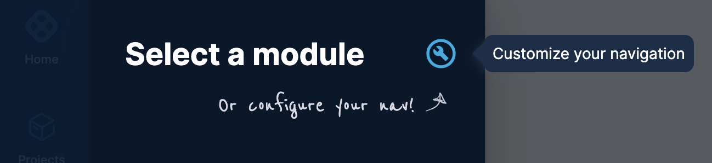
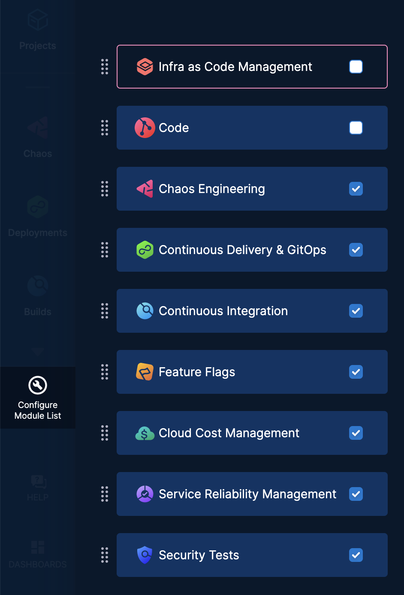
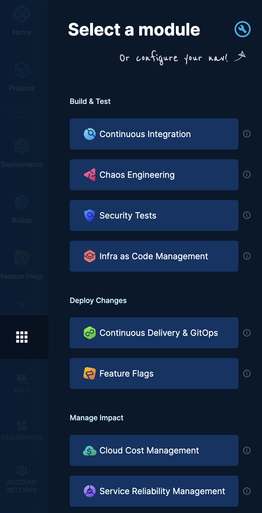

Harness is a comprehensive CI/CD platform that streamlines software delivery for modern enterprises. It provides a powerful and user-friendly interface for managing software releases, deployments, and rollbacks.

You can interact with the Harness platform through the Harness UI. It is designed to be intuitive and easy to use, while also providing robust features and capabilities for managing software releases.

The Harness UI is organized into several key areas. This topic explains how you can: 
- View your account and profile information.
- View subscription details.
- Navigate and select modules.

## Projects

A Harness project is a group of Harness modules, their pipelines, and resources. For example, a project might have a Harness CI pipeline to build code and push an image and a Harness CD pipeline to deploy that image to a cloud platform.

For more information, see [Create Organizations and Projects](https://developer.harness.io/docs/platform/organizations-and-projects/create-an-organization).

## Deployments

The **Deployments** module in Harness is designed to provide visibility and control over the deployment process, making it easier to manage and troubleshoot deployments across multiple projects and environments. You can create your CD pipelines in this module and view the status of all deployments across all projects, filter and sort the deployments based on various criteria, and drill down into the details of individual deployments.

For more information, see [Continuous Delivery & GitOps](https://developer.harness.io/docs/continuous-delivery).

## Builds

The **Builds** module in Harness is a component of the platform that provides a centralized view of all the builds that have been executed or are currently in progress. It allows you to manage and monitor your build activity across all your projects and environments.

For more information, see [Continuous Integration](https://developer.harness.io/docs/continuous-integration).

## Feature Flags

Feature flags are a key component of Harness that allows you to control the availability and behavior of specific features in your application. With feature flags, you can release new features to specific groups of users, test features before making them available to all users, and gradually roll out features to ensure a smooth transition.

For more information, see [Feature Flags](https://developer.harness.io/docs/feature-flags)

## Module selection

Harness also has the following modules: 

- Chaos Engineering
- Security Tests
- Cloud Cost Management
- Service Reliability Management

To navigate to your desired module, perform the following steps: 
1. In the left navigation, click **Select Modules**.
   
   

   The modules appear in the following categories: 
   - Build & Test
     - Continuous Integration
     - Chaos Engineering
     - Security Tests
     - Infra as Code Management
   - Deploy Changes
     - Continuous Delivery & GitOps
     - Feature Flags
   - Manage Impact
     - Cloud Cost Management
     - Service Reliability Management
  
    You can find more information about each module by selecting the info icon beside it.
    
    

2. To configure your left navigation, select **Customize your navigation**.

   

3. To reorder the modules, drag each module to its desired position. 
   
   

4. Select the modules you want to see in the left navigation. Harness automatically saves your selection, and you can see the selected modules in your left navigation.
   
   

## Account Settings

### Overview 

Account Overview has your Harness Account Details.

To view your Harness account details, go to **Account Settings** and click **Overview**.

Your account overview details are shown.

### Authentication

This section provides options for you to set up Authentication for users, enforce Password policies and restrict email domain.

For more information, refer to [Authentication Overview](../platform/3_Authentication/1-authentication-overview.md).

### Account Resources

Account Resources are shared and available for use within any organization or Project within your account.​

For better isolation of resources, it is recommended that you create resources at the organization or project scope respectively.​

### Policies

You can centrally define and store policies and then select where (which entities) and when (which events) they will be applied across the Harness Platform.

For more information, see [Harness Policy as Code](https://developer.harness.io/docs/category/policy-as-code)

### Access Control

Harness Role-Based Access Control (RBAC) helps you manage who has access to your Harness resources, what they can do with those resources, and in what scope they have access.​

For more information, see [Role-based Access Control](https://developer.harness.io/docs/category/role-based-access-control)

### Subscriptions

Harness provides the following plans:

- Free
- Team
- Enterprise

You can activate a Yearly or Monthly subscription to Harness after choosing your modules and plan.

Your subscription and plan details are displayed in Subscriptions.

### Audit Trail

With Audit Trail in Harness, you can view and track changes to your Harness resources within your Harness account.​

The audit data retention period is 2 years. Harness reserves the right to delete audit data after 2 years. You can request a longer retention period by contacting Harness.​

For more information, refer to [Audit Trail](https://developer.harness.io/docs/category/audit-trail).

### Organizations

Harness Organizations (Orgs) allow you to group projects that share the same goal.​

For more information, refer to [Projects and Organizations](https://developer.harness.io/docs/platform/organizations-and-projects/projects-and-organizations).

## My Profile

To view your profile information go to MY PROFILE.

The following profile information is displayed:

- Basic Information
- Your Projects
- Your Source Code Managers
- Your API keys
- You can also do the following from the profile page:
- Enable/disable Two-Factor Authentication​
- Change Password
- ​Switch Account​
- Add a new API key and Token.

