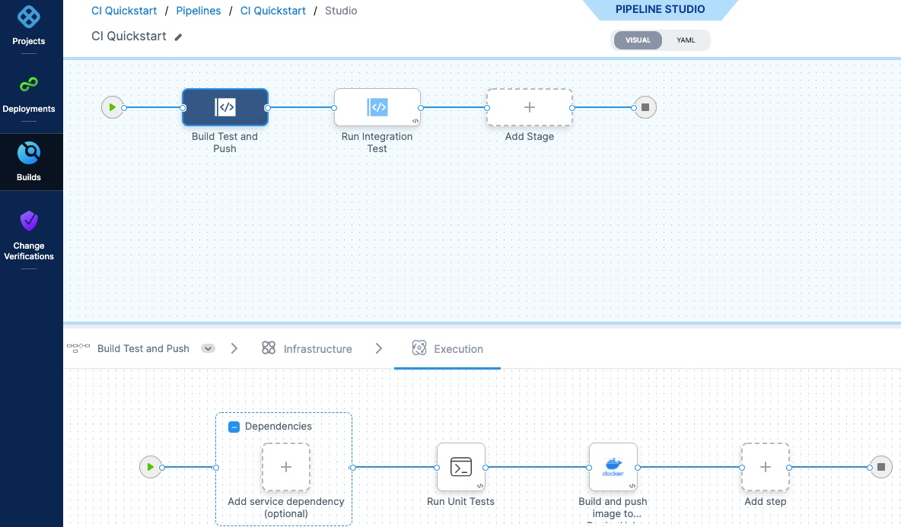
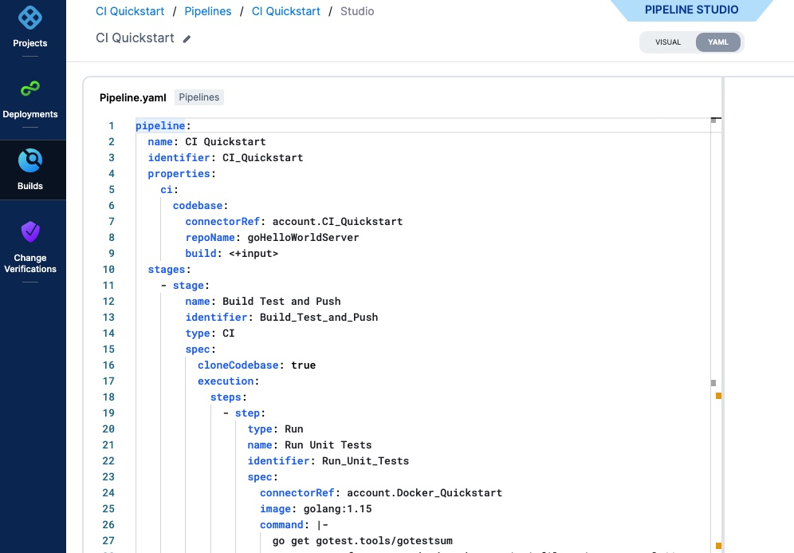

Before you begin using Harness modules, you should be familiar with the key concepts.

### Account

A Harness account is the top-level entity under which everything is organized.

Within an account you have organizations, and within organizations you have projects. You can add resources at the account level, and also at the organization and project levels.

All organizations and projects in the account can use the account's resources.

All projects in the organization can use the org's resources.

**Why is this great?** Each team can manage its resources within its project and not have to bother account admins every time they want to add a Connector or a secret. Projects make teams independent. This is part of Harness' democratization goals for developers.

### Organizations and projects

Harness Organizations (Orgs) allow you to group projects that share the same goal. For example, all projects for a business unit or division.

Within each org you can add several Harness Projects.

A Harness Project contains Harness pipelines, users, and resources that share the same goal. For example, a project could represent a business unit, division, or simply a development project for an app.

Think of projects as a common space for managing teams working on similar technologies. A space where the team can work independently and not need to bother account admins or even org admins when new entities like connectors, delegates, or secrets are needed.

Much like account-level roles, project members can be assigned Project Admin, Member, and Viewer roles.

Project users have at least view access to all configuration and runtime data of a project and share the same assets (environments, services, infrastructure, etc).

See [Projects and Organizations](../platform/organizations-and-projects/projects-and-organizations.md).

### Product modules

Your project can add Harness products as modules, such as Continuous Integration or Continuous Delivery.

### Pipelines

Typically, a pipeline is an end-to-end process that delivers a new version of your software. But a pipeline can be much more: a pipeline can be a cyclical process that includes integration, delivery, operations, testing, deployment, real-time changes, and monitoring.

For example, a pipeline can use the CI module to build, test, and push code, and then a CD module to deploy the artifact to your production infrastructure.

### Pipeline Studio

You build pipelines in Pipeline Studio.

You can create pipelines visually or using code, and switch back and forth as needed.

|  |  |
| --- | --- |
| **Visual** | **YAML** |
|  |  |

See [Harness YAML Quickstart](../platform/8_Pipelines/harness-yaml-quickstart.md).

Pipeline Studio guides you in setting up and running your pipelines with ready-to-use steps.

### Stages

A stage is a subset of a pipeline that contains the logic to perform one major segment of the pipeline process. Stages are based on the different milestones of your pipeline, such as building, approving, and delivering.

Some stages, like a deploy stage, use strategies that automatically add the necessary steps.

See [Add a Stage](../platform/8_Pipelines/add-a-stage.md).

### Steps and step groups

A step is an individual operation in a stage.

Steps can be run in sequential and parallel order.

A step group is a collection of steps that share the same logic such as the same rollback strategy.

See [Run Steps in a Step Group](/docs/continuous-delivery/x-platform-cd-features/cd-steps/step-groups/).

### Services

A service represents your microservices and other workloads logically.

A service is a logical entity to be deployed, monitored, or changed independently.

#### Service instance

Service instances represent the dynamic instantiation of a service you deploy via Harness.

For example, for a service representing a Docker image, service instances are the number of pods running with the Docker image.

#### Service definitions

When a service is added to the stage in a pipeline, you define its service definition. Service definitions represent the real artifacts, manifests, and variables of a service. They are the actual files and variable values.

You can also propagate and override a service in subsequent stages by selecting its name in that stage's service settings.

See [Monitor Deployments and Services in CD Dashboards](../continuous-delivery/monitor-deployments/monitor-cd-deployments.md).

### Environments

Environments represent your deployment targets logically (QA, Prod, etc). You can add the same environment to as many stages as you need.

#### Infrastructure definition

Infrastructure definitions represent an environment's infrastructure physically. They are the actual clusters, hosts, etc.

### Connectors

Connectors contain the information necessary to integrate and work with 3rd party tools.

Harness uses connectors at pipeline runtime to authenticate and perform operations with a third-party tool.

For example, a GitHub connector authenticates with a GitHub account and repo and fetches files as part of a build or deploy stage in a pipeline.

See [Connectors How-tos](/docs/category/connectors).

### Secrets management

Harness includes built-in secrets management to store your encrypted secrets, such as access keys, and use them in your Harness account. Harness integrates with all popular secrets managers.

See [Harness Secrets Management Overview](/docs/platform/Secrets/Secrets-Management/harness-secret-manager-overview).

### YAML and Git

You can sync your Harness account, orgs, and projects with your Git repo to manage Harness entirely from Git.

Harness can respond to Git events to trigger pipelines and pass in event data.

See [Harness Git Experience Overview](/docs/platform/git-experience/git-experience-overview/).

### Recap

What you've seen is how Harness integrates with your resources and tools, and how you can build pipelines.

Harness helps you to model any kind of software development and delivery process in minutes.

It allows for flexibility while making best practices easy to follow and poor practices difficult to implement.

Most importantly, it takes away the pain points of software development, delivery, verification, etc, and gives you confidence in their management and success.

**What's next?** [Sign up for Harness](https://app.harness.io/auth/#/signup/) and then try a [quickstart](quickstarts.md).

