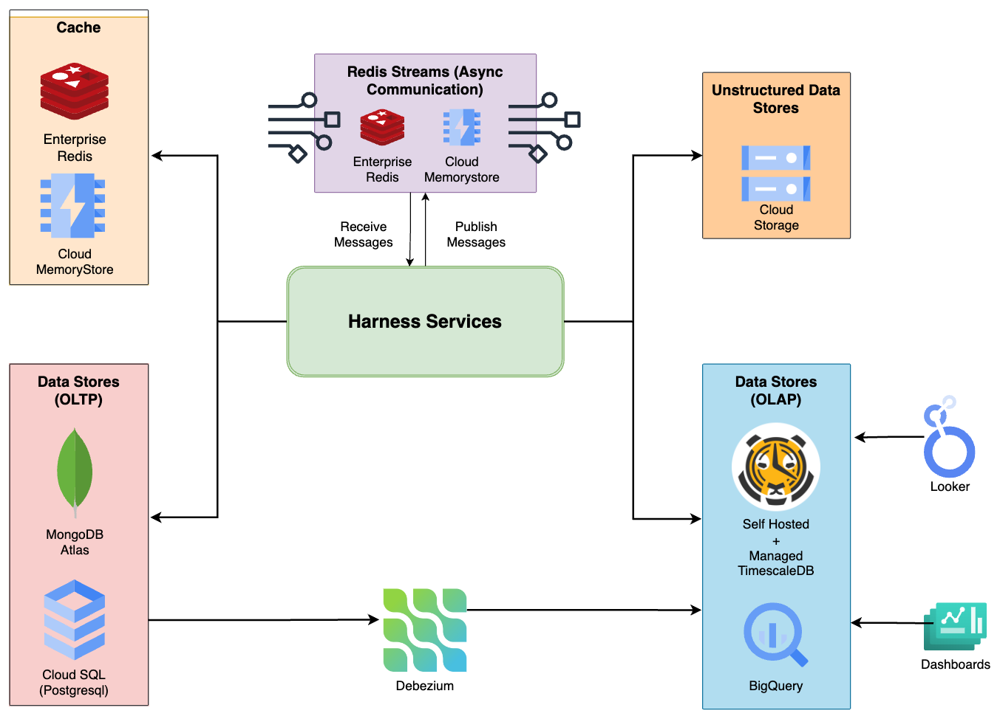

AutoStopping for AWS EC2: High-Level Overview
In this diagram, we delve into the dynamic interaction between CCM services and the customer's infrastructure, showcasing the intricate orchestration of AutoStopping for AWS VMs. The onboarding process is marked by Harness taking a pivotal role in managing the existing Application Load Balancer (ALB) within the customer environment. In cases where no ALB is present, Harness initiates the creation of a new one. Simultaneously, a freshly instantiated Proxy Manager comes into play, diligently tracking traffic directed towards the target resources.
Components and Flow:
CCM Services:
A suite of CCM services collaborates seamlessly, orchestrating the AutoStopping mechanism tailored for AWS EC2. These services serve as the backbone, driving automation and intelligence.
Customer Infrastructure:
The customer's infrastructure houses AWS EC2, subject to AutoStopping rules defined by CCM.
ALB Management by Harness:
Harness takes charge of managing the existing ALB within the customer environment during the onboarding process.
If no ALB is found, Harness proactively creates a new one, establishing a crucial element for directing and managing traffic.
Proxy Manager Creation:
A newly created Proxy Manager becomes an essential component, actively tracking traffic directed towards AWS EC2.
The Proxy Manager's role is central to detecting and analyzing traffic patterns for effective AutoStopping actions.

