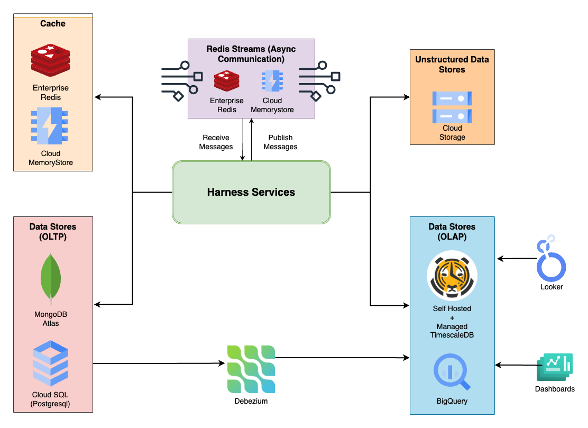

This diagram shows how Harness services use different data stores to manage data effectively.

MongoDB Atlas and Cloud SQL handle the day-to-day transactional and operational data, while TimescaleDB and BigQuery are used for analytical data and dashboards. Debezium keeps the data between systems in sync. Enterprise Redis and Cloud MemoryStore are used as caches to improve performance and scalability. Cloud Storage is used for storing unstructured data like static assets, delegate/watcher binaries etc. Redis Streams is used as a pub/sub and for async communication between microservices.

