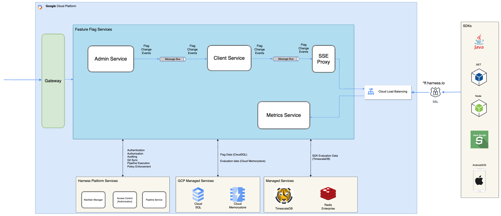
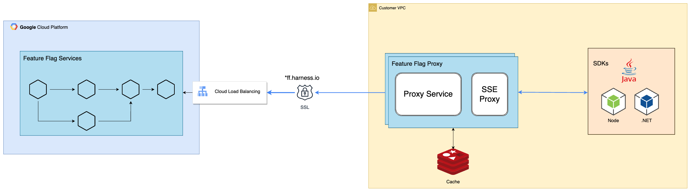

This diagram describes the logical architecture of the Feature Flags system within a production cluster. Comprising three microservices, the Feature Flags architecture is orchestrated as follows:

1. **Admin Service**:
Functionality: The Admin Service is responsible for creation, modification, and management of feature flags.
Workflow: Change events initiated within the Admin Service are transmitted to the Client Service for subsequent processing.

2. **Client Service**:
Functionality: The Client Service serves flag data and conducts evaluations for Software Development Kits (SDKs).
Workflow: Upon any changes to flags, the Client Service receives an event and proceeds to dispatch it to connected SDKs through the SSE Proxy notification service.

3. **Metrics Service**:
Functionality: The Metrics Service manages, stores and queries SDK evaluation counts.
Workflow: SDKs sends the number of times they have evaluated a flag in the last 60 mins to Metrics Service. Metrics service then stores this information as a time series for aggregation and tracking.

4. **SSE Proxy Service**:
Functionality: SSE Proxy manages long lived connections from SDKs, providing updates to SDKs when a flag changes.
Workflow: Upon flag changes, the Client Service will send the event details to SSE Proxy.  SSE Proxy will forward this event to every connected SDK over SSE.

**Platform Features**:
Feature Flags is developed upon the Harness platform, and integrates with its Authentication, Authorization, Pipeline, and GitSync capabilities. 

Administrative access to flag management is established through the Harness gateway, employing SSL connections to *.harness.io, ensuring secure and authorized access.

**SDK Traffic**:
SDKs play a pivotal role in fetching and assessing flags. The dedicated Google Cloud Platform Load Balancer (GCP LB) is configured to receive SDK traffic at *.ff.harness.io. The SSE Proxy service manages stream events for SDKs. Any time a flag is changed an event will be pushed down the stream to notify the SDKs that there has been an update.  Requests to fetch flag values are all routed to the client service, which will process the request and return the flag data.

**Managed Services**:
Feature Flags leverages managed services for scalable data storage and messaging solutions for its microservices.
1. Flag data is stored in Google Cloud Platform's Cloud SQL.
2. Cloud Memorystore is used for events and caching operations..
3. Timescale is used for the storage of historical evaluation data.

The Feature Flag proxy offers customers a greater degree of control and resilience. In this model one or more proxies are connected to the Harness SaaS Platform. The proxy fetches the initial flag data and will receive flag change events throughout its lifetime.

Customer's SDKs establish direct connection to the proxy for fetching flag rules, or evaluation results rather than going to the Harness SaaS Platform. In the event of an external network failure, the proxy continues to function using cached data, minimizing downtime.

**Scalability & Redundancy**
Multiple copies of the proxy can be deployed in read only mode to provide redundancy. The read only proxies are stateless, relying on Redis to store and persist the latest flag data. 

The proxies can be scaled for reads based on the number of SDKs that are connected and volume of flag values being served.

