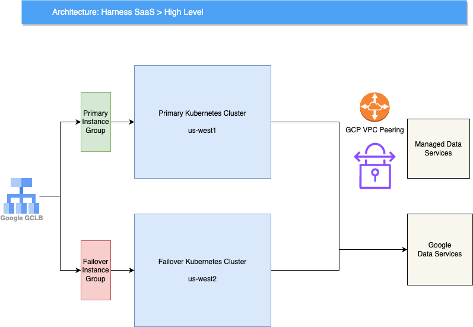

This diagram provides a very high level overview of the Harness SaaS infrastructure, which is deployed across two regions - **us-west1** and **us-west2** for fault tolerance. The core infrastructure consists of two Kubernetes clusters: one primary cluster and one failover cluster. The failover cluster runs all Harness services but with zero pods, ensuring that applications can be quickly recovered in case of a regional outage. In the case of a regional outage in GCP in us-west1 or one of its zones, pods running in failover cluster in us-west2 are scaled up, and the traffic can be flipped over to us-west2 in around 20–25 minutes. 

Both clusters connect to GCP managed data services for persistent storage and other data services. Additionally, they connect to a few non-GCP managed data services, such as MongoDB Atlas and Managed Timescale DB, which are VPC-peered with the GCP project to minimize network latency and enhanced security.

This diagram provides a detailed view of the primary cluster of the Harness SaaS platform. Clients, including automation tools, users, and Harness agents, make secure (SSL) requests to *.harness.io. Cloud DNS resolves this hostname to the GCLB IP address, which then routes the request to the appropriate backend: Cloud CDN (backed by Cloud Storage) for static content, delegate jars etc or the primary Kubernetes cluster in the **us-west1** region for dynamic content.
	
Cloud Armor provides an additional layer of security by protecting against DDoS attacks and enforcing Web Application Firewall (WAF) rules. SSL termination also occurs at the GCLB.

The primary Kubernetes cluster is divided into 3 logical clusters (**Prod1**, **Prod2**, and **Prod3**). Harness customer accounts are distributed across these 3 logical clusters to achieve scalability, reduce the blast radius of releases, and adhere to compliance requirements. Each logical cluster has its own set of Harness services and data stores. Releases typically follow a staged approach, starting with Prod1, then Prod2 after a day, and finally Prod3 after a week.
	
Harness employs a microservices architecture, and requests are directed to the appropriate microservices through the NGINX Ingress Controller. Prod3 utilizes a dedicated ingress controller, while Prod1 and Prod2 share a common ingress controller separate from Prod3's. The Gateway Service determines whether to route the request to Prod1 or Prod2 based on the account identifier in the request. Prod3 also has its own Gateway Service.
