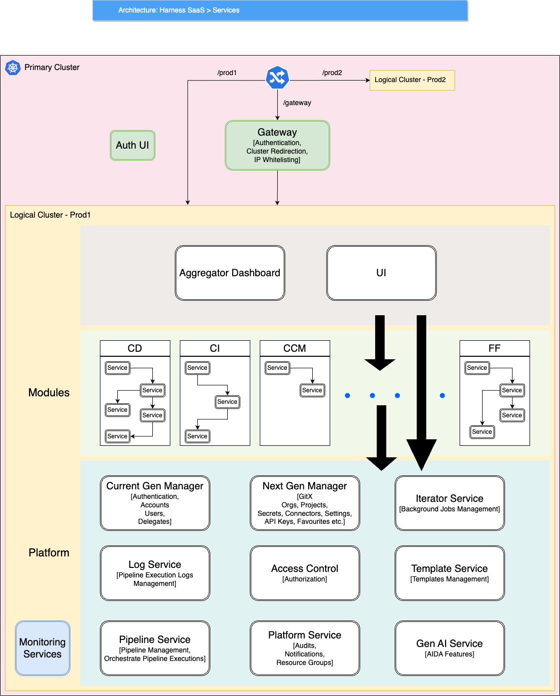

This diagram provides an overview of Harness microservices within the Prod1 logical cluster. This diagram illustrates the microservices architecture of Harness, which can be thought of divided into three distinct layers for simplicity. Higher-layer services invoke lower-layer services to fulfil their respective functions.

1. **Platform Layer:** The bottom-most layer encompasses Platform Services, which provide the core functionalities of Harness. These services handle tasks such as delegate management, pipeline management, secrets management etc.

2. **Module Layer:** The middle layer comprises modules like Feature Flags (FF), Cloud Cost Management (CCM), Continuous Integration (CI), and Continuous Delivery (CD) etc Each module possesses its own set of services, responsible for specific functionalities within their respective domains. The architecture of modules will be covered in detail separately. Module services interact with the Platform Services to fulfill their functionalities.

3. **Aggregator and UI Services:** The top layer consists of Aggregator services and UI services. Gateway and Auth UI are services common to both Prod1 and Prod2. Gateway handles authentication, IP whitelisting, and request cluster redirection. Services communicate with each other using both synchronous and asynchronous patterns.
