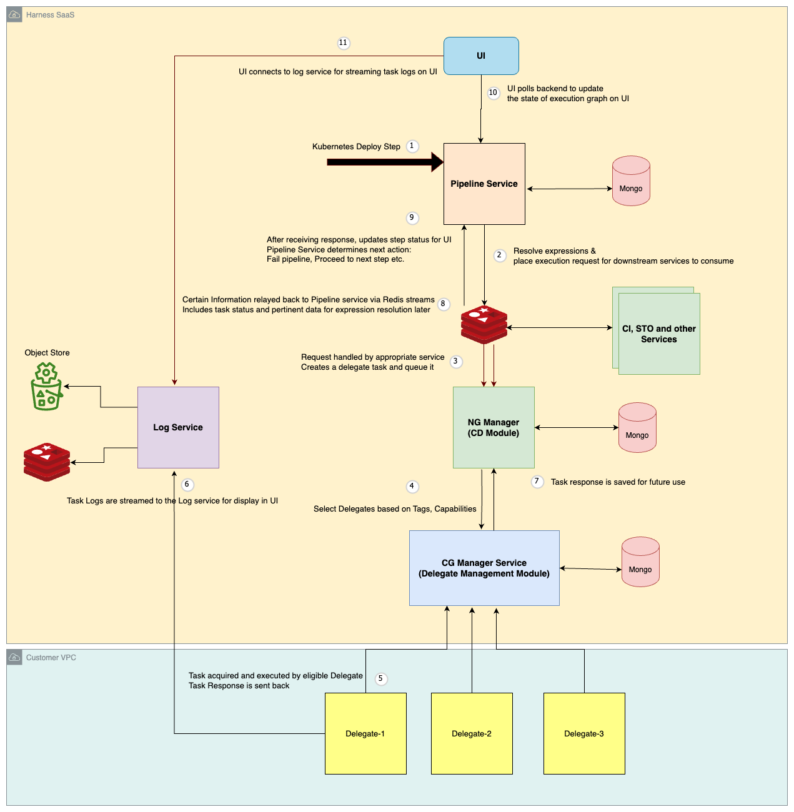

This diagram describes the high-level flow of executing a step within a Harness pipeline:

1. Upon receiving an execution request for a pipeline step, the Pipeline service first processes the step's YAML definition. It resolves any variables and expressions included within the YAML
2. The processed step definition is then placed in Redis Stream.
3. The NG Manager service (for Continuous Delivery steps) or CI Manager service (for Continuous Integration steps) picks up tasks from the Redis Stream.
4. The service creates a delegate task request specifying the step to be executed. This request is sent to the Delegate Management module.
5. The Delegate Management module selects a suitable delegate from the available pool. This selection is based on the delegate selectors, tags and capabilities.
6. Once the delegate finishes the task, it sends a response back to the service.
7. Logs generated during execution are sent to the Log service. The Log service stores these logs in two locations:
    - Redis: For immediate access (e.g., by the UI) during pipeline execution.
    - Blob Store: For long-term archival.
8. The NG Manager service asynchronously communicates the execution response back to the Pipeline service via Redis streams.
9. After receiving the response, the Pipeline service updates the status of the executed step. It then identifies the next step in the pipeline sequence and initiates the same execution process described above.
10. Monitoring:
    - UI Interaction: The user interface (UI) periodically checks the Pipeline service for updates on the execution status of each pipeline step.
    - Log Retrieval: The UI also polls the Log service to retrieve and display the latest log messages generated during step execution.
