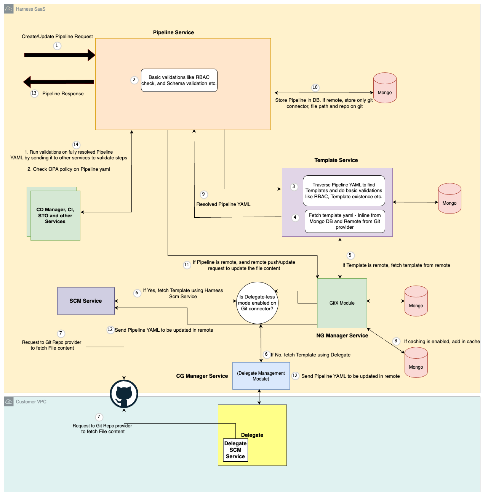

This diagram illustrates the high-level process of the Pipeline Service handling a "Get" request for Pipeline details.

1. **Authorization Check**: The service first verifies if the requesting user has the necessary permissions to access the specified pipeline.
2. **Pipeline Location**: It then determines the pipeline's location: either stored inline within the database (inline pipeline) or residing in a remote Git repository.
3. **Retrieving Pipeline Definition**:
    **Inline Pipeline**: If it's inline, the service retrieves the Pipeline YAML definition directly from the database and returns it in the response.
    **Remote Pipeline**: For pipelines in a remote Git repository:
        **Cache Check (Optional)**: If caching is enabled, the service first checks the GitX module within the NG Manager service for a cached copy of the Pipeline YAML for faster retrieval.
        **Download Pipeline YAML**: If not cached or caching is disabled, the service utilizes either the Delegate or Source Code Management (SCM) service to download the YAML definition directly from the remote repository.
4. **Validation**: The retrieved Pipeline YAML undergoes validation within the Pipeline service.
5. **Template Resolution**: The service identifies and resolves any template references included within the Pipeline YAML. This resolution involves communication with the Template Service, which follows a similar retrieval process as described previously (local data store for inline templates or the Git repository for remote ones).
6. **Final Validation**: Finally, the Pipeline service performs comprehensive validation on the entire assembled pipeline YAML, by calling other services, before sending the response back to the user.

This diagram describes the high-level flow for creating or updating a Pipeline:

1. **Authorization Check**: The Pipeline service first verifies if the requesting user has the necessary permissions to perform the desired action (create or update) on the pipeline.
2. **Template Resolution**: The Pipeline service sends the request containing the pipeline definition, including any template references, to the Template service.
3. **Template Retrieval**: The Template service resolves each template reference within the pipeline definition:
    **Inline Template**: If a template is inline, the Template service retrieves the YAML definition directly from the database.
    **Remote Template**: For remote templates stored in a Git repository, the Template service follows these steps:
        **Cache Check (Optional)**: If caching is enabled, it checks the GitX module within the NG Manager service for a cached copy of the template YAML for faster retrieval.
        **Download Template YAML**: If not cached or caching is disabled, the Template service utilizes either the Delegate or Source Code Management (SCM) service to download the YAML definition directly from the remote repository.
4. **Full Pipeline Definition**: Once all template references are resolved, the Template service sends back the complete pipeline definition to Pipeline service.
5. **Pipeline Storage**:
    **Inline Pipeline**: For inline pipelines, the complete Pipeline YAML definition is stored directly in the database.
    **Remote Pipeline**: For pipelines referencing a remote Git repository, only metadata like Git connector details (e.g., Git URL), pipeline file location in Git etc are stored in the database.
6. **Remote Pipeline Create/Update**: If the pipeline resides in a remote Git repository, pipeline service sends a request (push for updates, create for new pipelines) to the GitX service to update the pipeline YAML content in the remote repository.
