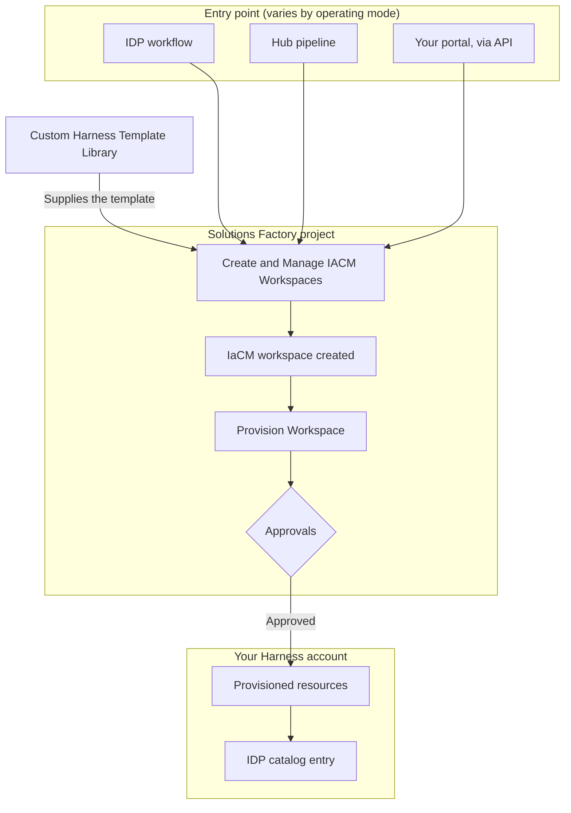

Harness Solutions Factory is built from several parts that each own a different job: 

**Pilot Light:** An IaCM workspace in the Solutions Factory project that manages the framework itself including the `harness-platform-manager` service account and its token rotation, the mirror schedule, and the operating mode variables.

**Solutions Factory:** An IaCM workspace and project that holds every HSF pipeline. It is the engine that turns a submitted request into provisioned resources, and the configuration that governs how requests are fulfilled.

**Template libraries:** A collection of Terraform templates that define what each workflow provisions. `harness-template-library` is provided by Harness and a point in time copy can be created at the time of deployment to be customized. Multiple template libraries can be leveraged if using a distributed model.

**Entry point:** The interface a developer uses to submit a request: IDP workflows, Hub pipelines, or your own portal calling Hub by API, depending on your operating mode. 

The distinction that matters most in day-to-day use is **Pilot Light vs Solutions Factory**. Pilot Light manages HSF. Solutions Factory manages what HSF builds. Changing a token rotation schedule is a Pilot Light change. Changing how workspaces are created for a request is a Solutions Factory change.

:::note
Both workspaces are created in the `Solutions Factory` project inside the `Harness Platform Management` organization. Go to [Created Resources](../use-hsf/created-resources.md) to review every resource HSF creates and where each one lives.
:::

## The request lifecycle

When a developer submits a request, it passes through the entry point, into the engine, and out as provisioned Harness resources registered back in the catalog.

The steps in detail:

1. **A request is submitted.** A developer selects a workflow, fills in the inputs, and submits it. The entry point depends on your operating mode.
2. **Create and Manage IACM Workspaces runs.** This pipeline is the single way into the engine for every operating mode. It reads the matching template from your template library and provisions an IaCM workspace for the request.
3. **An IaCM workspace is created.** Every resource HSF provisions is backed by a workspace, which is what makes the resource manageable and drift-detectable after creation.
4. **Provision Workspace runs.** This pipeline plans and applies the workspace configuration.
5. **Approvals gate the apply.** An HSF Admin approves the entity creation, then reviews the Terraform plan diff before the changes apply. Nothing is provisioned without both approvals.
6. **Resources exist and are registered.** The requested Harness resources are created, and the output is registered as an IDP catalog entry so the requester can find it.

Go to [Execute a workflow](../use-hsf/workflows/execute-a-workflow.md) to walk through this lifecycle in the UI, including where to monitor each pipeline.

### Where the lifecycle changes by operating mode

Only the entry point differs across operating modes. Every mode converges on **Create and Manage IACM Workspaces**, so the engine, the approvals, and the resulting workspaces work the same way in all three.

| Operating mode | How requests arrive |
|---|---|
| **Core+IDP** | A developer runs an IDP workflow. This is the default. |
| **Core+Hub** | A developer runs a pipeline in the Hub project. Hub pipelines are the equivalent of the IDP workflows, and permissions are handled with ABAC instead of IDP. |
| **Core+Backstage** | Your existing portal triggers a Hub pipeline by API. |

Go to [HSF Hub](../use-hsf/hsf-hub.md) to understand how Hub replaces the IDP entry point and how its permissions model works.

## Where workspaces are created

By default, every workspace HSF creates lands in the central `Solutions Factory` project. Two features change that, and both exist to spread the operational load rather than to change how provisioning works.

- **Mini Factory** gives each organization its own factory project, so workspaces are created alongside the organization that requested them. Turn it on with the `enable_hsf_mini_factory` variable.
- **Factory Floor** deploys the six workspace pipelines directly into an existing project, so that project runs HSF provisioning itself.

Go to [Mini Factory and Factory Floor](../use-hsf/mini-factory-and-factory-floor.md) to understand when to use each one.

## How updates reach you

Go to [Upgrade Guide](./hsf-upgrade.md) to work through an upgrade.