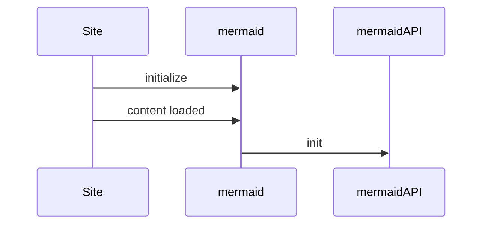
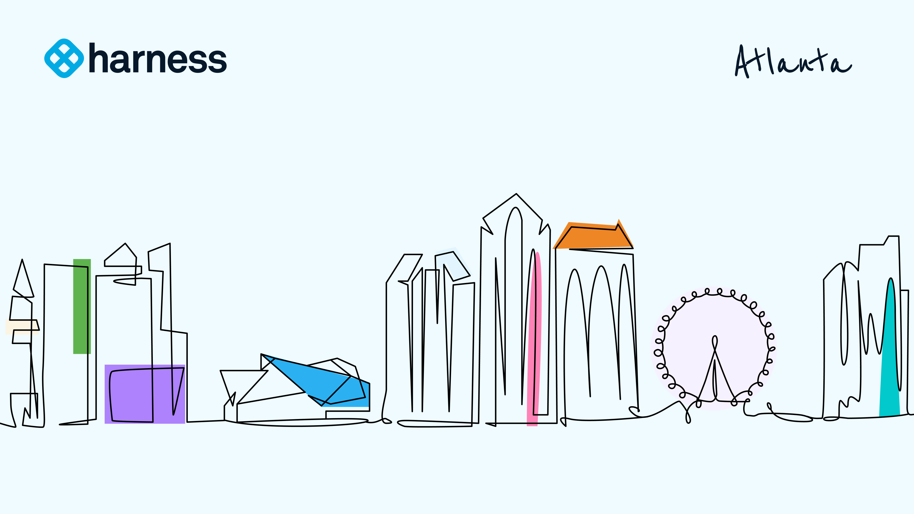

<CTABanner
  buttonText="Banner Button Text"
  title="Title text."
  tagline="Tagline text!"
  link="https://www.harness.io/training"
  closable={true}
  target="_self"
/>

import harness_atl from './static/atlanta_light.png'

# Markdown Capabilities

Thanks for checking out the Harness Developer Hub and learning more how to contribute. The HDH is powered by [Docusaurus](https://docusaurus.io/). Can leverage this Markdown File to see the facets of what is possible with Docusaurus's Markdown capabilities in an HDH styled post. Feel free to take a look at this page in `raw` format on GitHub. We look forward to seeing your creativity!

## Headings

H2 Heading
Can see how different headings look.

### H3 Heading

H3 Heading

#### H4 Heading

H4 Heading

##### H5 Heading

H5 Heading

## Tables

| Column     | Column | Column |
| :--------- | :----- | :----- |
| **1. Row** |        |        |
|            | Row    | Row    |

## Details

Details are toggle elements.

As of Late 2023 we have a [Set Focus](https://github.com/harness/developer-hub/blob/main/plugins/focusOnAnchor-plugin/index.js) feature that will process which detail the link is on and expand the appropriate section if a detail.

- https://developer.harness.io/docs/hdh/hdh-docusaurus-sandbox#second-level-detail-heading

<details>
<summary>First Level Detail</summary>

### First Level Detail Heading

Some first level text

<details>
<summary>Second Level Detail</summary>

### Second Level Detail Heading

Some second level text

</details>
</details>

## Notes

These are called [admonitions](https://docusaurus.io/docs/markdown-features/admonitions).

:::note

Note text.

:::

:::tip

Tip text.

:::

:::warning

Caution text.

:::

:::info

Information text.

:::

:::danger

Danger text.

:::

## Tabs

Tabs can also now have direct [query strings](https://docusaurus.io/docs/markdown-features/tabs?current-os=ios#query-string) in this example as of DS 3.2.1.

e.g deeper linking:

- https://developer.harness.io/docs/hdh/hdh-docusaurus-sandbox?tab-number=1#some-heading-in-tab-one
- https://developer.harness.io/docs/hdh/hdh-docusaurus-sandbox?tab-number=2#some-heading-in-tab-two
- https://developer.harness.io/docs/continuous-delivery/get-started/cd-tutorials/helm-chart?pipeline=uicdpipe&gitops-cli-os=windowsgitops&deploymentcli=helmrollingcli#create-a-service-3

Can see what the tab value ='s then the anchor tab there in combination and for nested tabs can continue.
`?pipeline=uicdpipe&gitops-cli-os=windowsgitops&deploymentcli=helmrollingcli#create-a-service-3`

As of Late 2023 we have a [Set Focus](https://github.com/harness/developer-hub/blob/main/plugins/focusOnAnchor-plugin/index.js) feature that will process which tab the link is on and expand the appropriate section if a detail.

import Tabs from '@theme/Tabs';
import TabItem from '@theme/TabItem';

<Tabs queryString="tab-number">
<TabItem value="1" label="Tab One">

### Heading in Tab One \{#some-heading-in-tab-one}

This is an `TabItem` 1.

<details>
<summary>Details in Tab One </summary>

#### Header inside Details Tab One

Detail text tab 1.

</details>

</TabItem>
<TabItem value="2" label="Tab Two">

### Heading in Tab Two \{#some-heading-in-tab-two}

This is an `TabItem` 2.

<details>
<summary>Details in Tab Two </summary>

#### Header inside Details Tab Two

Detail text tab 2.

</details>

</TabItem>
</Tabs>

## Code Formatting

Can enable syntax highlighting with these [common languages](https://github.com/FormidableLabs/prism-react-renderer/blob/master/packages/generate-prism-languages/index.ts).

```js
console.log("Check out Harness, Today!");
```

## Diagram

Docusaurus supports [Mermaid Diagrams](https://mermaid.js.org/config/configuration.html).



## Images

In HDH, we provide a few ways to include images. We support the standard Markdown format to include also additional control to re-size.

### Standard Include



### Formattable Include

Can apply what an `img` tag in HTML would apply.

```
import harness_atl from './static/atlanta_light.png'


```


### Lightbox / Image Expand

Can use the `DocImage` plugin for this.

```
<DocImage path={require('./static/atlanta_light.png')} />
```

<DocImage path={require('./static/atlanta_light.png')} />

## Videos

Videos are great tools to embed. You can embed a video in your Markdown.

```
<DocVideo src="https://www.youtube.com/watch?v=_Nj9EYYuSqY" />
```

<DocVideo src="https://www.youtube.com/watch?v=_Nj9EYYuSqY" />

## Quotes

> Software Delivery, made easy!
>
> — Harness

## Includes

Can include MD files as entire files. Import the asset as a tag then
leverage the tag.

```
import CISignupTip from '/docs/continuous-integration/shared/ci-signup-tip.md';
<CISignupTip />
```

import CISignupTip from '/docs/continuous-integration/shared/ci-signup-tip.md';

<CISignupTip />

## Buttons

Can leverage the button framework to add a button. Can give the Font Awesome Icon, text, Link, Tooltip,
and Size [small, medium, large].

```
<DocsButton icon = "fa-solid fa-square-rss" text="Subscribe via RSS" link="/release-notes/continuous-integration/rss.xml" tooltip=
"Subscribe to RSS" size="medium"/> />
```

<DocsButton icon = "fa-solid fa-square-rss" text="Subscribe via RSS" link="https://developer.harness.io/release-notes/continuous-integration/rss.xml" tooltip=
"Subscribe to RSS" size="medium"/>

## Pills

Similar to the Button Framework, the Pill Framework allows use to place pill tags in the MD. Buttons, unlike Pills, are designed to be
clicked and hoovered. Though pills can contain links also.

```
<DocsTag icon = "fa-solid fa-icons" text="Default" link="/docs/security-testing-orchestration" />
<DocsTag  text="Default without icon" link="/docs/security-testing-orchestration" />
<DocsTag  backgroundColor= "#ff8ac1" text="With out icon"  textColor="#ca136c"  />
<DocsTag icon = "fa-solid fa-hand-dots"  backgroundColor= "#cbe2f9"   textColor="#0b5cad" iconColor="#6938c0" text="Community" link="/docs/security-testing-orchestration"  />
```

<DocsTag icon = "fa-solid fa-icons" text="Default" link="/docs/security-testing-orchestration" />
<DocsTag  text="Default without icon" link="/docs/security-testing-orchestration" />
<DocsTag  backgroundColor= "#ff8ac1" text="With out icon"  textColor="#ca136c"  />
<DocsTag icon = "fa-solid fa-hand-dots"  backgroundColor= "#cbe2f9"   textColor="#0b5cad" iconColor="#6938c0" text="Community" link="/docs/security-testing-orchestration"  />

## Embed Mode

If needing to embed HDH externally, can use the embed request parameter e.g `embed=true`. Below
is an example of an iframe.

```
<iframe src="https://developer.harness.io/docs/platform/get-started/onboarding-guide?embed=true" title="HDH Embed Example" height="600" width="940"></iframe>
```

#### Iframe Render

<iframe src="https://developer.harness.io/docs/platform/get-started/onboarding-guide?embed=true" title="HDH Embed Example" height="600" width="940"></iframe>

## Math Equations

### Inline

Write inline math equations by wrapping LaTeX equations between $:

```
Let $f\colon[a,b]\to\R$ be Riemann integrable. Let $F\colon[a,b]\to\R$ be
$F(x)=\int_{a}^{x} f(t)\,dt$. Then $F$ is continuous, and at all $x$ such that
$f$ is continuous at $x$, $F$ is differentiable at $x$ with $F'(x)=f(x)$.
```

Let $f\colon[a,b]\to\R$ be Riemann integrable. Let $F\colon[a,b]\to\R$ be
$F(x)=\int_{a}^{x} f(t)\,dt$. Then $F$ is continuous, and at all $x$ such that
$f$ is continuous at $x$, $F$ is differentiable at $x$ with $F'(x)=f(x)$.

### Blocks

For equation block or display mode, use line breaks and $$:

```
$$
I = \int_0^{2\pi} \sin(x)\,dx
$$
```

$$
I = \int_0^{2\pi} \sin(x)\,dx
$$

### Escaping Dollar Signs

Leveraging `$` as plain text now needs to be escaped.

```
#Safe
`**${host}**`

#Safe
`${host}`

#Not Safe
${host}
```

## HDH API CALL

### Usuage

```js
<HarnessApiData
  query="https://app.harness.io/ng/api/organizations/default"
  accountIdentifier
  token
  fallback="harness fallback"
  parse=".data.organization.description"
/>
```

### Result

<HarnessApiData  query="https://app.harness.io/ng/api/organizations/default" accountIdentifier token fallback="harness fallback" parse=".data.organization.description"/>

### Usuage

```js
<HarnessApiData
  query="https://app.harness.io/gateway/iacm/api/provisioners/supported/terraform"
  token="process.env.HARNESS_GENERIC_READ_ONLY_KEY"
  fallback="error"
  parse='.[-1] | "(up to v\(.))"'
></HarnessApiData>
```

### Result

<HarnessApiData
    query="https://app.harness.io/gateway/iacm/api/provisioners/supported/terraform"
    token="process.env.HARNESS_GENERIC_READ_ONLY_KEY"
    fallback="error"
    parse='.[-1] | "(up to v\(.))"'>
</HarnessApiData>

### Usuage

```js
<HarnessApiData
  query="https://jsonplaceholder.typicode.com/todos/1"
  fallback="Failed to load data."
  parse=".title"
/>
```

### Result

<HarnessApiData query="https://jsonplaceholder.typicode.com/todos/1" fallback="Failed to load data." parse=".title"

/>

## Call To Action (CTA) Banners
A few ways of adding banners in HDH. 

### Per Page CTA

Leverage the `CTABanner` tag which is on this page. 

```
<CTABanner
  buttonText="Banner Button Text"
  title="Title text."
  tagline="Tagline text!"
  link="https://www.harness.io/training"
  closable={true}
  target="_self"
/>
```

### Rule Based Bannering
This needs to be configured in `docusaurus.config.js` with the `announcementBar` element. 

```
 announcementBar: {
          id: 'announcementBar_cd_announcement',
          content:
            "<i class='fa-solid fa-circle-exclamation' style='color: #CF2318; margin-right: 4px;'></i><span style='color: #CF2318;'>FirstGen Harness CD will be EOL on 12/30/2023 and EOS on 3/30/2024.</span> Learn more in our <a href='/docs/continuous-delivery/get-started/upgrading/upgrade-nextgen-cd/' target='_self'>Upgrade Guide</a>. Contact  <a href='https://support.harness.io' target='_self'>Harness Support</a> with questions or concerns.",
          backgroundColor: '#FFF5ED',
          textColor: '#000000',
          isCloseable: true,
        },
        announcementBarByPath: {
          // list all pathnames in Regular expressions format
          pathRegExp: [
            // paths for md-doc pages / global patterns
            '^/docs/first-gen/continuous-delivery.*',
            '^/docs/first-gen/first-gen-quickstarts.*',
            '-fg.*',
            'fg-.*',
            'firstgen-.*',
            'first-gen.*',
            '-firstgen.*',
          ],
        },
```