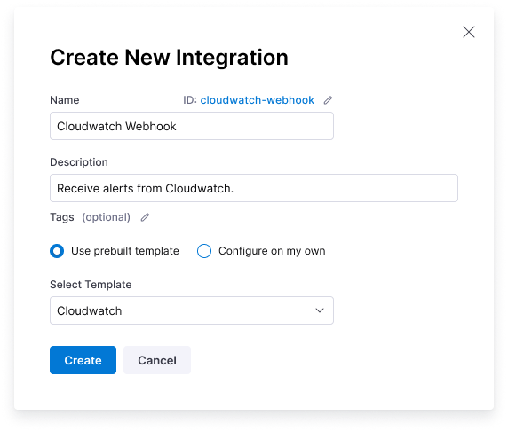

You can add webhooks in Harness Incident Response to enable data to be received from external services.

Incoming webhooks are connected to a data parser application in Harness Incident Response, which parses the data. The data can be parsed based on the webhook source, data in the incoming webhook request, and much more.

You can trigger runbooks based on a specific webhook or the data in the request and also use the data to define action parameters that will be dynamically populated during runbook runs.

### Creating a New Webhook

On the Harness Incident Response site, go to **Integrations**. Click **+New Integration**. Name your Alert Source and choose a data parser application to use with your webhook.



Harness Incident Response can parse data to format alerts, pass data to subsequent actions in a runbook and call other external services to enrich the incoming data.

:::tip
You can extend the capability of the built-in data parser by choosing the ```Custom``` option to configure your own data parsers.
:::


Built-in webhook data parser applications are available for the following external services:

* [AlertManager alerts](#)
* [AlertSite alerts](#)
* [BigPanda alerts](#)
* [Bitbucket events](#)
* [Cloudwatch alerts](#)
* [Datadog monitor alerts](#)
* [Dynatrace alerts](#)
* [GitHub events](#)
* [GitLab events](#)
* [Grafana alerts](#)
* [Grafana Incident alerts](#)
* [Harness SLO alerts](#)
* [Jenkins build notifications](#)
* [Jira issues](#)
* [Lacework alerts](#)
* [Manual alerts](#)
* [New Relic alerts](#)
* [Octopus Deploy events](#)
* [Opsgenie alerts](#)
* [PagerDuty incidents](#)
* [Sentry alerts](#)
* [ServiceNow events](#)
* [Splunk On-Call (Formerly VictorOps) alerts](#)
* [Stackdriver alerts](#)
* [Travis CI events](#)

<!-- This is a comment and will not be rendered in the output
Optionally, on the  a Slack channel for the webhook alerts to appear in. The Slack channel must already exist, create it before adding the webhook.
-->

### Using Webhooks

Once you have clicked **Add** to create the new webhook, find it in the list on the Integrations page, and click the **Click to copy** link.

Now that you have created the webhook, you can register it in the external service, so that it will send data to Harness Incident Response when an event happens within the external service.
