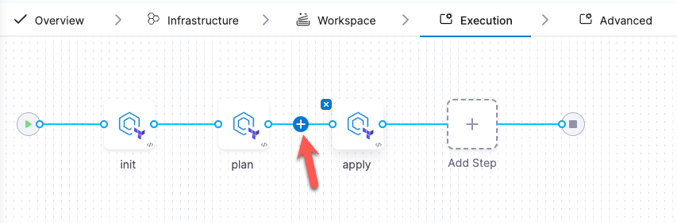

import Tabs from '@theme/Tabs';
import TabItem from '@theme/TabItem';

### Prerequisites
Before beginning the walkthroughs in this guide, ensure you have:
- Access to a Harness account.
- Access to a Git provider with your [OpenTofu](https://opentofu.org/) project.
- Access to a Cloud Provider such as AWS or Google Cloud Platform.
- An [organization and project set up](/docs/platform/organizations-and-projects/create-an-organization) on the Harness Platform.

<details>
<summary>Sample OpenTofu</summary>

The following example OpenTofu (.tf) file declares:

- **Provider Configuration:** Specifies the AWS provider and sets the region to "us-east-1". Go to [AWS Regions & Availability Zones](https://docs.aws.amazon.com/AmazonRDS/latest/UserGuide/Concepts.RegionsAndAvailabilityZones.html) for a complete region list.
- **Resource Definition:** Creates an EC2 instance with the identifier `my_first_ec2_instance`.
- **AMI:** Utilizes ami-123abc321cba18, go to [AWS EC2 User Guide](https://docs.aws.amazon.com/AWSEC2/latest/UserGuide/finding-an-ami.html) to find your AMI image ID.
- **Instance Type:** Configures the instance to use a t2.micro. Go to the [AWS t2 instances list](https://aws.amazon.com/ec2/instance-types/t2/).  
  Tags: To facilitate easy identification and management within AWS resources, a tag name with the value `my_first_ec2_instance` is applied.

```hcl
provider "aws" {
  region = "us-east-1"
}

resource "aws_instance" "my_first_ec2_instance" {
  ami = "ami-123abc321cba18"
  instance_type = "t2.micro" # Got to https://aws.amazon.com/ec2/instance-types/t2/ for a full T2 instance type list.

  tags = {
    Name = "my_first_ec2_instance"
  }
}
```

Go to [OpenTofu Documentation](https://opentofu.org/docs/) for more information on currently supported workspace types.
</details>

---

## Set up your workspace
A workspace is a named environment for storing your OpenTofu configurations and resources. Connect your Cloud Provider and Code Repository through **Connectors** to manage infrastructure changes and updates with Harness IaCM pipelines.

:::info
Harness recommends configuring your connector before creating your workspace, however, you can also add new connectors during the [Create Workspace flow](/docs/infra-as-code-management/get-started/#add-a-new-workspace).
:::

### Step 1: Add connectors
Use **Harness AI** to create and configure your cloud provider and code repository connectors before you create a Workspace:
<Tabs>
<TabItem value="Create a connector">
<DocVideo src="https://app.tango.us/app/embed/73d9628e-7093-4c6b-a9f7-dac8125c8441?skipCover=true&defaultListView=false&skipBranding=false&makeViewOnly=true&hideAuthorAndDetails=true" title="Create Cloud Provider Connector with Harness AI" />
</TabItem>
<TabItem value="Step-by-step">

When adding any connector, start by:

1. Signing in to [app.harness.io](https://app.harness.io).
2. In the module pane, select **Infrastructure**.
3. Select **Project Setup**, and then select **Connectors**.
4. Select **New Connector (AI)**.
5. Select an option, e.g. "Create a GitHub connector", or type your request to create a connector for you chosen cloud provider or code repository.

Harness will create a YAML file for you connector, once you select **Create**, Harness will create your connector and add it to your project.

:::tip edit connector
Edit your connector by updating the AI generated YAML file, or by selecting **Edit Details** in the connectors panel.
:::

Go to [Connect your Cloud Provider](https://developer.harness.io/docs/category/cloud-providers) and [Connect your Code Repository](/docs/platform/connectors/code-repositories/connect-to-code-repo) for more information regarding connecting your cloud provider and code repository.
</TabItem>
</Tabs>

:::info OIDC Connectors
For easier access and token management, use the **OIDC** (OpenID Connect) option in the Credentials panel. This allows your connector to assume roles with permissions set in your Cloud Provider, updated only by authorized users. For more details, visit [the Use OIDC tab](/docs/platform/connectors/cloud-providers/ref-cloud-providers/aws-connector-settings-reference/#credentials).
:::

---

### Step 2: Create your workspace
Once you have configured your connectors, you can create a Workspace and select them in the New Workspace panel:

:::tip migrate existing projects
For first-time use, use our [migration tool](/docs/infra-as-code-management/remote-backends/state-migration) to create new workspaces and import your existing Terraform projects into the Harness Platform.
:::

<Tabs queryString="create-workspace">
<TabItem value="Interactive guide">
<DocVideo src="https://app.tango.us/app/embed/e6ec4051-90e5-4430-a003-a9bcce4d8981?skipCover=true&defaultListView=false&skipBranding=false&makeViewOnly=true&hideAuthorAndDetails=true" title="Create an OpenTofu Workspace in Harness IaCM" />
</TabItem>
<TabItem value="Step-by-step">

1. In the module pane, select **Infrastructure**.
2. Select an existing project or create a new project.
3. Select **Workspaces**, and then select **New Workspace**.
4. Select **Create new Workspace**, then select **Start from scratch** and complete the following fields in the new workspace wizard:

#### About Workspace
- **Name** - Type a unique name to identify the Workspace.
- **Description (optional)**: Type an optional description to help identify the Workspace.
- **Tags (optional)**: Add a unique tag to identify the Workspace.

#### Configure Repository Details
- Select your Git provider, either **Harness Code Repository** or **Third-party Git provider** for other providers like GitHub or GitLab.
- **Git Connector**: Select the Git connector you created in the previous step.
- **Git Fetch Type**: Select the Git fetch type, either **Latest from branch**, **Git tag** or **Commit SHA**.
- **Git Branch**: Specify the branch you want to use for the workspace.

:::tip branch with jexl
  you can configure the workspace branch to be a [JEXL expressions](/docs/platform/variables-and-expressions/harness-variables/) that references a pipeline variable, and then set the pipeline variable as a run time input.

  

  Set you branch variable as a runtime input in the pipeline:

  ```
  variables:
   - name: iacm_branch
     type: String
     description: ""
     required: true
     value: <+input>.default(main)
   ```
  :::

- **Folder Path**: Specify the folder path to the OpenTofu configuration files in the repository.

**Advanced** options allow you to **include submodules** if your code repository includes modules and submodules. Go to [Module Registry](/docs/category/module-registry) for more information.

#### Provisioner
- **Connector**: Select the cloud provider connector you created in the previous step.
- **Cloud Cost Estimation**: Toggle the **Enable Cost Estimation** switch to enable cloud cost estimation. This will allow you to estimate the cost of your infrastructure changes before you apply them.
- **Workspace Type**: Select **OpenTofu** as the workspace type you want to use for the workspace.
- **OpenTofu Version**: Select the OpenTofu version you want to use for the workspace<HarnessApiData
    query="https://app.harness.io/gateway/iacm/api/provisioners/supported/opentofu"
    token="process.env.HARNESS_GENERIC_READ_ONLY_KEY"
    fallback=""
    parse='.[-1] | " (latest: v\(.))"'></HarnessApiData>

#### Add Variable Set (Optional)
If you have configured variable sets for reuse, select the variable set you want to use for the workspace.

5. Select **Create**.
</TabItem>
</Tabs>

---

### Step 3: Add a provision pipeline
A pipeline structures workflows to manage tasks like planning infrastructure changes, enforcing policies, and approvals. Learn more about [Harness Pipelines](/docs/category/pipelines). You can also add pipelines through the Harness Platform or [use a code-first approach with YAML](/docs/platform/pipelines/harness-yaml-quickstart).

#### Harness AI pipeline generation

<Tabs>
  <TabItem value="Interactive guide">
  <DocVideo src="https://app.tango.us/app/embed/5e8d0ffa-f4a6-4b02-9953-dcd42e608ac8?skipCover=true&defaultListView=false&skipBranding=false&makeViewOnly=true&hideAuthorAndDetails=true" title="Create a Provision Pipeline in Harness IaCM" />
  </TabItem>
  <TabItem value="Step-by-step">
  Start by adding the pipeline:

1. Select the **Infrastructure** module.
2. Select **Pipelines**, then select **Create a Pipeline**.
3. Select an option from Harness AI chat or type a request to generate one, for example:
   - "Create a pipeline to Provision an OpenTofu files with an init, plan and apply step."
4. Review the generated YAML and Harness AI chat summary, and make any changes if necessary. 
5. Select **Accept**.
</TabItem>
</Tabs>

The Provision operation adds three Terraform plugin steps: `init`, `plan`, and `apply`. Go to [Tofu/Terraform Plugins](/docs/infra-as-code-management/cli-commands/terraform-plugins) for more information about supported OpenTofu/Terraform commands.

---

### Step 4: Add an Approval step (optional)
You can add the Approval step to prompt a review of the previous pipeline before proceeding to the next. The most common use case would be to add the Approval step between the `plan` and `apply` steps to ensure you are happy with the infrastructure changes and estimated costs (if `cost estimation` is enabled on your Workspace) that come with them before applying them.

:::warning Approval steps hold resources
When using an Approval step, the underlying machine running the pipeline remains active until the approval is resolved. This means it will continue consuming compute resources.
:::

<Tabs>
<TabItem value="Interactive guide">
<DocVideo src="https://app.tango.us/app/embed/e84d97b6-413b-4e04-a4dc-fd4c802d0f05?skipCover=true&defaultListView=false&skipBranding=false&makeViewOnly=true&hideAuthorAndDetails=true" title="Add Approval step to your OpenTofu Pipeline in Harness IaCM" />
</TabItem>
<TabItem value="Step-by-step">
1. From the Pipeline > **Execution** tab, click on **+** between `plan` and `apply`.



2. Click **Add Step**.
3. Under **IACM**, select **IACM Approval**.
4. Name the approval step and click **Apply Changes**.
5. Select **Save**, then **Run** your pipeline.
</TabItem>
</Tabs>