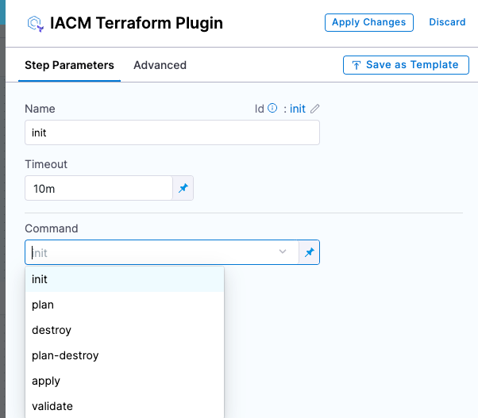
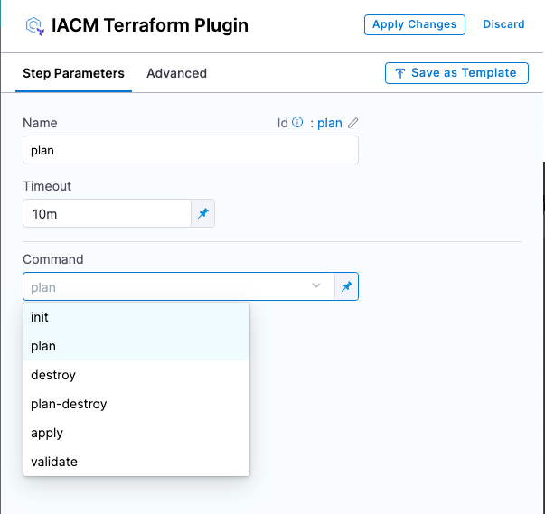
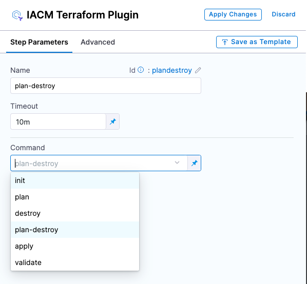
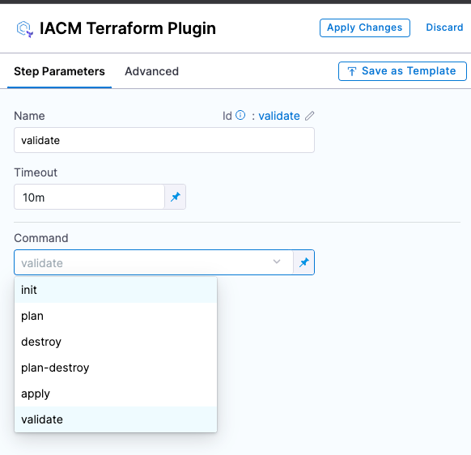
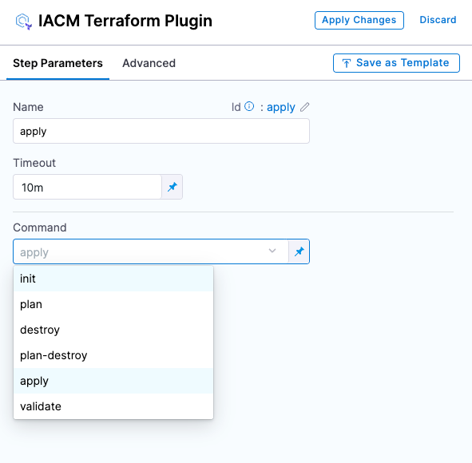
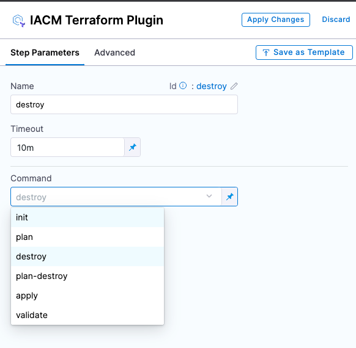

Harness provides the following Terraform plugins that you can embed in your infrastructure stage. 

# Terraform init

This step executes **terraform init**. 

The Terraform init command initializes a working directory containing the Terraform configuration file (downloading all the providers, for example) and saves those files in the plugin-shared folder that will be used later on. 

This should be the first step to execute before any other Terraform step.

# Terraform plan

This step executes **terraform plan**. 

The Terraform plan command creates an execution plan, which lets you preview the changes that Terraform plans to make to your infrastructure. 

The step pulls the state from the remote repository, or if none is selected, it pulls a copy of the state stored in the Harness backend. After that, it compares the current state with the future state. If there are differences, then it generates the plan file, which is saved in the plugin-shared folder that is used later on. 

This plan is the “plan that was applied” in the workspace, but this only happens in the consolidation phase.

# Terraform plan-destroy

This step executes **terraform plan --destroy**. 

This step is similar to the Terraform plan step, but the plan that is created indicates what are going to be the resources that are going to be destroyed.

# Terraform validate

This step executes **terraform validate** on the plugin side. 

The Terraform validate command validates the configuration files in a directory, referring only to the configuration and not accessing any remote services.

# Terraform apply

This step executes **terraform apply** on the plugin side. 

Terraform starts the provisioning of the resources. Once the step is completed, if the apply succeeds, the plugin pushes the state to the back end (custom or Harness-hosted back end). At this point, the last plan that was executed and the state that was the result of that plan being applied are consolidated as the plan and state that the workspace is pointing to.

# Terraform destroy

This step executes **terraform destroy** on the plugin side. 

Terraform starts destroying the resources. Once the step is completed, if the destroy succeeded, the plugin pushes the state to the back end (custom or Harness-hosted back end). At this point, the last plan that was executed and the state that was the result of that plan being applied are consolidated as the plan and state that the workspace is pointing to.
