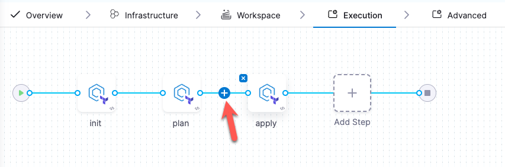

import Tabs from '@theme/Tabs';
import TabItem from '@theme/TabItem';


Welcome to the Harness IaCM onboarding guide. Discover how Harness streamlines and secures your infrastructure management with Infrastructure as Code Management (IaCM).

## What is IaCM?
IaC automates infrastructure management via code. IaCM enhances this by ensuring consistent, accountable, and repeatable deployments. Harness boosts IaCM with [**real-time cost estimation**](/docs/infra-as-code-management/workspaces/cost-estimation), [**automated policy enforcement**](/docs/infra-as-code-management/policies-governance/terraform-plan-cost-policy), and [**drift detection**](/docs/infra-as-code-management/pipelines/operations/drift-detection), ensuring efficient provisioning and compliance with standards.

### Prerequisites
Before beginning the walkthroughs in this guide, ensure you have:
- Access to a Harness account.
- Access to a Git provider with your [OpenTofu](https://opentofu.org/) or Terraform file.  
- Access to a Cloud Provider such as AWS or Google Cloud Platform.
- An [organization and project set up](https://developer.harness.io/docs/platform/organizations-and-projects/create-an-organization) on the Harness Platform.

Go to [What's Supported in IaCM](/docs/infra-as-code-management/whats-supported) for more information on supported Cloud Providers and Code/Git providers.

<details>
<summary>Sample terraform</summary>

The following example OpenTofu/Terraform (.tf) file declares:
- **Provider Configuration:** Specifies the AWS provider and sets the region to "us-east-1". Go to [AWS Regions & Availability Zones](https://docs.aws.amazon.com/AmazonRDS/latest/UserGuide/Concepts.RegionsAndAvailabilityZones.html) for a complete region list.
- **Resource Definition:** Creates an EC2 instance with the identifier `my_first_ec2_instance`.
- **AMI:** Utilizes ami-123abc321cba18, go to [AWS EC2 User Guide](https://docs.aws.amazon.com/AWSEC2/latest/UserGuide/finding-an-ami.html) to find your AMI image ID.
- **Instance Type:** Configures the instance to use a t2.micro. Go to the [AWS t2 instances list](https://aws.amazon.com/ec2/instance-types/t2/).  
Tags: To facilitate easy identification and management within AWS resources, a tag name with the value `my_first_ec2_instance` is applied.

```hcl
provider "aws" {
  region = "us-east-1"
}

resource "aws_instance" "my_first_ec2_instance" {
  ami = "ami-123abc321cba18" 
  instance_type = "t2.micro" # Got to https://aws.amazon.com/ec2/instance-types/t2/ for a full T2 instance type list.
  
  tags = {
    Name = "my_first_ec2_instance"
  }
}
```

Go to [OpenTofu Documentation](https://opentofu.org/docs/) or [Terraform Documentation](https://developer.hashicorp.com/terraform/intro) for more information on currently supported workspace types. 
</details>

:::tip Terraform to OpenTofu migration
Harness supports all OpenTofu versions, and Terraform MPL versions up to 1.5.x, any BSL versions (from 1.6.0) are not supported. 
Follow this [**OpenTofu migration guide**](https://opentofu.org/docs/intro/migration/) to transition from Terraform to OpenTofu and leverage the benefits of this open-source alternative.
:::

---
## Set up your workspace
A workspace is a named environment for storing OpenTofu or Terraform configurations and resources. Connect your Cloud Provider and Code Repository through **Connectors** to manage infrastructure changes and updates with Harness IaCM pipelines.

:::info
Harness recommends configuring your connector before creating your workspace, however, you can also add new connectors during the [Create Workspace flow](https://developer.harness.io/docs/infra-as-code-management/get-started/#add-a-new-workspace).
:::

### Add connectors
To configure your connectors before you create a Workspace, go to the following interactive guides:
<Tabs>
<TabItem value="Cloud Provider connector">
<DocVideo src="https://app.tango.us/app/embed/3d7ee504-7664-4805-a93c-5796b3db939b?skipCover=false&defaultListView=false&skipBranding=false&makeViewOnly=false&hideAuthorAndDetails=true" title="Set up a Cloud Provider Connector for Harness IaCM" />
</TabItem>
<TabItem value="Git repository connector">
<DocVideo src="https://app.tango.us/app/embed/33ce65a9-69bb-418d-9328-cd5198dcf6e5?skipCover=false&defaultListView=false&skipBranding=false&makeViewOnly=false&hideAuthorAndDetails=true" title="Set up a Git Repository Connector" />
</TabItem>
<TabItem value="Step-by-step">

When adding any connector, start by:

1. Signing in to [app.harness.io](https://app.harness.io).
2. In the module pane, select **Infrastructure**.
3. Select **Project Setup**, and then select **Connectors**.
4. Select **New Connector**.
5. Select the appropriate Connector, e.g. Cloud Provider, Code Repository.

#### Add a cloud provider connector
Using AWS as an example, after following the initial five steps to reach the Connectors panel:

1. Select a provider, e.g. **AWS**.
2. Name your connector and select **Continue**.
3. Add your Cloud Provider **Access Key** and **Secret Key**.

:::note
Your secret key can be stored in a secret manager (default: Harness Built-in Secret Manager).
:::

4. Select the Connectivity Mode.
    - Harness recommends selecting **Connect through Harness Platform**.
5. Continue to the final step to confirm your Cloud Provider connection is verified successfully.
6. Select **Finish**.

 Go to [Connect your Cloud Provider](https://developer.harness.io/docs/category/cloud-providers) for more information regarding connecting your Cloud Provider.

#### Add a Git repository connector
Using GitHub as an example, after following the initial five steps to reach the Connectors panel:

1. Select a code provider, e.g. **GitHub**.
2. Name your connector and select **Continue**.
3. Select **Repository** and add your GitHub Repository URL.
4. In the Credentials step, add your GitHub Username.
5. Select **Create or Select a Secret**.
    - Go to [Manage your Personal Access Tokens (PAT)](https://docs.github.com/en/enterprise-server@3.9/authentication/keeping-your-account-and-data-secure/managing-your-personal-access-tokens) for more information on finding or generating a GitHub secret.
6. Select **New Secret Text**, then enter your **Secret Name** and **Secret Value**.
7. Select **Save**.
8. Select **Enable API access**.
9. Under API Authentication, select **Create or Select a Secret** and choose the secret you created in Step 5.
10. Apply the selected secret and continue.
11. Select the Connectivity Mode.
    - Harness recommends selecting **Connect through Harness Platform**.  
12. Continue to the final step to confirm your GitHub connection is verified successfully.
13. Select **Finish**.

Go to [Connect your Code Repository](https://developer.harness.io/docs/platform/connectors/code-repositories/connect-to-code-repo) for more information regarding connecting your Code Repository.
</TabItem>
</Tabs>

:::info OIDC Connectors
For easier access and token management, use the **OIDC** (OpenID Connect) option in the Credentials panel. This allows your connector to assume roles with permissions set in your Cloud Provider, updated only by authorized users. For more details, visit [the Use OIDC tab](https://developer.harness.io/docs/platform/connectors/cloud-providers/ref-cloud-providers/aws-connector-settings-reference/#credentials).
:::

---
### Create your workspace
Once you have configured your connectors, you can create a Workspace and select them in the New Workspace panel:

:::tip migrate existing projects
For first-time use, use our [migration tool](https://developer.harness.io/docs/infra-as-code-management/remote-backends/state-migration) to create new workspaces and import your existing Terraform projects into the Harness Platform.
:::

<Tabs>
<TabItem value="Interactive guide">
:::warning pending release
The new workspace wizard is currently pending release and will be available soon!
:::
<DocVideo src="https://app.tango.us/app/embed/cfb68b54-eb46-42af-a622-5b76c9270598" title="Creating a New Workspace in Harness" />
</TabItem>
<TabItem value="Step-by-step" default>
1. In the module pane, select **Infrastructure**.
2. Select an existing project or create a new project.
3. Select **Workspaces**, and then select **New Workspace**.
4. Select **Create new Workspace**.

Complete the fields as follows:
- **Name** - Type a unique name to identify the Workspace.
- **Description**: Type an optional description to help identify the Workspace.
- **Connector**: Select the connector to use during provisioning.
- **Workspace Type**: Select the IaC type you want to use. IaCM currently supports Terraform and OpenTofu.
- **Provisioner Version**: Select the OpenTofu/Terraform version the configuration supports. This version determines which version of OpenTofu or Terraform to use during execution. 

:::info opentofu / terraform
Harness IaCM currently supports integration with all **OpenTofu** versions<HarnessApiData
    query="https://app.harness.io/gateway/iacm/api/provisioners/supported/opentofu"
    token="process.env.HARNESS_GENERIC_READ_ONLY_KEY"
    fallback=""
    parse='.[-1] | " (latest: v\(.))"'></HarnessApiData>.  
 For **Terraform**, we support all MPL versions up to **1.5.x**, any BSL versions (from 1.6.0) are not supported.

 Go to [OpenTofu migration](https://opentofu.org/docs/intro/migration/) to migrate from Terraform to OpenTofu.
:::

- **Repository**: Specify the Git configuration for the Terraform configuration files. You should specify the Harness Git connector, repository branch, and file path to the configuration files in the repository.
5. Select **Add workspace details**.
6. Select **Save**. 
</TabItem>
</Tabs> 

<details>
<summary>Add connectors while creating a workspace</summary>
<DocVideo src="https://app.tango.us/app/embed/d267f7c8-767f-4f14-b382-7b20c96a8e08" title="Add connector while create a workspace" />
</details>  
---

### Add a pipeline
A pipeline structures workflows to manage tasks like planning infrastructure changes, enforcing policies, and approvals. Learn more about [Harness Pipelines](https://developer.harness.io/docs/category/pipelines). You can also add pipelines through the Harness Platform or [use a code-first approach with YAML](https://developer.harness.io/docs/platform/pipelines/harness-yaml-quickstart).

#### Provision with Cost Estimation
:::info
You can include **cost estimation** as part of the workspace setup and in conjunction with the provision operation in your pipeline. This is part of the tofu or terraform `plan` step in your pipeline, which provides you with an approximate cost of the infrastructure changes you are making. Go to [cost estimation](/docs/infra-as-code-management/workspaces/cost-estimation) for more details.
:::

<Tabs>
  <TabItem value="Interactive guide">
  <DocVideo src="https://app.tango.us/app/embed/ca925494-e35b-4ddc-af6f-a881197da980" title="Create an IaCM Provision Pipeline" />
  </TabItem>
  <TabItem value="Step-by-step">
  Start by adding the pipeline:

  1. Select the **Infrastructure** module.
  2. Select **Pipelines**, then select **Create a Pipeline**. 
  3. Enter a **Name**, then select **Start**.
      - This will create a blank pipeline for you to add stages to.
  4. Click **Add Stage** and select **Infrastructure**.
  5. **Name** the stage to describe what it should do, then select **Set Up Stage**.  
  6. Go to the **Workspace** and select the Workspace you want the pipeline to run on.
      Remember, the Workspace is configured with your Git and Cloud Provider connectors, which will determine where your infrastructure changes are applied.
  7. Go to the **Execution**, where a selection of **Operations** will be presented.  
  8. Select **Provision**, then select **Use Operation**.
  9. Select **Save**.
  </TabItem>
</Tabs>
  
The Provision operation adds three Terraform plugin steps: `init`, `plan`, and `apply`. Go to [Tofu/Terraform Plugins](/docs/infra-as-code-management/pipelines/terraform-plugins) for more information about supported OpenTofu/Terraform commands.

---

### Add an Approval step (optional)
You can add the Approval step to prompt a review of the previous pipeline before proceeding to the next. The most common use case would be to add the Approval step between the `plan` and `apply` steps to ensure you are happy with the infrastructure changes and estimated costs (if `cost estimation` is enabled on your Workspace) that come with them before applying them.

<Tabs>
<TabItem value="Interactive guide">
<DocVideo src="https://app.tango.us/app/embed/3efdb37e-0d97-4875-a0b2-91fd4442cbe9" title="Add an IaCM Approval step to your provision pipeline" />
</TabItem>
<TabItem value="Step-by-step">
1. From the Pipeline > **Execution** tab, click on **+** between `plan` and `apply`.  



2. Click **Add Step**.
3. Under **IACM**, select **IACM Approval**.
4. Name the approval step and click **Apply Changes**.
5. Select **Save**, then **Run** your pipeline.
</TabItem>
</Tabs>

Go to [pipeline approval steps](/docs/infra-as-code-management/pipelines/operations/approval-step) for more details about approval steps and how they work.

## Conclusion
This guide introduced you to the core functionalities and setup of Harness IaCM, from creating workspaces to configuring pipelines. For further learning and performance analysis, explore the [Project Setup guides](https://developer.harness.io/docs/category/project-settings) and [Reporting & Insights guides](https://developer.harness.io/docs/category/reports--insights) to enhance your infrastructure management with Harness.
