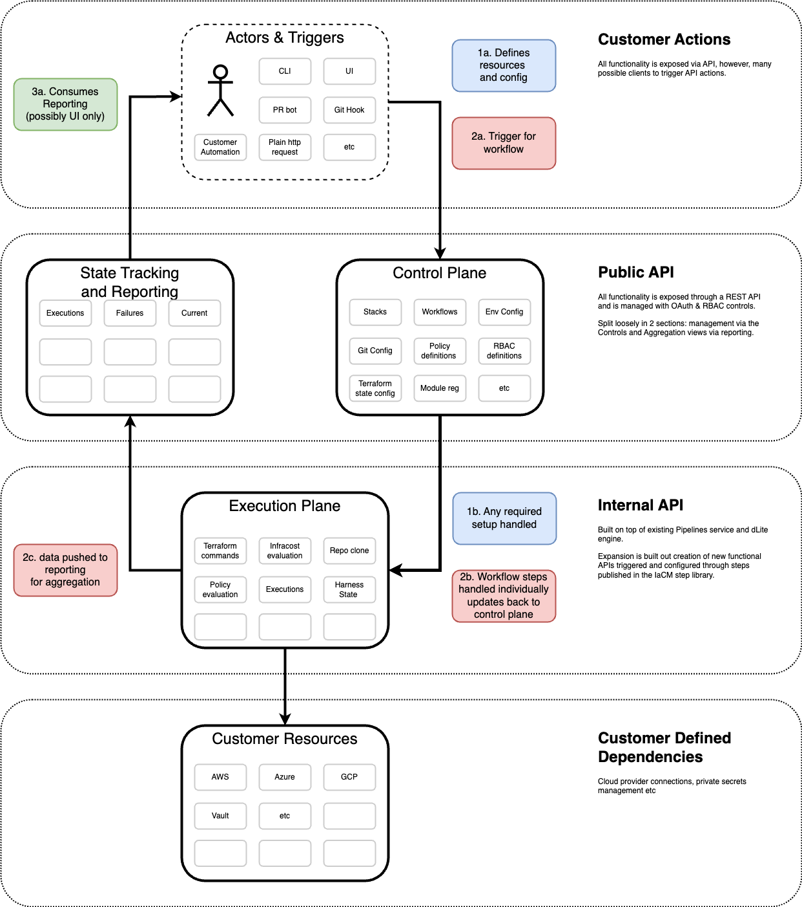
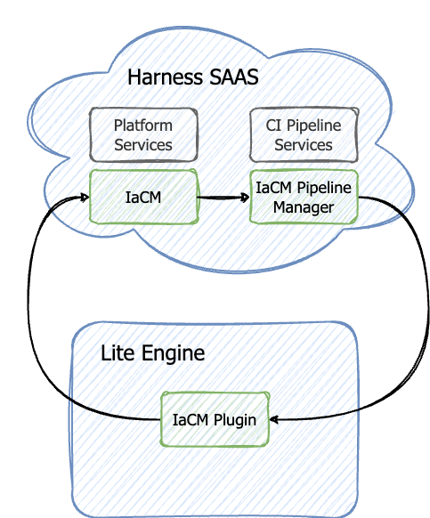
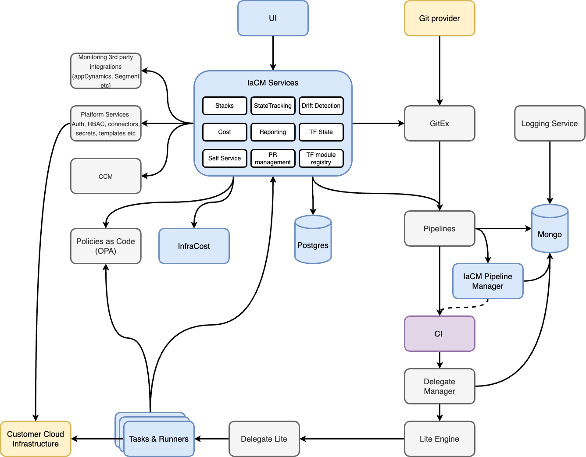

import Tabs from '@theme/Tabs';
import TabItem from '@theme/TabItem';

# IaCM Architecture

Infrastructure as Code Management architecture the following:

- **Control Plane:** handles resource definition and functionality config management.
- **Execution Plane:** based on definitions handles the running of tasks.
- **Reporting and Dashboards:** aggregations of system activity and changes.
- **Triggers:** Everything is driven through the API but multiple drivers: UI, git, CLI etc

The system is designed to be extensible with functionality being built through the combination of config and tasks executors. 

## Services

Harness Infrastructure as Code Management hosts its own service while integrating with Harness Platform Services and Harness CI Pipeline Services

IaCM utilizes three internal services:

### IaCM Server

### IaCM Pipeline Manager

### IaCM Plugin

## Extensive service map
The following service map highlights the architectural flow incorporating the following internal and external services:

Blue: IaCM-specific services

White: Harness Services external to IaCM

Yellow: External services including Code Repository and Cloud Provider Connectors

