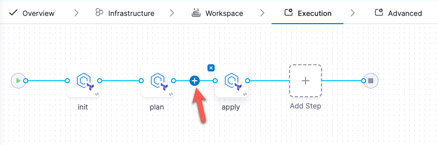

import Tabs from '@theme/Tabs';
import TabItem from '@theme/TabItem';

# IaCM onboarding guide

Welcome to the Harness Infrastructure as Code Management (IaCM) onboarding guide. This topic introduces you to the powerful capabilities of IaCM using Harness and guides you through key functionalities that streamline and secure your infrastructure management tasks.  


## What is IaCM?

Infrastructure as Code (IaC) enables the automated management and provisioning of infrastructure through machine-readable definition files. Infrastructure as Code Management (IaCM) extends this by focusing on the oversight and enhancement of IaC practices, ensuring consistency, accountability, and repeatability across deployments. Harness enhances IaCM with features like real-time cost estimation, automated policy enforcement, and drift detection, ensuring that your infrastructure is provisioned efficiently and complies with organizational standards and budget constraints.

### Prerequisites

Before beginning the walkthroughs in this guide, ensure you have:

- Access to a Harness account.
- Access to a Git provider with your OpenTofu or Terraform file.  
- Access to a Cloud Provider such as AWS or Google Cloud Platform.
- An [organization and project set up](https://developer.harness.io/docs/platform/organizations-and-projects/create-an-organization) on the Harness Platform.

### Sample Terraform

The following example Terraform (.tf) file declares:

- Provider Configuration: Specifies the AWS provider and sets the region to "us-east-1". Go to [AWS Regions & Availability Zones](https://docs.aws.amazon.com/AmazonRDS/latest/UserGuide/Concepts.RegionsAndAvailabilityZones.html) for a complete region list.
- Resource Definition: Creates an EC2 instance with the identifier `my_first_ec2_instance`.
- AMI: Utilizes ami-123abc321cba18, go to [AWS EC2 User Guide](https://docs.aws.amazon.com/AWSEC2/latest/UserGuide/finding-an-ami.html) to find your AMI image ID.
- Instance Type: Configures the instance to use a t2.micro. Go to the [AWS t2 instances list](https://aws.amazon.com/ec2/instance-types/t2/).  
Tags: To facilitate easy identification and management within AWS resources, a tag name with the value `my_first_ec2_instance` is applied.

```hcl
provider "aws" {
  region = "us-east-1"
}

resource "aws_instance" "my_first_ec2_instance" {
  ami = "ami-123abc321cba18" 
  instance_type = "t2.micro" # Got to https://aws.amazon.com/ec2/instance-types/t2/ for a full T2 instance type list.
  
  tags = {
    Name = "my_first_ec2_instance"
  }
}
```

Go to [Terraform Documentation](https://developer.hashicorp.com/terraform/intro) or [OpenTofu Documentation](https://opentofu.org/docs/) for more information on currently supported Workspace types. 

## Create a workspace

A workspace is essentially a named environment or container that stores your Terraform configurations, variables, states, and other resources necessary to manage infrastructure. 

One of the fundamental pieces of the Workspace creation step is to configure a connection to your Cloud Provider and Code Repository through **Connectors** so it can compare the current and expected state of your infrastructure, and apply infrastructure updates when required via your Harness IaCM pipelines.

:::info
Harness recommends configuring your connector before creating your workspace, however, you can also add new connectors during the [Create Workspace flow](https://developer.harness.io/docs/infra-as-code-management/get-started/onboarding-guide#add-a-new-workspace).
:::

## Add connectors

To configure your connectors before you create a Workspace, go to the following interactive guides:

<Tabs>
<TabItem value="Cloud Provider connector">
  <iframe 
    src="https://app.tango.us/app/embed/3d7ee504-7664-4805-a93c-5796b3db939b" 
    title="Set up a Cloud Provider Connector for Harness IaCM" 
    style={{minHeight:'640px'}}
    width="100%" 
    height="100%" 
    referrerpolicy="strict-origin-when-cross-origin" 
    frameborder="0" 
    webkitallowfullscreen="webkitallowfullscreen" 
    mozallowfullscreen="mozallowfullscreen" 
    allowfullscreen="allowfullscreen"></iframe>
</TabItem>
<TabItem value="Git repository connector">
  <iframe 
    src="https://app.tango.us/app/embed/33ce65a9-69bb-418d-9328-cd5198dcf6e5" 
    title="Set up a Git Repository Connector for Harness IaCM" 
    style={{minHeight:'640px'}}
    width="100%" 
    height="100%" 
    referrerpolicy="strict-origin-when-cross-origin" 
    frameborder="0" 
    webkitallowfullscreen="webkitallowfullscreen" 
    mozallowfullscreen="mozallowfullscreen" 
    allowfullscreen="allowfullscreen"></iframe>
</TabItem>
<TabItem value="Step-by-step">

When adding any connector, start by:

1. Signing in to [app.harness.io](https://app.harness.io).
2. In the module pane, select **Infrastructure**.
3. Select **Project Setup**, and then select **Connectors**.
4. Select **New Connector**.
5. Select the appropriate Connector, e.g. Cloud Provider, Code Repository.

### Add a cloud provider connector
Using AWS as an example, after following the initial five steps to reach the Connectors panel:

1. Select **AWS**.
2. Name your connector and select **Continue**.
3. Add your Cloud Provider Access Key and Secret Key.

:::note
Your secret key can be stored in a secret manager (default: Harness Built-in Secret Manager).
:::

4. Select the Connectivity Mode.
    - Harness recommends selecting **Connect through Harness Platform**.
5. Continue to the final step to confirm your Cloud Provider connection is verified successfully.
6. Select **Finish**.

 Go to [Connect your Cloud Provider](https://developer.harness.io/docs/category/cloud-providers) for more information regarding connecting your Cloud Provider.

### Add a Git repository connector

Using GitHub as an example, after following the initial five steps to reach the Connectors panel:

1. Select **GitHub**.
2. Name your connector and select **Continue**.
3. Select **Repository** and add your GitHub Repository URL.
4. In the Credentials step, add your GitHub Username.
5. Select **Create or Select a Secret**.
    - Go to [Manage your Personal Access Tokens (PAT)](https://docs.github.com/en/enterprise-server@3.9/authentication/keeping-your-account-and-data-secure/managing-your-personal-access-tokens) for more information on finding or generating a GitHub secret.
6. Select **New Secret Text**, then enter your **Secret Name** and **Secret Value**.
7. Select **Save**.
8. Select **Enable API access**.
9. Under API Authentication, select **Create or Select a Secret** and choose the secret you created in Step 5.
10. Apply the selected secret and continue.
11. Select the Connectivity Mode.
    - Harness recommends selecting **Connect through Harness Platform**.  
12. Continue to the final step to confirm your GitHub connection is verified successfully.
13. Select **Finish**.

Go to [Connect your Code Repository](https://developer.harness.io/docs/platform/connectors/code-repositories/connect-to-code-repo) for more information regarding connecting your Code Repository.
</TabItem>
</Tabs>

:::info OIDC Connectors
For ease of access and control over aspects like expiring tokens, consider adding your connector using the **OIDC** (OpenID Connect) option in the **Credentials** panel from the above Add Connector steps.

Using OIDC allows your connector to assume a role and its permissions set in your Cloud Provider configuration meaning that permissions can only be updated via the Cloud Provider by authorized users.

Go to the **Use OIDC** tab [Cloud platform connectors reference](https://developer.harness.io/docs/platform/connectors/cloud-providers/ref-cloud-providers/aws-connector-settings-reference/#credentials) for more information.
:::
---

:::tip migrate existing projects
For first-time use, use our [migration tool](https://developer.harness.io/docs/infra-as-code-management/remote-backends/state-migration) to create new workspaces and import your existing Terraform projects into the Harness Platform.
:::

## Add a new workspace

Once you have configured your connectors, you can create a Workspace and select them in the New Workspace panel:

1. In the module pane, select **Infrastructure**.
2. Select an existing project or create a new project.
3. Select **Workspaces**, and then select **New Workspace**.
4. Select **Create new Workspace**.

Complete the fields as follows:

- **Name** - Type a unique name to identify the Workspace.
- **Description**: Type an optional description to help identify the Workspace.
- **Connector**: Select the connector to use during provisioning.
- **Workspace Type**: Select the IaC type you want to use. IaCM currently supports Terraform and OpenTofu.
- **Terraform Version**: Select the OpenTofu/Terraform version the configuration supports. This version determines which version of Terraform to use during execution. Currently, Harness IaCM only supports the open-source versions of Terraform (all versions up to 1.5.7).    
- **Repository**: Specify the Git configuration for the Terraform configuration files. You should specify the Harness Git connector, repository branch, and file path to the configuration files in the repository.
5. Select **Add workspace details**.
6. Select **Save**.  

Now that you have set up your Workspace, you can proceed to add a new pipeline.

<details>
<summary>Add connectors while creating a workspace</summary>
  <iframe 
      src="https://app.tango.us/app/embed/d267f7c8-767f-4f14-b382-7b20c96a8e08" 
      title="Set up a Git Repository Connector for Harness IaCM" 
      style={{minHeight:'640px'}}
      width="100%" 
      height="100%" 
      referrerpolicy="strict-origin-when-cross-origin" 
      frameborder="0" 
      webkitallowfullscreen="webkitallowfullscreen" 
      mozallowfullscreen="mozallowfullscreen" 
      allowfullscreen="allowfullscreen"></iframe>
</details>
  
---

## Add a Pipeline

A pipeline allows you to lay out a workflow from one point to another with as many steps as necessary to carry out specific tasks like planning infrastructure changes, enforcing policies, or ensuring approval before proceeding to the next step. Go to [Harness Pipelines](https://developer.harness.io/docs/category/pipelines) for more information.

The following sections highlight how to add a pipeline through the Harness Platform, but it also supports a code-first approach with options to [Write pipelines in YAML](https://developer.harness.io/docs/platform/pipelines/harness-yaml-quickstart).

### Provision with Cost Estimation

:::info
You can include cost estimation as part of the workspace setup and in conjunction with the Provision operation in your pipeline. This is part of the `terraform plan` step in your pipeline, which provides you with an approximate cost of the infrastructure changes you are making.
:::

<Tabs>
  <TabItem value="Interactive guide">
    <iframe 
      src="https://app.tango.us/app/embed/ca925494-e35b-4ddc-af6f-a881197da980" 
      title="Creating an IaCM Provision Pipeline" 
      style={{minHeight:'640px'}}
      width="100%" 
      height="100%" 
      referrerpolicy="strict-origin-when-cross-origin" 
      frameborder="0" 
      webkitallowfullscreen="webkitallowfullscreen" 
      mozallowfullscreen="mozallowfullscreen" 
      allowfullscreen="allowfullscreen"></iframe>
  </TabItem>
  <TabItem value="Step-by-step">
  Start by adding the pipeline:

  1. Select the **Infrastructure** module.
  2. Select **Pipelines**, then select **Create a Pipeline**. 
  3. Enter a **Name**, then select **Start**.
      - This will create a blank pipeline for you to add stages to.
  4. Click **Add Stage** and select **Infrastructure**.
  5. **Name** the stage to describe what it should do, then select **Set Up Stage**.  
  6. Go to the **Workspace** and select the Workspace you want the pipeline to run on.
      Remember, the Workspace is configured with your Git and Cloud Provider connectors, which will determine where your infrastructure changes are applied.
  7. Go to the **Execution**, where a selection of **Operations** will be presented.  
  8. Select **Provision**, then select **Use Operation**.
  9. Select **Save**.
  </TabItem>
</Tabs>
  

The Provision operation adds three Terraform plugin steps: `init`, `plan`, and `apply`. Go to [Terraform Plugins](https://developer.harness.io/docs/infra-as-code-management/pipelines/iacm-plugins/terraform-plugins) for more information about Terraform commands.

### Add an Approval step

You can add the Approval step to prompt a review of the previous pipeline before proceeding to the next. The most common use case would be to add the Approval step between the `plan` and `apply` steps to ensure you are happy with the infrastructure changes and estimated costs (if `cost estimation` is enabled on your Workspace) that come with them before applying them.

1. From the Pipeline > **Execution** tab, click on **+** between `plan` and `apply`.  



2. Click **Add Step**.
3. Under **IACM**, select **IACM Approval**.
4. Name the approval step and click **Apply Changes**.
5. Select **Save**, then **Run** your pipeline.

## Conclusion

This onboarding guide has introduced you to the essential functionalities and initial setup processes of Harness Infrastructure as Code Management (IaCM). Through this guide, you have explored the essentials of managing and provisioning infrastructure using IaCM, from creating workspaces to configuring pipelines.

For a deeper understanding of setting up your projects and analyzing their performance, Harness recommends reviewing the [Project Setup guides](https://developer.harness.io/docs/category/project-setup) and the [Reporting & Insights guides](https://developer.harness.io/docs/category/reporting--insights). These resources are designed to support your continued learning and to help you maximize the effectiveness of your infrastructure management strategies with Harness.
