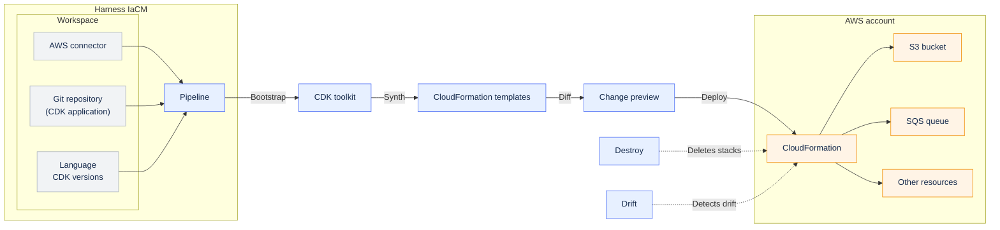

import Tabs from '@theme/Tabs';
import TabItem from '@theme/TabItem';

[AWS Cloud Development Kit (CDK)](https://docs.aws.amazon.com/cdk/v2/guide/home.html) lets you define AWS infrastructure using a general-purpose programming language instead of a domain-specific language such as HCL. During deployment, CDK synthesizes your application into [AWS CloudFormation](https://docs.aws.amazon.com/AWSCloudFormation/latest/UserGuide/Welcome.html) templates, and CloudFormation provisions and manages the underlying AWS resources. The following diagram illustrates the CDK deployment workflow in Harness IaCM. A workspace provides the AWS connector, Git repository, and CDK configuration that a pipeline uses to synthesize your application into CloudFormation templates and deploy the resulting stacks to your AWS account.



:::info
CloudFormation manages the deployed infrastructure state for CDK applications. Unlike Terraform and OpenTofu workspaces, CDK workspaces do not use a Harness-managed state file. CloudFormation tracks deployed resources and automatically rolls back a stack if a deployment fails. Harness records deployment activity and stack-level results.
:::

CDK supports AWS only. To provision infrastructure on other cloud providers, use Terraform or OpenTofu.

This page covers AWS CDK provisioning in **Infrastructure as Code Management (IaCM)**. To use AWS CDK as part of a **Continuous Delivery (CD)** pipeline, go to [CD CDK provisioning steps](/docs/continuous-delivery/cd-infrastructure/aws-cdk/aws-cdk-provisioning).

---

## What you will learn

By the end of this page, you will be able to:

- Understand how CDK deployments work in Harness IaCM.
- Understand the CDK deployment lifecycle and CloudFormation stacks.
- Create an AWS connector and a Git repository for a CDK application.
- Create a CDK workspace and configure the programming language and CDK versions.
- Configure the CDK plugin environment variables and run a deployment pipeline.

---

## The CDK deployment lifecycle

A CDK pipeline runs a sequence of steps that correspond to the phases of the AWS CDK workflow. The workspace provides the AWS connector, source repository, and variables that those steps use. After the pipeline deploys your infrastructure, you can view the provisioned resources and activity history in the workspace.

| Phase | What it does |
| --- | --- |
| **Bootstrap** | Provisions the CDK toolkit resources required to deploy your application, including an [Amazon S3](https://docs.aws.amazon.com/AmazonS3/latest/userguide/Welcome.html) bucket for CloudFormation assets and an [Amazon ECR](https://docs.aws.amazon.com/AmazonECR/latest/userguide/what-is-ecr.html) repository for container image assets. Bootstrap is a one-time operation for each AWS account and Region. |
| **Synth** | Compiles each stack in your CDK application into a corresponding AWS CloudFormation template. If the application contains errors, the **Synth** step fails before any AWS resources are created or updated. |
| **Diff** | Compares the synthesized CloudFormation templates with the currently deployed **CloudFormation stacks** and shows the changes that will be applied. Because CDK deployments are incremental, only the detected changes are deployed. |
| **Deploy** | Applies the changes identified during the Diff step to provision or update your infrastructure. Harness records the deployment results and activity history for each stack in the workspace. |
| **Drift** | Compares the deployed CloudFormation stacks with the expected state defined by your CDK application using the [CloudFormation drift detection API](https://docs.aws.amazon.com/AWSCloudFormation/latest/UserGuide/using-cfn-stack-drift.html). Drift detection runs on demand and reports resources that were modified outside of CDK. |
| **Destroy** | Deletes the CloudFormation stacks and the AWS resources managed by the workspace. After the **Destroy** operation completes, the resources are also removed from the workspace resource mapping. The workspace itself remains available for future deployments. |

Bootstrap is idempotent. Once the toolkit exists, later runs detect it and proceed without re-bootstrapping, so you can leave the **Bootstrap** step in the pipeline.

Go to [CDK pipeline steps](/docs/infra-as-code-management/iac-provisioners/cdk/cdk-pipeline-steps) to read the full reference on each step, single-stack destroy, and stack targeting.

---

## Stacks

A CDK application defines one or more stacks. Each stack maps to an AWS CloudFormation stack and is the unit of deployment. Harness provisions, updates, and destroys all resources in a stack together.

- A resource belongs to the stack that you pass as its parent scope in your CDK application. Stack membership is defined in code and does not depend on the deployment that created the resource.
- **Deploy** and **Destroy** are deployment operations, not part of your CDK application. You define stacks in code and then run deploy or destroy operations against those stacks.
- List the stacks in your application's entry point. To add a stack, define a new stack class and instantiate it in your application's entry point, such as `app.py` for Python.

By default, a CDK deployment provisions every stack in the application. To deploy a subset of stacks, specify the target stack in the pipeline step or set the `PLUGIN_AWSCDK_STACKS` environment variable.

:::warning
Rename stacks with care. The stack ID determines the CloudFormation stack name. If you change the stack ID, CloudFormation creates a new stack instead of updating the existing one. The original stack and its resources remain in your AWS account, but Harness no longer tracks those stacks, so they no longer appear in the workspace.

Removing a stack from your CDK application stops Harness from managing that stack, but does not delete the CloudFormation stack or its resources. To remove those resources, run a destroy operation or delete the stack from the AWS CloudFormation console.
:::

---

## Before you begin

Before you create a CDK workspace, ensure you have the following:

- **IaCM permissions:** View, Create, and Execute permissions for IaCM pipelines. Go to [RBAC in Harness](/docs/platform/role-based-access-control/rbac-in-harness) to configure roles.
- **AWS account access:** Permissions to create CloudFormation stacks, Amazon S3 buckets, Amazon ECR repositories, and IAM roles for bootstrapping, along with permissions to provision the AWS resources defined in your CDK application.
- **A Git repository:** A Harness Code repository or a supported third-party Git provider that contains your CDK application.

---

## Create an AWS connector

The AWS connector authenticates Harness to your AWS account. Go to [AWS Connector Authentication](/docs/infra-as-code-management/configuration/connectors-and-variables/aws-connector-auth) to review authentication methods and configuration.

:::info
The connector **Test Region** only validates credentials. The Region that CDK deploys to comes from the `PLUGIN_AWS_REGION` workspace variable that you set later.
:::

---

## Add your CDK application to a repository

Your repository needs a CDK application with a `cdk.json` file at the root of the application folder, your code, and a dependency file (`requirements.txt`, `package.json`, `pom.xml` or `build.gradle`, or `go.mod`). Note the folder path from the repository root to `cdk.json`, because you enter it when you create the workspace. A Harness Code repository is the simplest option, because there is no external connector or token to configure.

<Tabs>
<TabItem value="python" label="Python" default>

Save the following as `app.py`, with a `cdk.json` that contains `{ "app": "python3 app.py" }`.

```python
import aws_cdk as cdk
from aws_cdk import aws_s3 as s3, aws_sqs as sqs, Stack, Duration, RemovalPolicy
from constructs import Construct

class MyFirstStack(Stack):
    def __init__(self, scope: Construct, construct_id: str, **kwargs) -> None:
        super().__init__(scope, construct_id, **kwargs)
        s3.Bucket(self, "MyBucket", versioned=True, removal_policy=RemovalPolicy.DESTROY)
        sqs.Queue(self, "MyQueue", visibility_timeout=Duration.seconds(300))

app = cdk.App()
MyFirstStack(app, "MyFirstStack")
app.synth()
```

</TabItem>
<TabItem value="typescript" label="TypeScript">

Save the following as `bin/app.ts`, with a `cdk.json` that contains `{ "app": "npx ts-node --prefer-ts-exts bin/app.ts" }`, plus a `package.json` (with `aws-cdk-lib` and `constructs`) and a `tsconfig.json`.

```typescript
import * as cdk from 'aws-cdk-lib';
import { Stack, StackProps, Duration, RemovalPolicy } from 'aws-cdk-lib';
import * as s3 from 'aws-cdk-lib/aws-s3';
import * as sqs from 'aws-cdk-lib/aws-sqs';
import { Construct } from 'constructs';

class MyFirstStack extends Stack {
  constructor(scope: Construct, id: string, props?: StackProps) {
    super(scope, id, props);
    new s3.Bucket(this, 'MyBucket', { versioned: true, removalPolicy: RemovalPolicy.DESTROY });
    new sqs.Queue(this, 'MyQueue', { visibilityTimeout: Duration.seconds(300) });
  }
}

const app = new cdk.App();
new MyFirstStack(app, 'MyFirstStack');
app.synth();
```

</TabItem>
</Tabs>

---

## Create the CDK workspace

A [workspace](/docs/infra-as-code-management/workspaces/create-workspace) is a named environment that ties together the Git repository, AWS connector, and language settings that a pipeline uses. Complete the following steps to create a new workspace for AWS CDK.

1. In Harness, navigate to the IaCM module and select the **Workspaces** tab.
2. Click **New Workspace**, then select **Start from scratch**.
3. In the **About workspace** panel, enter a unique **Name** for the workspace, and optionally a **Description** and **Tags**. Then click **Next**.

   

4. In the **Configure repository details** panel, enter the following details to point the workspace at the repository that holds your CDK application, then click **Next**.

   - **Git provider:** [Harness Code Repository](/docs/code-repository) or a third-party Git provider.
   - **Git Connector:** For a third-party provider, select or create the Git connector. Harness Code repositories do not require a separate connector.
   - **Git Fetch Type:** Latest from branch, Git tag, or Commit SHA.
   - **Git Branch:** The branch to fetch, for example `main`. You can set this to a runtime input or a [JEXL expression](/docs/platform/variables-and-expressions/harness-variables).
   - **Folder Path:** The path from the repository root to the folder that contains `cdk.json`. Use `.` if it is at the root.

   

5. In the **Provisioner** panel, enter the following details to configure the AWS connector and the CDK runtime, then click **Create**.

   - **Connector:** Your [AWS connector](/docs/infra-as-code-management/configuration/connectors-and-variables/aws-connector-auth).
   - **Workspace Type:** AWS CDK.
   - **AWS CDK version:** The CDK CLI version to run.
   - **Programming Language:** Python, TypeScript, JavaScript, Java, or Go.
   - **Language Version**, **Package Manager**, and **Package Manager Version:** The runtime and package manager that Harness installs for the selected language.

   

   :::info
   Harness installs the language runtime and package manager at pipeline execution time based on these fields, rather than from a pre-baked Docker image. Each run uses exactly the versions you specify.
   :::

6. Optionally, select a preset variable set in the **Add Variable Set** panel.

   

7. Click **Create**. The workspace appears in your **Workspaces** list. Use the workspace's [Connectors and Variables tab](/docs/infra-as-code-management/workspaces/workspace-tabs) to set the required CDK plugin environment variables.

---

## Languages and version management

CDK compiles to CloudFormation regardless of language. Harness IaCM supports Python, TypeScript, JavaScript, Java, and Go.

| Language | Typical package manager | Dependency file |
| --- | --- | --- |
| Python | pip | `requirements.txt` |
| TypeScript | npm | `package.json` |
| JavaScript | npm | `package.json` |
| Java | Maven | `pom.xml` |
| Go | Go modules | `go.mod` |

Two independent versions are involved: the CDK CLI version (the workspace **AWS CDK version**, for example `2.1108.0`) and the CDK library version (`aws-cdk-lib` in your dependency file). The CDK library writes a synthesized application using a cloud assembly schema version, and each CDK CLI version supports schema versions only up to a certain point.

:::caution
Pin the library to a version that the CLI supports. CDK CLI `2.1108.0` supports cloud assembly schema versions up to 53. `aws-cdk-lib` 2.250.0 emits schema 53 and works with this CLI. A newer library such as 2.261.0 emits schema 54 and requires CDK CLI `2.1130.0` or newer. If you leave the library unpinned, the package manager installs the newest release, which can be too new for the CLI you select, and pipeline execution fails with a Cloud Assembly schema mismatch.
:::

A Python `requirements.txt` pinned to a version compatible with CDK CLI 2.1108.0:

```text
aws-cdk-lib==2.250.0
constructs>=10.0.0,<11.0.0
```

---

## CDK plugin environment variables

CDK pipeline steps run in a containerized environment that uses a `PLUGIN_` prefix convention for environment variables. Set them on the workspace **Connectors and Variables** tab, or as stage, pipeline, or step variables.

:::caution
Use the `PLUGIN_`-prefixed variables, not the standard AWS variables. Standard AWS environment variables such as `AWS_REGION` or `AWS_DEFAULT_REGION` are not recognized by the IaCM plugin. If a deploy targets the wrong Region or fails with STS endpoint errors, confirm that you set `PLUGIN_AWS_REGION` rather than `AWS_REGION`.
:::

| Variable | Required | Description |
| --- | --- | --- |
| `PLUGIN_AWS_REGION` | Yes | Target AWS Region for the deployment (for example `us-east-1`). CDK steps need this to know where to deploy. |
| `PLUGIN_AWSCDK_STACKS` | No | Comma-separated logical stack IDs when you want the run to process specific stacks (for example `SQSStack,S3Stack`). Omit to process every stack. |
| `PLUGIN_AWS_SESSION_DURATION` | No | Duration for AWS session tokens. The default is `15m`. Raise it for long deploys. |
| `PLUGIN_CONNECTOR_REF` | No | Override the connector reference at the step level. |

You can still target a single stack from the pipeline UI using the **Stack Path** field on CDK steps; use `PLUGIN_AWSCDK_STACKS` when you want to drive a comma-separated list from variables or YAML.

Go to [AWS Connector Authentication](/docs/infra-as-code-management/configuration/connectors-and-variables/aws-connector-auth#cloud) to review the full list of `PLUGIN_` variables and credential types.

---

## Run the deploy pipeline

Complete the following steps to run your first AWS CDK deploy pipeline.

1. In Harness, navigate to the IaCM module and select the **Pipelines** tab.
2. Click **Create a Pipeline**.
3. Enter a **Name** for your pipeline, for example **AWS Deploy**.
4. Select **Inline** for **Pipeline Storage** to store the configuration in Harness. You can also store pipelines in Git using **Remote** storage. Go to the [Pipelines documentation](/docs/category/pipelines) for details.
5. In the Pipeline Studio, click the **Add Stage** icon, then select the **Infrastructure** stage type. Go to [Add a Stage](/docs/platform/pipelines/add-a-stage#add-a-stage) to configure the stage.
6. Select the **Execution** tab.
7. In the **Execution Strategies** panel, select **AWS CDK** as the provisioner and **Deploy** as the operation, and then click **Use Strategy**. This creates a pipeline with the **Bootstrap**, **Synth**, **Diff**, and **Deploy** steps in order. Go to [CDK pipeline steps](/docs/infra-as-code-management/iac-provisioners/cdk/cdk-pipeline-steps) to understand each step in detail.

   

8. Click **Save**, then **Run**.

---

## Add governance

You can add policy enforcement, approvals, and drift detection to a CDK pipeline. These are shared IaCM features with CDK-specific behavior.

- **OPA policies:** Evaluate policies against the synthesized CloudFormation template before deploy. Go to [OPA Policies](/docs/infra-as-code-management/policies-governance/opa-workspace) to configure policy enforcement.
- **Approvals:** Gate a deployment with the IaCM Approval step between diff and deploy. Go to [Approval step](/docs/infra-as-code-management/pipelines/operations/approval-step) to add approval gates.
- **Drift detection:** Compare deployed stacks against your CDK definition. Go to [Drift detection](/docs/infra-as-code-management/pipelines/operations/drift-detection) to run drift checks.

---

## Related concepts

- Go to [CDK pipeline steps](/docs/infra-as-code-management/iac-provisioners/cdk/cdk-pipeline-steps) to read the full reference for the bootstrap, synth, diff, deploy, destroy, and drift steps.
- Go to [AWS Connector Authentication](/docs/infra-as-code-management/configuration/connectors-and-variables/aws-connector-auth) to review authentication methods and IAM permissions required for CDK workspaces.
- Go to [OPA Policies](/docs/infra-as-code-management/policies-governance/opa-workspace) to configure policy enforcement on synthesized CloudFormation templates.
- Go to [Approval step](/docs/infra-as-code-management/pipelines/operations/approval-step) to gate a CDK deploy on a human review of the diff output.
- Go to [Drift detection](/docs/infra-as-code-management/pipelines/operations/drift-detection) to review where drift results are reported and how to resolve them.
- Go to [Create a workspace](/docs/infra-as-code-management/workspaces/create-workspace) to manage workspace settings, variables, and connectors.
