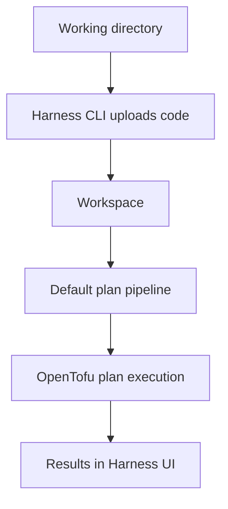

import { Troubleshoot } from '@site/src/components/AdaptiveAIContent';

You can validate OpenTofu changes locally by using the Harness CLI. Instead of running `tofu plan` on your machine, Harness uploads your working directory and executes the plan using the OpenTofu version, state backend, and workspace configuration associated with your OpenTofu workspace. Pipeline logs display a "Remote Execution" message to indicate the plan ran against your local code rather than a Git repository.

---

## What you will learn

- How local CLI plans work with OpenTofu workspaces
- Which OpenTofu version and state backend Harness uses during plan execution
- What remains the same and what changes between local CLI plans and Git-triggered plans
- Where to find plan results after execution

---

## How local CLI plans work

When you run `harness iacm plan` from your local machine, the following workflow executes:

<div style={{textAlign: 'center'}}>



</div>

Each step in this workflow:

1. **Working directory:** The CLI uploads your current working directory contents to Harness temporary storage.
2. **Harness CLI uploads code:** Your local files are transferred to Harness.
3. **Workspace:** Harness identifies which OpenTofu workspace to use based on the command flags or `.harness/workspace.yaml` configuration.
4. **Default plan pipeline:** The workspace's configured default plan pipeline is triggered automatically.
5. **OpenTofu plan execution:** The pipeline executes the plan using the workspace's configured OpenTofu version and remote state backend.
6. **Results:** Plan output appears in the Harness UI pipeline logs.

The primary difference from a Git-triggered plan is the source of the configuration code. Local CLI plans use your working directory, while Git-triggered plans pull from a repository. The OpenTofu version, state backend, and workspace configuration remain the same in both cases.

---

## Local CLI plan vs Git-triggered plan

The following table shows what stays the same and what changes between local CLI plans and Git-triggered pipeline runs:

| Aspect | Local CLI plan | Git-triggered plan |
|--------|---------------|-------------------|
| Code source | Working directory | Git repository |
| OpenTofu version | Workspace version setting | Workspace version setting |
| State backend | Workspace remote state | Workspace remote state |
| Workspace configuration | Workspace connectors and secrets | Workspace connectors and secrets |
| Workspace variables | Workspace variables | Workspace variables |

From the perspective of OpenTofu execution, the primary difference is the source of the configuration code. The OpenTofu version, state backend, and workspace configuration remain the same. This means you can iterate quickly on local code while maintaining the same execution environment as your Git-triggered pipeline runs.

---

## Run a local plan

Run the following command from the root of your OpenTofu working directory:

```bash
harness iacm plan --org-id <org-id> --project-id <project-id> --workspace-id <workspace-id>
```

:::info Prerequisites
Before you run a local plan, make sure you have a [default plan pipeline configured](/docs/infra-as-code-management/iac-provisioners/opentofu/default-pipelines) in your OpenTofu workspace and the [Harness CLI installed and authenticated](/docs/infra-as-code-management/cli-commands/cli-iacm-plan). Installing OpenTofu locally is optional because the plan executes remotely through Harness.
:::

Go to [Local CLI Plan](/docs/infra-as-code-management/cli-commands/cli-iacm-plan) for complete command reference, configuration options, authentication details, and limitations.

---

## How the workspace affects plan execution

When the default plan pipeline runs, Harness uses the OpenTofu version configured in your workspace settings. If you update the workspace OpenTofu version, subsequent local plans will use the new version.

The plan executes using the workspace configuration, including the configured state backend. Both local CLI plans and Git-triggered pipeline runs use the same workspace configuration, ensuring consistency across execution types.

The plan uses the connectors and secrets configured for the workspace. This means you do not need to store provider credentials on your local machine to run plans.

---

## Review results

After the pipeline completes, go to the execution URL printed by the CLI command to view the plan output. The pipeline logs display the full plan output, including resource additions, modifications, and deletions.

---

## Troubleshooting

<Troubleshoot
  issue="OpenTofu Local CLI plan fails in remote execution with missing provider credentials in Harness IaCM"
  mode="docs"
  fallback="The remote plan uses secrets stored in the workspace, not your local environment variables. Verify the workspace has the required provider credentials configured as connectors or secrets."
/>

---

## Next steps

As your infrastructure grows, you may need to reorganize workspaces or transfer resource ownership between teams. Learn how to migrate resources between workspaces without recreating infrastructure.

Go to [Remove and import resources with OpenTofu](/docs/infra-as-code-management/iac-provisioners/opentofu/remove-import-resources) to transfer resource management between workspaces without downtime.
