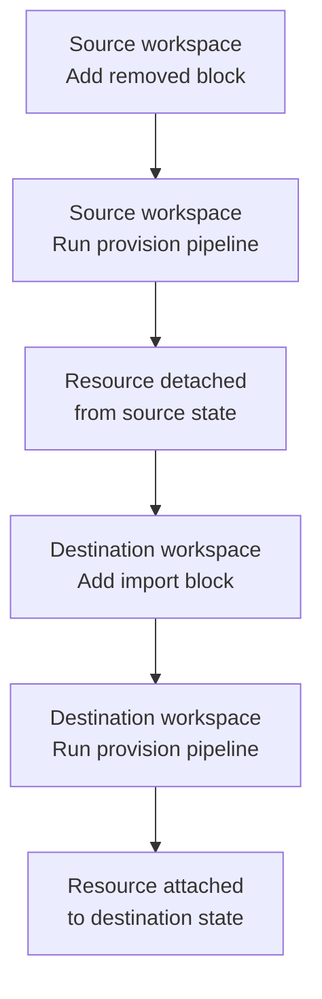

import { Troubleshoot } from '@site/src/components/AdaptiveAIContent';

OpenTofu 1.6+ provides declarative `import` blocks to bring existing infrastructure under OpenTofu management, and OpenTofu 1.7+ provides `removed` blocks to detach resources from state without destroying them. When you run a provision pipeline in Harness, OpenTofu processes these blocks as part of the pipeline execution and updates the workspace state stored in your remote backend.

One workspace can remove a resource from its state while another workspace imports the same resource into its state. The actual infrastructure remains running throughout the entire process.

---

## What you will learn

- OpenTofu version requirements for import and removed blocks
- How to transfer resource ownership between OpenTofu workspaces in Harness
- How to verify state changes after import or removal operations
- Where to find OpenTofu syntax documentation for these blocks

---

## Version requirements

| Block type | Minimum OpenTofu version | Purpose |
|-----------|-------------------------|---------|
| `import` | 1.6+ | Add existing infrastructure to OpenTofu state |
| `removed` | 1.7+ | Remove resources from state without destroying infrastructure |

Go to [What is supported](/docs/infra-as-code-management/whats-supported) to review the OpenTofu versions supported by Harness IaCM.

---

## Transfer resource ownership between workspaces

The most common workflow combines `removed` and `import` blocks to transfer resource management between workspaces without downtime. This is useful when reorganizing teams, splitting monolithic workspaces, or consolidating infrastructure management.

### Transfer workflow

<div style={{textAlign: 'center'}}>



</div>

The workflow has two phases:

1. **Remove from source workspace:**
   - Add a `removed` block to the source workspace configuration
   - Run a provision pipeline in the source workspace
   - The resource is removed from the source workspace state
   - The actual infrastructure remains running

2. **Import into destination workspace:**
   - Add an `import` block and resource configuration to the destination workspace
   - Run a provision pipeline in the destination workspace
   - The resource is added to the destination workspace state
   - The actual infrastructure remains running

**No infrastructure is created or destroyed during this process. Only the state files change.**

---

## Import resources into an OpenTofu workspace

Add an `import` block to your OpenTofu configuration and run a provision pipeline in Harness.

Example OpenTofu configuration:

```hcl
import {
  to = aws_instance.example
  id = "i-abcd1234"
}

resource "aws_instance" "example" {
  ami           = "ami-0c55b159cbfafe1f0"
  instance_type = "t2.micro"
}
```

When the provision pipeline runs, the plan output displays the import operation. During apply, OpenTofu adds the resource to the workspace state without modifying the actual infrastructure.

Go to [OpenTofu import documentation](https://opentofu.org/docs/language/import/) to learn about import block syntax and provider-specific ID formats.

---

## Remove resources from an OpenTofu workspace

Add a `removed` block to your OpenTofu configuration and run a provision pipeline in Harness.

Example OpenTofu configuration:

```hcl
removed {
  from = aws_instance.example
  lifecycle {
    destroy = false
  }
}
```

When the provision pipeline runs, the plan output displays the removal operation. During apply, OpenTofu updates the state file to remove the resource without making API calls to destroy infrastructure. The actual infrastructure remains running.

Go to [OpenTofu removed block documentation](https://opentofu.org/docs/language/resources/syntax/#removing-resources) to learn about removed block syntax and lifecycle options.

---

## Verify state changes

After running a provision pipeline with `import` or `removed` blocks, verify the state changes in the Harness UI.

### Resources tab

Go to the workspace **Resources** tab to view the current resource inventory. After the pipeline completes, verify that imported resources appear in the list and removed resources no longer appear.

### Pipeline logs

Review the plan and apply logs to see the import or removal operations. The plan output displays which resources will be imported or removed. The apply logs confirm the state update completed successfully.

### State file (advanced)

If you need to inspect the raw state, go to the workspace **State** tab to download the current state file. Imported resources appear in the state JSON. Removed resources do not appear in the state JSON.

---

## Next steps

If your organization requires private providers, air-gapped environments, or additional tooling beyond what the default images provide, you can build custom plugin images.

Go to [Custom images for OpenTofu](/docs/infra-as-code-management/iac-provisioners/opentofu/custom-images) to learn when and how to use custom images with OpenTofu workspaces.
