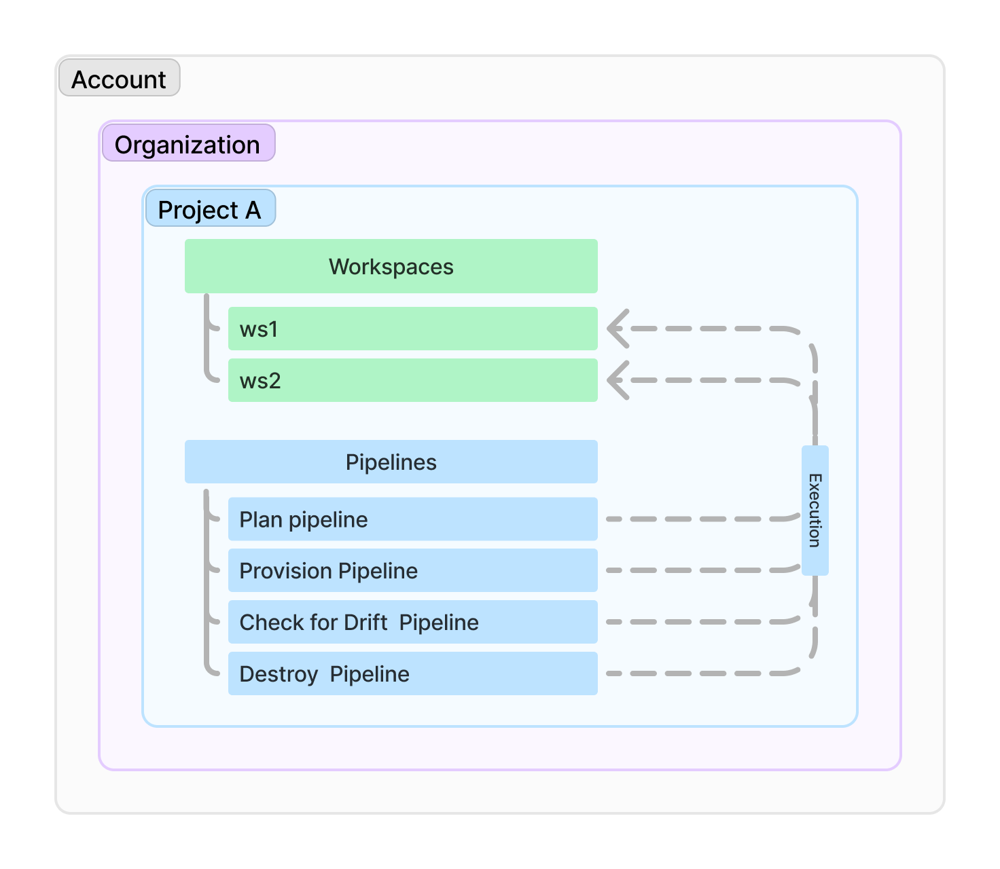

import HarnessApiData from '/src/components/HarnessApiData/index.tsx';

Harness Infrastructure as Code allows you to **define**, **deploy**, and **manage infrastructure across environments**, ensuring compliance and control.  

Key features include [cost estimation](/docs/infra-as-code-management/workspaces/cost-estimation), [approval steps](/docs/infra-as-code-management/pipelines/operations/approval-step), [PR automation](/docs/infra-as-code-management/pipelines/operations/pr-automation), [policy enforcement](/docs/infra-as-code-management/policies-governance/opa-workspace), and [drift detection](/docs/infra-as-code-management/pipelines/operations/drift-detection). These integrate seamlessly with other Harness modules and third-party services, enhancing your DevOps lifecycle.

This document provides best practices and guidelines to help you implement and manage IaCM effectively. It offers clear, actionable recommendations to optimize performance, strengthen security, and avoid common pitfalls.

## Workflow hierarchy

- **Account** is the root level, containing multiple Organizations.  
    - **Organizations** contain multiple Projects.  
        - **Projects** contain multiple Workspaces.  
            - **Workspaces** are isolated environments for IaC execution within a Project.
            - **Pipelines** are independent entities that can be executed against any Workspace within a Project.

### Supported IaC Frameworks
:::info opentofu / terraform
Harness IaCM currently supports integration with all **OpenTofu** versions<HarnessApiData
    query="https://app.harness.io/gateway/iacm/api/provisioners/supported/opentofu"
    token="process.env.HARNESS_GENERIC_READ_ONLY_KEY"
    fallback=""
    parse='.[-1] | " (latest: v\(.))"'></HarnessApiData>.
    
 For **Terraform**, we support all MPL versions up to **1.5.x**, any BSL versions (from 1.6.0) are not supported.
:::

### Configuration Guidelines
As a first step, we recommend you [configure your Cloud Provider and Code repository connectors](/docs/infra-as-code-management/get-started/#add-connectors) to streamline further configurations like workspace and pipeline creation so they can be easily selected.  

### OpenTofu / Terraform Authentication
To effectively authenticate OpenTofu or Terraform across different providers, it’s crucial to follow a consistent approach that aligns with the requirements of each provider while ensuring security and efficiency.

1. **Use Connectors When Available:** If the provider supports native integration with Harness (e.g., AWS, Azure, GCP), use the relevant [Harness connectors](/docs/infra-as-code-management/get-started/#add-connectors). These connectors provide secure and streamlined authentication, reducing the need for manual setup and environment configuration.
2. **Environment Variables and Secrets:** For providers that do not have native Harness connectors, you can manage authentication using environment variables and secrets. Ensure that sensitive credentials are securely stored using Harness Secret Manager or another secure secret management system.
3. **Custom Plugin Images:** If the provider has specific dependencies or custom configurations, use a [custom plugin image](/docs/infra-as-code-management/pipelines/plugin-images) to include the necessary tools and libraries. This approach allows for flexibility and tailored setups but requires maintaining the image to match provider updates and requirements.

Go to [What's supported](/docs/infra-as-code-management/whats-supported#supported-workspace-connectors) to see what cloud provider and code repository vendors are supported by Harness. 

## Recommended Workflows and Performance Optimization
### Reusable components
For general use cases to reduce unnecessary complexity and to optimize performance, we encourage reuse wherever possible.

Some reusable options can be to:
- Create reusable pipelines and set them as default pipelines to trigger quickly from any workspace within a project.
- Use [pipeline variables](/docs/infra-as-code-management/manage-projects/connectors-variables) to ensure consistency.
- Use built-in plugins such as [drift detection](/docs/infra-as-code-management/pipelines/operations/drift-detection), [PR automation](/docs/infra-as-code-management/pipelines/operations/pr-automation) and [IaCM Approval steps](/docs/infra-as-code-management/pipelines/operations/approval-step).
- Utilize [built-in OPA policies](/docs/infra-as-code-management/policies-governance/terraform-plan-cost-policy) to add protection and ensure your pipelines warn or fail if certain conditions are not met, e.g. if your total monthly infrastructure costs exceed a specified amount.
<!-- placeholder for module registry -->
<!-- placeholder for workspace templates -->

### Trade-offs and considerations
Harness seamlessly integrates with third-party services like external code repositories and secret managers, providing flexibility in tool choice. However, using Harness’s native services like [Harness Code Repository](docs/code-repository/) and [Harness Secret Manager](docs/platform/secrets/secrets-management/harness-secret-manager-overview/) can offer key performance and operational benefits.

- **Reduced Latency:** Avoids external API calls, leading to faster execution and reduced overhead.
- **Simplified Authentication:** Minimizes multiple authentication mechanisms, reducing complexity and potential security risks.
- **Streamlined Management:** Centralizes configuration, simplifying updates and secret rotation.
- **Enhanced Visibility:** Provides a single point of control for auditing and policy enforcement.
- **Reduced Dependencies:** Lowers reliance on external services, increasing system resilience.

## Limitations & Gotchas
Be aware of the following when working with IaCM:
- **AWS Connector via Delegates:** IAM role inheritance from delegates is not supported. If you need to assume roles, configure them directly in the connector.  
- **Feature-flagged functionality:** Some features are released behind feature flags. Pages covering these features should include a **Pending Release** banner until the feature is fully available in production.  
- **Delegate version requirements:** Certain features (such as module registry sync) may fail silently if your delegate is outdated. Always confirm you are running the latest delegate version to ensure support for new capabilities.  

## Security
- **Access Controls:** [Role-based access control (RBAC)](/docs/platform/role-based-access-control/rbac-in-harness/) lets you control who can access your resources and what actions they can perform on the resources. To do this, a Harness account administrator assigns resource-related permissions to members of user groups.
- **Secret Management:** Go to the [secret management page](/docs/category/secrets-management) to see all supported secret management option available in the Harness Platform and determine what option is best suited for your needs. As mentioned above, Harness offer integration with multiple secret management options but recommend [Harness secret manager](/docs/platform/secrets/secrets-management/harness-secret-manager-overview/) to help offer optimal performance.
- **OPA Policies:** Use [OPA policies](/docs/platform/governance/policy-as-code/harness-governance-overview/) to implement governance and trigger pipeline warnings or failures when policy conditions are not met. 

### State Management
- **Remote State Storage:** Use remote state backends like AWS S3, GCP Cloud Storage, or Azure Blob Storage for reliable and scalable state management. Ensure state files are stored securely and versioned to prevent accidental data loss or corruption. Go to [OpenTofu backend configuration](https://opentofu.org/docs/language/settings/backends/configuration/) for more information.
- **State Locking and Security:** Implement state locking to prevent multiple users or processes from modifying the state simultaneously, reducing the risk of conflicting changes and state corruption. For example, tools like OpenTofu or Terraform provide native support for state locking, typically using a shared backend like a database or cloud storage service. This ensures that only one operation can modify the state at a time, protecting the integrity of your infrastructure configurations.

### Error Handling and Debugging
- **Common Errors:** Common IaCM errors include misconfigurations, authentication failures, and resource conflicts. To troubleshoot these, check the error messages in your pipeline execution logs, which provide detailed information about the cause and location of the issue.
- **Pipeline Execution Logs:** Utilize pipeline execution history to view detailed logs for each pipeline run. These logs capture step-by-step execution details, making it easier to identify and resolve issues.

## Approval Processes in IaCM
Harness IaCM provides multiple layers of approval mechanisms to ensure secure and controlled infrastructure changes. Here's an overview of the available approval options:

### Access Control (RBAC)
Role-Based Access Control (RBAC) forms the foundation of approval processes in IaCM. Through workspace RBAC, you can **define who has permission to manage infrastructure resources** and **what actions they can perform**. This granular control ensures that only **authorized team members** can make changes to your infrastructure. Learn more about setting up access controls in our [Workspace RBAC configuration guide](/docs/infra-as-code-management/manage-projects/workspace-rbac).

### Pipeline Approval Steps
When you need additional oversight for infrastructure changes, you can add **manual approval steps** to your pipelines. These approval gates allow **designated team members to review and approve changes** before they're applied to your infrastructure. You can **configure who needs to approve changes** and **how long the system should wait for approvals**. See our guide on [implementing approval steps](/docs/infra-as-code-management/pipelines/operations/approval-step) to get started.

### PR Automation
Streamline your infrastructure change process by **automating pull request workflows**. PR automation helps **standardize how changes are proposed, reviewed, and merged** into your infrastructure code. This ensures **consistent review processes** and maintains a **clear audit trail** of all infrastructure modifications. Check out our documentation on [PR automation](/docs/infra-as-code-management/pipelines/operations/pr-automation) to learn how to set this up for your team.