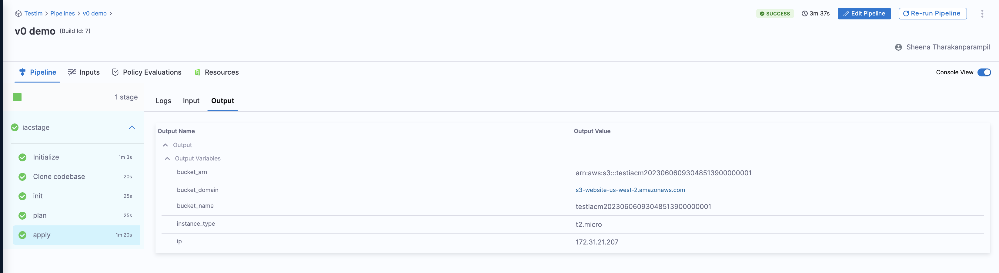
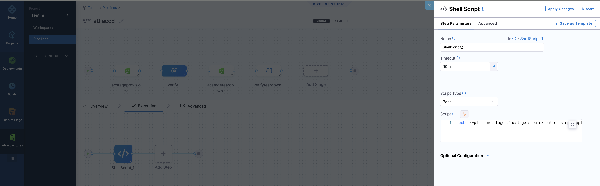

You may want to have a single pipeline that provisions or updates resources used during deployment. To do this, you need to create a pipeline with the following stages:

*  An IaCM stage to provision or update resources.

* A CD stage to perform deployments.

For information about CD stages, go to [CD steps, stages, and strategies](/docs/continuous-delivery/x-platform-cd-features/executions/stages-steps-strategies.md).

You can pass [variables](/docs/platform/12_Variables-and-Expressions/add-a-variable.md) from an IaCM pipeline to CD. For example, you might want to pass the Kubernetes namespace as a value. 

If you view an executed pipeline and select the **Apply** step, you will see that all the Terraform outputs are available as output expressions. You can copy an output expression and then use it in any subsequent step or stage in the pipeline, or even other pipelines.

The following example shows how to pass a variable from an IaCM stage to an another stage. If you are interested in using the "bucket_name" as an input, you either copy the current value or the path to the variables, meaning that the value will be fetched at runtime.

`<+pipeline.stages.iacstage.spec.execution.steps.apply.output.outputVariables.bucket_name>`

