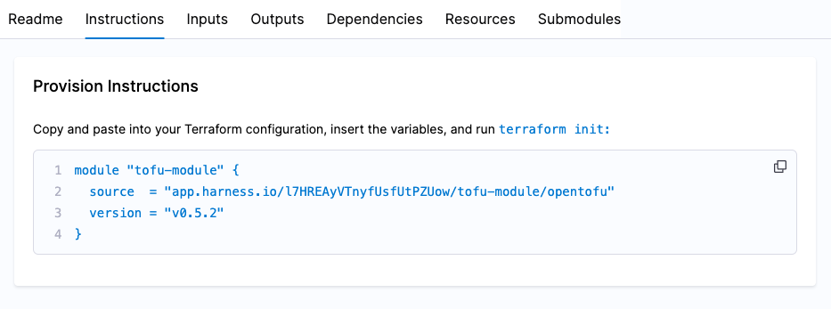

import Tabs from '@theme/Tabs';
import TabItem from '@theme/TabItem';

## Prerequisites
- A registered *tf* modules, to register a new module, go to [Register a module](https://developer.harness.io/docs/infra-as-code-management/iacm-features/module-registry#register-a-module)

Once your have registered your *tf* modules, Harness automatically parses the metadata from your connected repository, so your module information is readily available for re-use. 

## Registered module tabs
This document walks through each tab of a registered module, explaining its data, settings, and usage to help you configure and manage your module effectively.

:::note information source
The Module Registry compiles information from various files when a repository adheres to the standard module structure. 
:::

### Readme
The Readme tabs directly reflects and renders the `README.md` file in your modules connected repository.

### Instructions
The Instructions tab provides a code snippet that you can copy and integrate into your Tofu/Terraform code. This allows you to seamlessly incorporate the infrastructure defined in your module into your environment once the code is applied.



### Inputs
The inputs tab is populated from the `variables.tf` file. Here are some examples:

```hcl
    variable "aws-region" {
    description = "The AWS region to deploy resources"
    type        = string
    default     = "us-west-2"
    }

    variable "instance_type" {
    description = "EC2 instance type"
    type        = string
    default     = "t2.micro"
    }
```

### Outputs
The outputs tab is populated from the `outputs.tf` file. Example outputs might include:

```hcl
    output "instance_id" {
    description = "The ID of the EC2 instance"
    value       = aws_instance.example.id
    }

    output "public_ip" {
    description = "The public IP address of the instance"
    value       = aws_instance.example.public_ip
    }
```

### Dependencies
The dependencies tab is populated by your `versions.tf` file.

```hcl
    terraform {
    required_providers {
        aws = {
        source  = "hashicorp/aws"
        version = "~> 3.0"
        }
    }

    required_version = ">= 0.12"
    }
```

### Resources
Resources are defined within your Tofu/Terraform configuration files, which can be named according to your preference, though a common example is `main.tf`. These resources are applied when you [run your provision pipelines](https://developer.harness.io/docs/infra-as-code-management/use-iacm/provision-workspace). For example:

```hcl
    resource "aws_instance" "example" {
    ami           = "ami-0c55b159cbfafe1f0"
    instance_type = var.instance_type

    tags = {
        Name = "ExampleInstance"
    }
    }
```

### Submodules
The metadata of the submodules is extracted from your `modules` folder.

**Use cases:**

**Separation of concern:**
By breaking down a module into submodules, you can isolate specific functionality. For example:
    - A Kubernetes module could have submodules for managing:
    - Cluster setup.
    - Worker nodes.
    - Network policies.

**Versioning and dependency management:**
Submodules let you version and manage dependencies independently. For example:
    - If you update the networking submodule to include a new feature, it won’t impact the other submodules in the module unless explicitly updated.

**Customization and flexibility:**
Submodules can provide users with the flexibility to override or customize certain aspects. For example:
    - A cloud storage module might include submodules for S3 buckets, IAM roles, and lifecycle policies, allowing users to only configure the features they need.

## Top level overview
<Tabs>
<TabItem value="Interactive guide">
<DocVideo src="https://app.tango.us/app/embed/338cf3be-ddf5-4272-9178-fe3f84d815d4" title="Harness IaCM registered module overview" />
</TabItem>
<TabItem value="Step-by-step">

## Module versions
- Select the version dropdown, which corresponds with the Git tags from your module's code repository.
- Select a version to reflect the module's state at the selected point in time.

## Source code
- Select the `SOURCE CODE` link to navigate to the module's code repository.

## Sync button
The sync button fetches any new Git tags from the module's code repository and syncs them to the Harness IaCM registered module, making the tag/version available in the version dropdown.
</TabItem>
</Tabs>