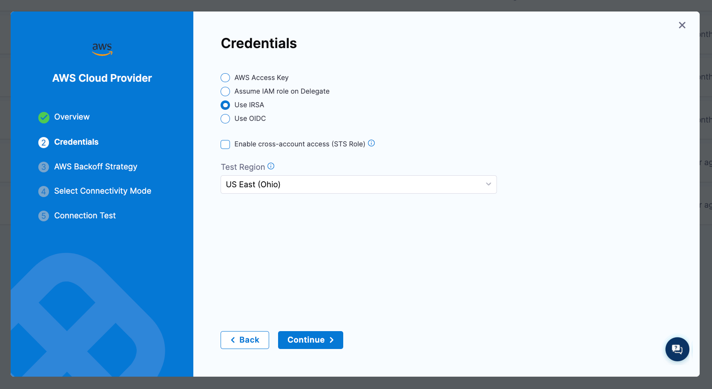
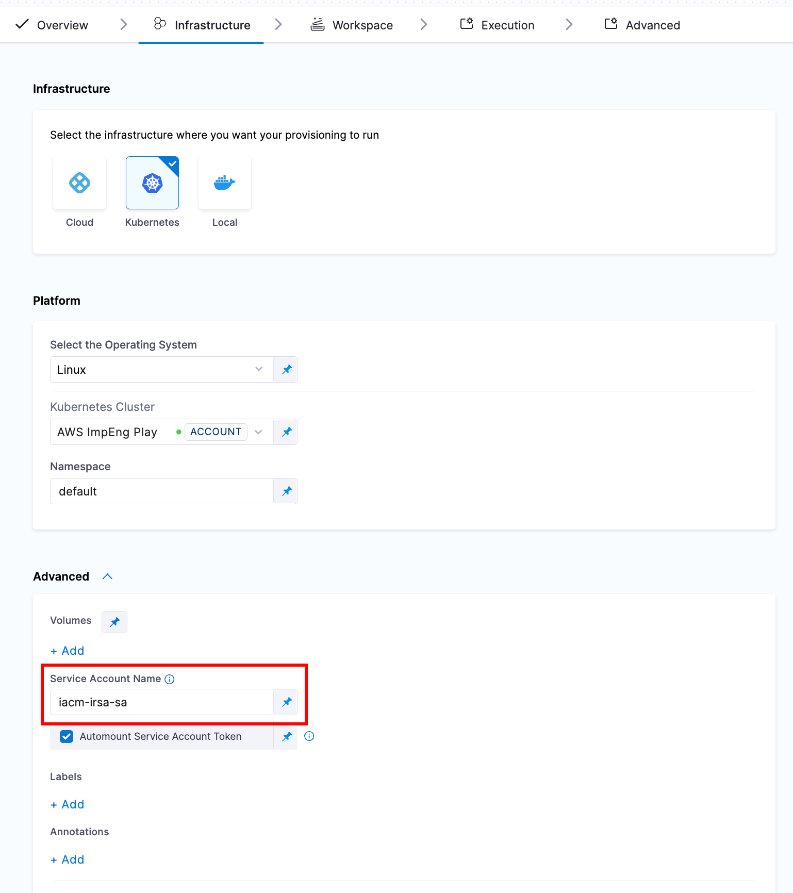

When defining authentication to AWS for Harness Infrastructure as Code there are several methods for doing so. Harness connectors act as a way to centrally define an authentication pattern which can then be utilized across many workspaces. Depending on the build infrastructure type you are using for your executions there are different methods that are supported.

:::tip AWS Session Duration
To increase the default session duration in IaCM steps, you can set `PLUGIN_AWS_SESSION_DURATION` as a stage variable to a custom limit (default: `15m`).
:::

## Cloud
Harness offers a [hosted execution environment](/docs/continuous-integration/ci-articles-faqs/harness-cloud-faqs) where your builds run on independent ephemeral machines. Using this environment requires that all the endpoints you are configuring using TF are exposed to the public internet.

If you are using this environment, you can use Access Keys or OIDC in a Harness AWS connector to connect. It is recommended that you use OIDC over access keys as keys have to be rotated whereas OIDC uses a trust between Harness and your AWS account to do "serverless" authentication.

## Kubernetes (self-hosted)
The other option for executing IaCM pipelines is to use a Kubernetes environment to launch a pod that will execute the steps defined in your pipeline. This requires a cluster, delegate, and if the delegate is not installed into the target cluster, a service account token. Follow [this guide](https://developer.harness.io/docs/platform/connectors/cloud-providers/ref-cloud-providers/kubernetes-cluster-connector-settings-reference/) for configuration of the connector.

### "Serverless" Auth
If you are using this environment, you can still use Access Keys or OIDC in a Harness AWS connector to connect. It is recommended that you use OIDC over access keys as keys have to be rotated whereas OIDC uses a trust between Harness and your AWS account to do "serverless" authentication.

### Execution Environment Auth
In addition, you can also use authentication inherited from the execution environment, which is normally an EKS cluster.

#### Node Role
The first option is to use the "node role" or the instance profile of the Kubernetes node that the execution pod runs on as the identity of the TF being ran. To do this you would create a Harness AWS connector that LEVERAGES the "IAM Role on Delegate" option.


You will have to select some delegate for the connector to be tied to. This selection does not matter as it will be ignored when used in an IaCM workspace. Select and delegate and save the connector. The healthcheck for this connector may fail if the delegate selected doesn't have an AWS instance profile associated with it so it may be helpful to select a delegate that does.

This does not require EKS to be used as the cluster type and could be ran on any self-hosted cluster using EC2 instances for the nodes, when there are instance profiles used.

For details on how to use a second role in the connector with STS AssumeRole, see [below](#using-sts-assumerole)

#### IRSA
The second option would be using an IRSA configuration on the build pod to assume an IAM Role. To leverage this authentication scheme you will need to set up an OIDC provider for your cluster and a role [as described in this guide](https://docs.aws.amazon.com/eks/latest/userguide/iam-roles-for-service-accounts.html).

Next, we can create a Harness AWS Connector that uses the "IRSA" method. You will have to select some delegate for the connector to be tied to. This selection does not matter as it will be ignored when used in an IaCM workspace. Select and delegate and save the connector. The healthcheck for this connector may fail if the delegate selected doesn't have an AWS instance profile associated with it so it may be helpful to select a delegate that does.



You will now need to create a Kubernetes service account in the namespace to be used for your executions.

```shell
kubectl -n <namespace> create sa <sa name>
kubectl annotate sa <sa name> -n <namespace> eks.amazonaws.com/role-arn=<irsa role arn>
```

Finally, in your IaCM stage you will need to add the namespace and service account you created to be used in your build pod. This is set under Infrastructure > Platform and Advanced.



For details on how to use a second role in the connector with STS AssumeRole, see [below](#using-sts-assumerole)

#### Using STS AssumeRole
Both the NodePool and IRSA authentication styles allow you to specify a seperate role in the connector to use for the IaCM steps. The role specified here will be used by the IaCM stage during execution.

When the stage executes, the steps will call the STS `AssumeRole` service to assume the second IAM role defined in the connector, and that is the role that will be used when running the IaCM steps. This role can be in a separate AWS account, allowing the IaCM stage running in centralized infrastructure to reach any number of target accounts.

