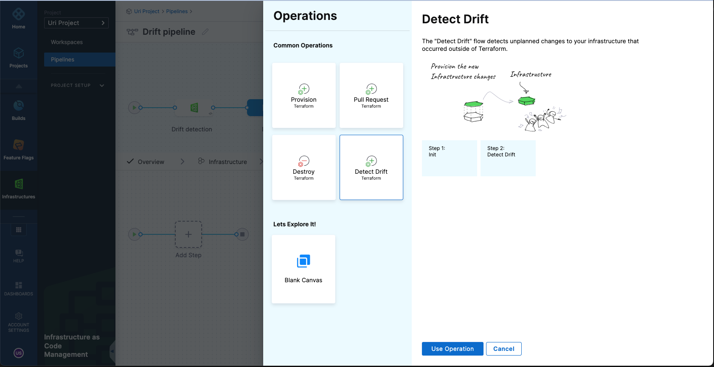
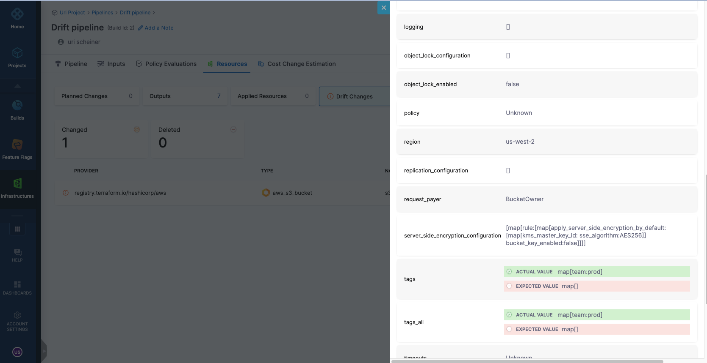
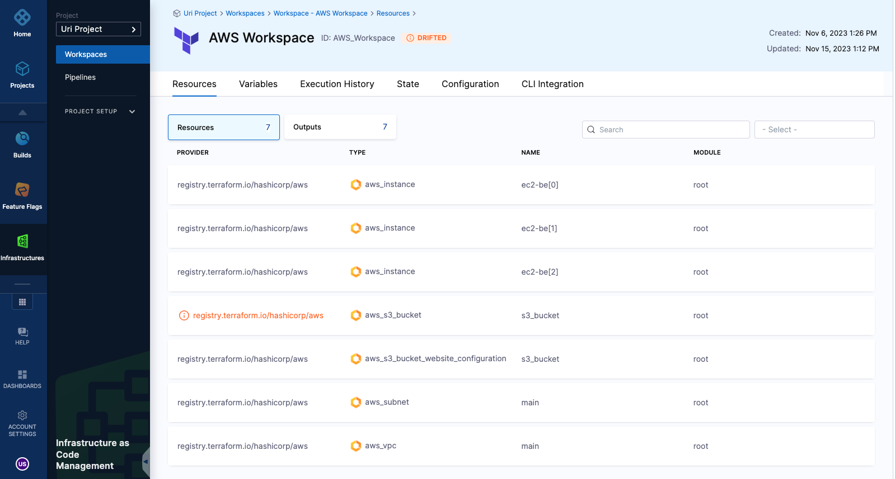
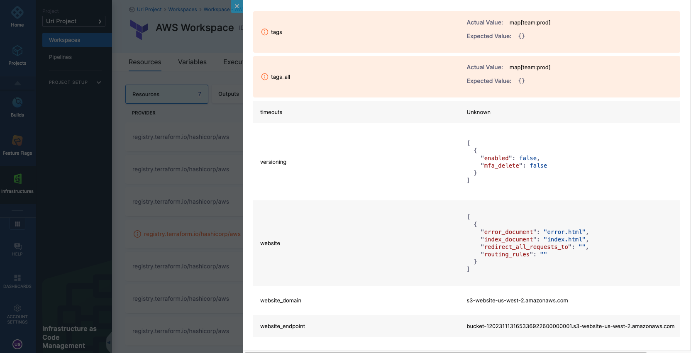
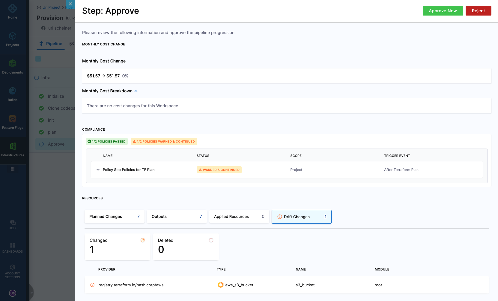
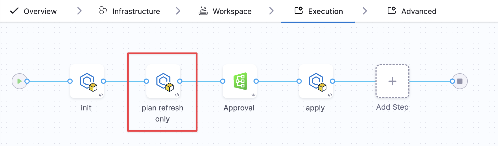

Drift occurs when the actual resources in your cloud environment differ from those defined in your OpenTofu or Terraform state file. This usually happens when someone makes manual changes, for example, modifying a resource directly in the cloud console instead of updating it through code.

Harness IaCM helps detect and highlight these discrepancies, enabling you to quickly reconcile the real infrastructure with your configuration. This is typically done using a provisioning pipeline, which ensures that your Git-based configuration is the source of truth.

:::info Example: Detecting manually created resources
Suppose you have a pipeline that provisions an **SQS queue**. The pipeline runs `init`, `plan`, and `apply`, and the queue is successfully created.
Later, someone manually adds an **EC2 instance** in the same environment. When you re-run the pipeline or execute a **Detect Drift** operation, Harness identifies that the EC2 instance is not in your code or state and flags it as drift.

As an operator, you have a few options:
- **Import** the EC2 instance into your state file if you want to manage it as code.
- **Delete** it if it was created unintentionally.
- **Ignore** it if it is a known but unmanaged resource.

If you want to reconcile the state without applying pending configuration changes, use a `plan-refresh-only` step.
:::

## Detect drift

To detect drift, follow these steps:

1. Create a Pipeline with an Infrastructure as Code Management stage, as described in [Provision workspace](/docs/infra-as-code-management/workspaces/provision-workspace).
2. Choose a Workspace or set it as a runtime input.
3. Select **Detect Drift** when prompted to choose an operation.



4. To schedule drift detection regularly, define a [cron trigger for the pipeline](/docs/platform/triggers/schedule-pipelines-using-cron-triggers/).

## Review drift details

When drift is detected, the pipeline fails and highlights the affected resources. You can review drift details in your pipeline and workspace.

### In the pipeline

Go to the **Resources** tab. The **Drift Changes** section outlines all resources where drift was detected. Click a resource to see which attributes have changed.



### In the workspace

Drifted resources are also visible in the Workspace view. Under the **Resources** tab, look for resources marked as **Drifted**.



Click a resource to view its drifted attributes.



### Using YAML

You can also run drift detection by configuring a plugin step in your pipeline YAML. This is useful when you are customizing pipeline execution outside the UI.

```yaml
- step:
    name: Drift or Refresh
    identifier: drift_or_refresh
    type: Plugin
    spec:
      connectorRef: <your_tofu_or_terraform_image_connector>
      image: plugins/harness-tofu # or plugins/harness-terraform
      settings:
        command: detect-drift # plan-refresh-only
      environmentVariables:
        PLUGIN_WORKSPACE: <your_workspace_id>
```

## Detect drift during provisioning

Harness IaCM can also detect drift during provisioning. If a provisioning pipeline identifies drift, that information is displayed in the **Approval** step and the **Resources** tab.



## Resolve drift

To promote best practices, always treat your IaC repository as the source of truth. If drift occurs, consider the following options:

- **Reconcile the infrastructure** using a provision pipeline to bring resources back in sync.
- **Use plan-refresh-only** to refresh the state without applying new configuration changes.
- **Manually import or delete** the drifted resources depending on your intent.

:::tip When to use plan-refresh-only
Use `plan-refresh-only` if there are drifted resources in your environment, but your code also has unreviewed changes. This ensures only the state is updated to match the real environment, without applying unrelated code updates.
:::

### Resolve drift using plan-refresh-only

This pipeline shows how to handle drift without applying pending changes:



:::info OpenTofu drift vs plan behavior
OpenTofu and Terraform handle `drift` and `plan` operations differently.

**For drift detection:** Harness runs `tofu plan -refresh-only` to find changes made outside of OpenTofu, including metadata like `updated_at` values.

**For regular planning:** The `tofu plan` command (and corresponding Harness step) only reports differences between your configuration and infrastructure. If your config matches the current state, **OpenTofu will report no changes needed**, even if metadata values changed.

In short: Drift detection finds all external changes, while planning only focuses on changes relevant to bringing your infrastructure in line with your configuration.
:::
