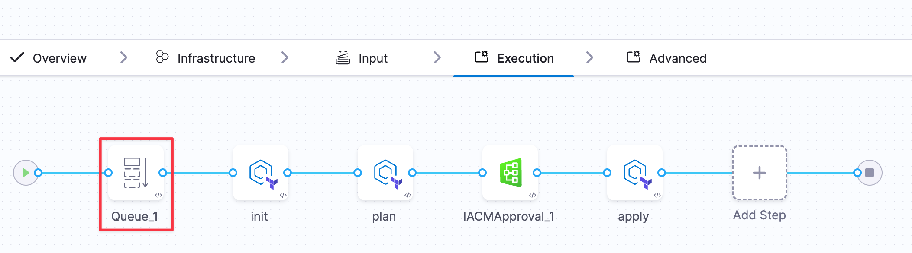
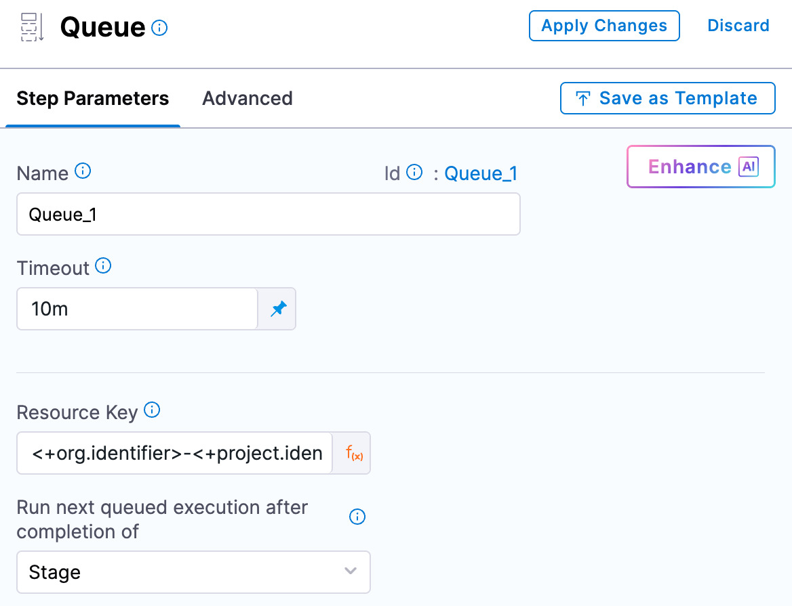

The Queue step serializes IaCM stage executions that target the same workspace. It prevents concurrent runs from conflicting with each other and provides a deterministic order of execution per workspace.

:::info Use case
The key use case for the Queue step to safeguard against multiple people trying to make changes to the same workspace at the same time.
:::

## What is the Queue step used for

The Queue step addresses the following scenarios:

- **Shared workspaces:** A single workspace may be referenced by multiple pipelines or stages.
- **State protection:** Without queuing, simultaneous executions can cause state conflicts.
- **Determinism:** Beyond a low-level lock, the Queue step serializes each pipeline execution to ensure that only one pipeline can execute at a time for a given workspace.

## When to use the Queue step

Use the Queue step any time more than one pipeline or stage may operate on the same workspace (or set of resources) and you need serialized execution. Typical cases include:

- **Multiple pipelines targeting the same workspace**
- **Concurrent triggers** on a single pipeline
- **Long-running applies** where overlapping plans could drift

## Recommended placement

For best practice, place the Queue step at the very beginning of your IaCM stage, so the entire stage execution is serialized for the target workspace.

:::info Queue lock
With this placement, the entire stage is queued until the lock for the resource is released.
:::

:::warning Alternative queue step placement
The Queue step can be placed after the plan step, as concurrent plans do not cause conflicts in state files. However, to prevent conflict, ensure that the Queue step is placed before the apply step.
:::

## Configuration

Configure the Queue step with a unique resource key that identifies the workspace. 

:::tip Common scope pattern
A common pattern is to scope the key with org, project, and workspace identifiers as follows: 

`<+org.identifier>-<+project.identifier>-<+workspace.identifier>`
:::

### Guidelines

Follow these guidelines when configuring the Queue step:

- **Uniqueness:** Ensure the resource key uniquely maps to the workspace (or resource scope) you want to serialize.
- **Consistency:** Use the same pattern across pipelines so all executions that target the same workspace share the key.
- **Granularity:** If needed, include additional context (e.g., environment) to serialize more narrowly.

## Placement pitfalls

Avoid these common mistakes:

- **After apply:** If the Queue step is added after apply, it will not protect the critical section and is effectively a no-op for preventing state conflicts.
- **Between plan and apply:** Avoid placing Queue here. A plan may run, then the stage may queue while another pipeline applies. When the queued pipeline resumes, it could apply an outdated plan, potentially causing state conflicts.

Go to [Control resource usage with Queue steps](/docs/continuous-delivery/x-platform-cd-features/cd-steps/flow-control/control-resource-usage-with-queue-steps/) to learn more about the Queue step and integrate with your CD pipelines.
