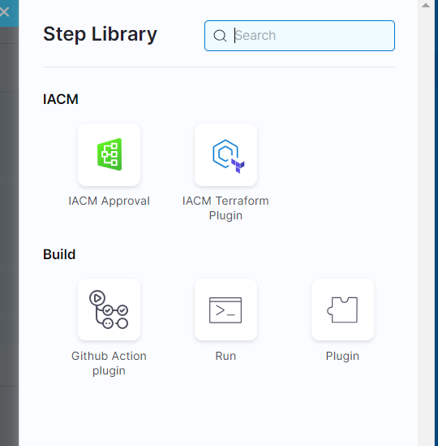

import Tabs from '@theme/Tabs';
import TabItem from '@theme/TabItem';

If you want to see the result and impact of the Terraform plan before applying it against the resources, you can add an approval step to your flow. 

The approval step provides the following information:

*  The resources that were added (including Terraform outputs).
*  The resources that were deleted.
*  The resources that were changed.
*  Cost estimation.
*  OPA rules that were evaluated so far in the flow.

Once you've reviewed the plan and are confident in the proposed changes, you can approve it. Approving the plan acknowledges that you understand the modifications that will be made to your infrastructure.

To use the approval plan step, perform the following steps:

<Tabs>
<TabItem value="Interactive guide">
The following example adds an **IaCM Approval** step to a provision pipeline, placing the approval step between `terraform plan` and `terraform apply`.

<iframe 
    src="https://app.tango.us/app/embed/3efdb37e-0d97-4875-a0b2-91fd4442cbe9" 
    title="Adding an IaCM Approval step to a provision pipeline" 
    style={{minHeight:'640px'}}
    width="100%" 
    height="100%" 
    referrerpolicy="strict-origin-when-cross-origin" 
    frameborder="0" 
    webkitallowfullscreen="webkitallowfullscreen" 
    mozallowfullscreen="mozallowfullscreen" 
    allowfullscreen="allowfullscreen"></iframe>

</TabItem>
<TabItem value="Step-by-step">
1. Go to the pipeline where you want to add an approval step to the infrastructure stage.
2. Edit the stage, and then select the **Execution** tab.
3. Hover between the **Plan** and **Apply** steps, and then select **Add Step**.
4. From the **Step Library**, select **IaCM Approval** and add it to the pipeline. 

</TabItem>
</Tabs>

:::note approval timeout
The approval plan step has a timeout of up to *60 minutes*. You can configure this setting when you are editing the step. Upon timeout, the pipeline fails.
:::

During pipeline execution, once the approval plan appears, you can see all the changes and decide whether to approve or reject the changes. Approving runs the **Apply** command. Rejecting causes the pipeline to fail.

:::tip optional wiz scan
As an additional safeguard, you can add a [Wiz Scan](https://developer.harness.io/docs/security-testing-orchestration/sto-techref-category/wiz/iac-scans-with-wiz) to scan your proposed infrastructure change for security vulnerabilities.
:::

If you have the right access control, you can select each resource and see which attributes have changed. 

