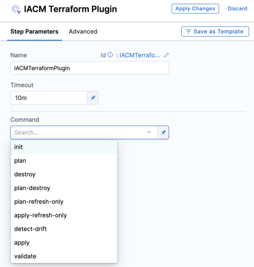

Incorporate a Terraform Plugin step in your pipeline to execute specific Terraform commands at designated stages. This guide provides a detailed look at the available commands within the Infrastructure as Code Management (IaCM) module.

For instance, incorporating a [Terraform Provision operation](../../workspaces/provision-workspace.md) automatically configures your pipeline with the `terraform init`, `terraform plan`, and `terraform apply` commands by default.

### IaCM Supported Commands

The supported commands include:
- `init`
- `plan`
- `apply`
- `destroy`
- `plan-destroy`
- `plan-refresh-only`
- `apply-refresh-only`
- `detect-drift`
- `validate`

## Command Descriptions

### Initialize
The `terraform init` command prepares a working directory containing Terraform configuration files, performing key functions like:
- **Backend Initialization**: Sets up the backend for Terraform state management.
- **Provider Installation**: Downloads and installs necessary provider plugins to interact with service provider APIs.
- **Module Installation**: Downloads and sets up modules included in the configuration within the `.terraform` directory.

### Plan
`terraform plan` creates an execution plan to preview the actions Terraform will take to align the infrastructure with the specified configuration. This includes:
- **State Refresh**: Updates the state file with the latest data from the managed infrastructure.
- **Configuration Comparison**: Analyzes current versus desired states to identify necessary changes.
- **Change Proposal**: Lists the actions that `terraform apply` will execute to reach the desired state.

### Apply Plan Changes
`terraform apply` executes the proposed plan to modify the infrastructure state:
- **Executing Plan**: Implements the changes outlined in the plan to modify resource states.
- **State Update**: Updates the state file to reflect the new status of the infrastructure.

### Destroy
`terraform destroy` removes all resources managed by Terraform:
- **Resource Removal**: Identifies and eliminates all managed resources, respecting their interdependencies.

### Plan & Destroy
`terraform plan-destroy` prepares a plan for dismantling infrastructure, outlining:
- **Destruction Overview**: Highlights which resources will be removed if the plan is executed.

### Plan - Refresh Only
The `plan-refresh-only` command focuses on updating the state file to mirror real-time data without altering the infrastructure:
- **State Refresh**: Updates the state file with the current infrastructure status.

### Apply - Refresh Only
`apply-refresh-only` applies a state update without changing the infrastructure:
- **Immediate State Update**: Refreshes the state file to ensure it accurately reflects the current infrastructure conditions.

### Detect Drift
Although not an official command, `detect-drift` is typically executed using `terraform plan` with specific flags to:
- **Drift Detection**: Identifies discrepancies between the configured and actual states of the infrastructure.

### Validate
`terraform validate` checks the configuration for errors:
- **Syntax Checks**: Ensures all configuration files are syntactically correct.
- **Consistency Checks**: Confirms all configurations are internally consistent with no unresolved references or missing mandatory arguments.

