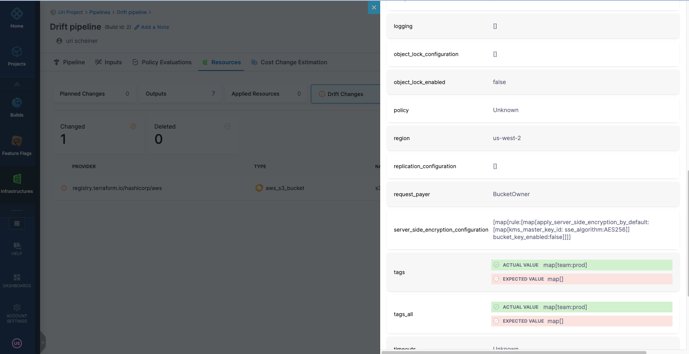
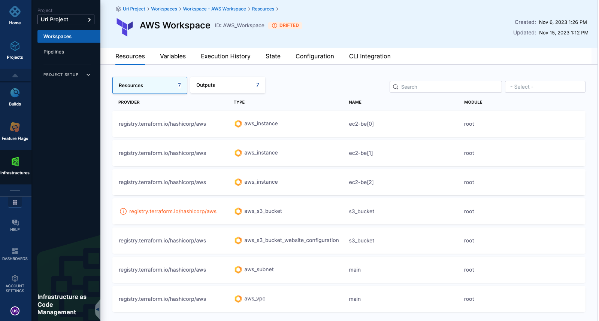
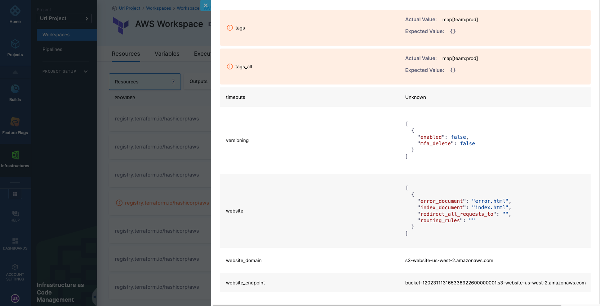
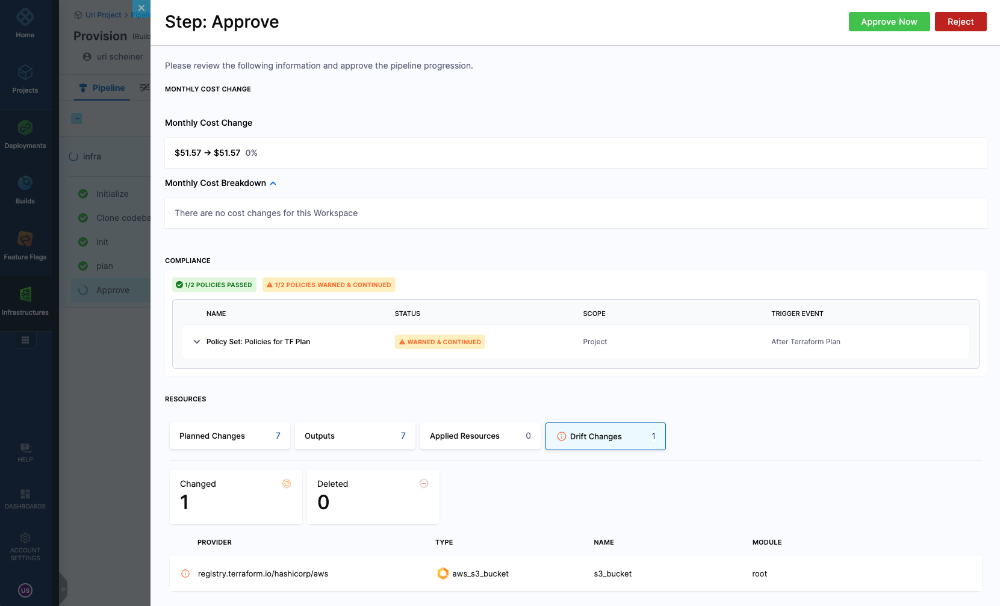
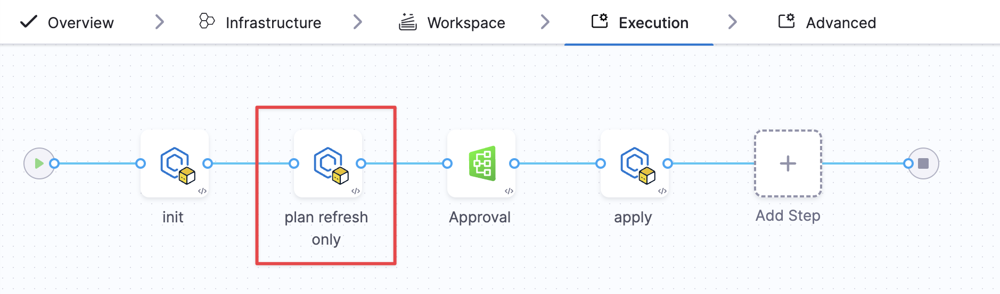

Drift is when the resources in the target environment differ from those in the Terraform state file. This can happen if a manual change occurred (for example - a user changed a resource directly in the management console and not via Terraform). 
Harness IaCM helps to detect drift and simplifies the process of reconciling - usually using a provisioning pipeline that will ensure that the configuration in git is applied correctly and ensures no discrepancies between the git configuration, the state file, and the resources in the target environment.

To detect drift, follow these steps:

1. Create a Pipeline with an Infrastructure as Code Management stage, as described [here](https://developer.harness.io/docs/infra-as-code-management/pipelines/operations/provision-workspace/)
2. Choose a Workspace or set it as a runtime input
3. Select "Detect Drift" when prompted to choose operation

4. To schedule drift detection regularly, define a [cron trigger for the pipeline](https://developer.harness.io/docs/platform/triggers/schedule-pipelines-using-cron-triggers/)

When executed, the pipeline will fail if drift is detected, and you will be able to see the drift in the following areas:

**In the pipeline** If you go to the "Resources" tab, the "Drift Changes" section will outline all the resources where the drift was detected. Clicking on each resource will highlight which attribute has drifted

 

**In the Workspace** When drift is detected, the resources will go into a "Drifted" mode 
Under the "Resources" tab, you will be able to see which resources are in drift

 

Clicking on each resource will highlight which attribute drifted

 

## Drift detection during resource provisioning 
Harness IaCM can also detect drift during a provisioning operation. If during execution, IaCM identifies drift, the drift information will be populated in the Approval step and "Resources" Tab

 

## Handle drift 
To promote best practices, use your IaC repository as the central source of truth for your infrastructure. When drift occurs due to external actions, such as manual changes in your cloud provider console, you can run a provision pipeline to realign your infrastructure with the state defined in your code.

:::tip Why use plan-refresh-only instead of plan?
In scenarios where drift is detected, but there are unreviewed changes pending in your configuration code, the `plan-refresh-only` step is ideal. It refreshes the state to reconcile drift without applying any pending code updates, ensuring only the manual changes are addressed.
:::

**Example workflow:**
The following pipeline demonstrates how to handle drift using plan-refresh-only:

