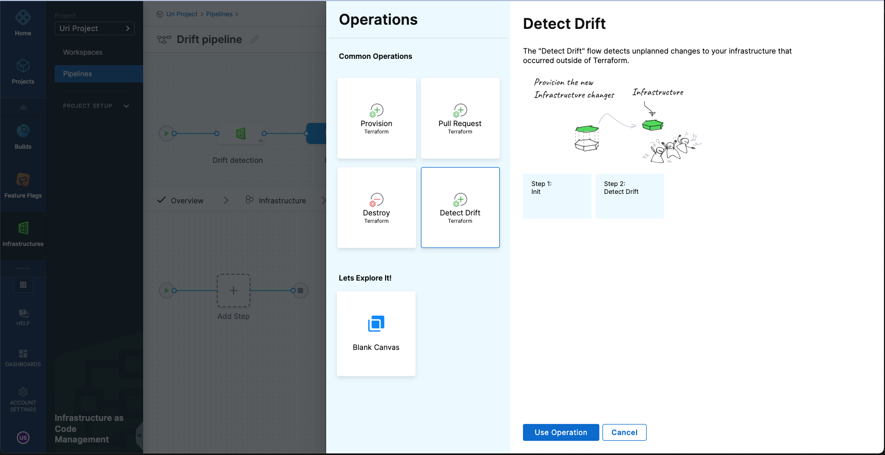

import Tabs from '@theme/Tabs';
import TabItem from '@theme/TabItem';

Drift occurs when the actual state of managed infrastructure differs from the desired configuration defined in your OpenTofu/Terraform code and recorded in the state file. Drift can happen when someone manually modifies an existing resource, or when another process outside OpenTofu/Terraform changes managed infrastructure. For example, a resource’s attributes may be updated directly in the cloud console or by another automation system, causing a mismatch between the recorded state and the real-world configuration.

Harness IaCM helps detect and highlight these discrepancies, enabling you to quickly reconcile the real infrastructure with your configuration. This is typically done using a provisioning pipeline, which ensures that your Git-based configuration is the source of truth.

:::info Example: Detecting changes to managed resources
Suppose you have a pipeline that provisions an **SQS queue**. The pipeline runs `init`, `plan`, and `apply`, and the queue is successfully created and tracked in the OpenTofu/Terraform state.

Later, someone manually modifies the queue's configuration, for example, by changing its visibility timeout, or deletes the queue entirely in the cloud provider console. When you re-run the pipeline or execute a **Detect Drift** operation, Harness uses OpenTofu/Terraform to compare the real state of that resource with what's recorded in the state file and flags the mismatch as drift.

Drift detection only applies to resources that are already tracked in the state file. Resources created entirely outside of OpenTofu/Terraform, and never imported, won't be detected as drift.
:::

As an operator, you have a few options:
- Delete the modified or manually altered resource if it’s no longer needed.
- Revert the manual change to realign the resource with what’s defined in code.
- Ignore the drift if the change is acceptable, but understand it creates a misalignment with your declared infrastructure.

Use a `plan-refresh-only` step to reconcile the state without applying other pending code changes.
:::

---
## Detect drift
To detect drift, follow these steps:
1. Create a Pipeline with an Infrastructure as Code Management stage, as described [here](/docs/infra-as-code-management/workspaces/provision-workspace).
2. Choose a Workspace or set it as a runtime input.
3. Select **Detect Drift** when prompted to choose an operation.



4. To schedule drift detection regularly, define a [cron trigger for the pipeline](/docs/platform/triggers/schedule-pipelines-using-cron-triggers/).

---
## Review drift details
When drift is detected, the pipeline fails and highlights the affected resources. Check out how to review drift details in your pipeline and workspace.

<Tabs>
<TabItem value="pipeline" label="Pipeline">
Go to the **Resources** tab. The **Drift Changes** section outlines all resources where drift was detected. Click a resource to see which attributes have changed.


</TabItem>
<TabItem value="workspace" label="Workspace">
Drifted resources are also visible in the Workspace view. Under the **Resources** tab, look for resources marked as **Drifted**.


Click a resource to view its drifted attributes.


</TabItem>
<TabItem value="yaml" label="YAML">
You can also run drift detection by configuring a plugin step in your pipeline YAML. This is useful when you're customizing pipeline execution outside the UI.

```yaml
- step:
    name: Drift or Refresh
    identifier: drift_or_refresh
    type: Plugin
    spec:
      connectorRef: <your_tofu_or_terraform_image_connector>
      image: plugins/harness-tofu # or plugins/harness-terraform
      settings:
        command: detect-drift # plan-refresh-only
      environmentVariables:
        PLUGIN_WORKSPACE: <your_workspace_id>
```
</TabItem>
</Tabs>

---
## Detect drift during provisioning
Harness IaCM can also detect drift during provisioning. If a provisioning pipeline identifies drift, that information is displayed in the **Approval** step and the **Resources** tab.


---
## Resolve drift
To promote best practices, always treat your IaC repository as the source of truth. If drift occurs, consider the following options:

- **Reconcile the infrastructure** using a provision pipeline to bring resources back in sync.
- **Use `plan-refresh-only`** to refresh the state without applying new configuration changes.
- **Manually import or delete** the drifted resources depending on your intent.

:::tip When to use `plan-refresh-only`
Use `plan-refresh-only` if there are drifted resources in your environment, but your code also has unreviewed changes. This ensures only the state is updated to match the real environment, without applying unrelated code updates.
:::

### Resolve drift using `plan-refresh-only`
This pipeline shows how to handle drift without applying pending changes:

