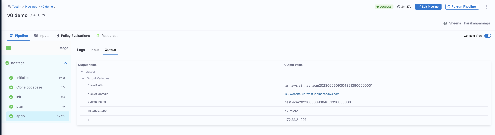
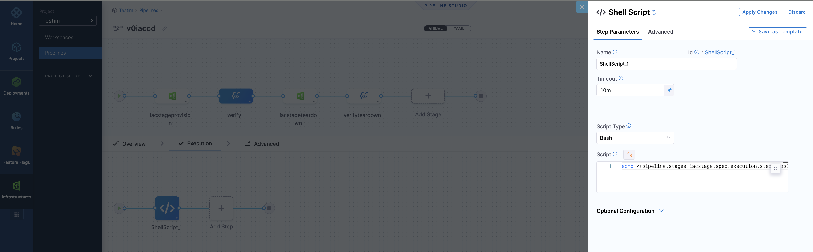

Create a single pipeline to provision or update resources during deployment. Here's how to set it up:

### Pipeline Stages Overview
- **IaCM Stage:** This stage provisions or updates resources, setting the groundwork for your deployment.
- **CD Stage:** This stage uses the resources provisioned in the IaCM stage to deploy your application.

Go to [CD steps, stages, and strategies](/docs/continuous-delivery/x-platform-cd-features/executions/stages-steps-strategies.md) for information about **CD stages**.

### Passing Variables Between Stages
You can pass [variables](/docs/platform/variables-and-expressions/add-a-variable.md) from an IaCM pipeline to a CD stage. For example, pass the Kubernetes namespace as a value.

After executing a pipeline, select the **Apply** step to view all [OpenTofu](https://opentofu.org/)/Terraform outputs as output expressions. Copy these for use in subsequent steps or stages, even across different pipelines.



**Example of Passing a Variable:**
To use the "bucket_name" as an input, copy the current value or the path to the variables. This ensures the value is fetched at runtime:

```bash
<+pipeline.stages.iacstage.spec.execution.steps.apply.output.outputVariables.bucket_name>
```



Explore additional options like [IaCM approval steps](/docs/infra-as-code-management/pipelines/operations/approval-step) and [Pull Request Automation](/docs/infra-as-code-management/pipelines/operations/pr-automation) to enhance your workflows.