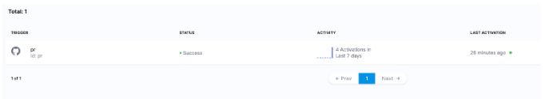
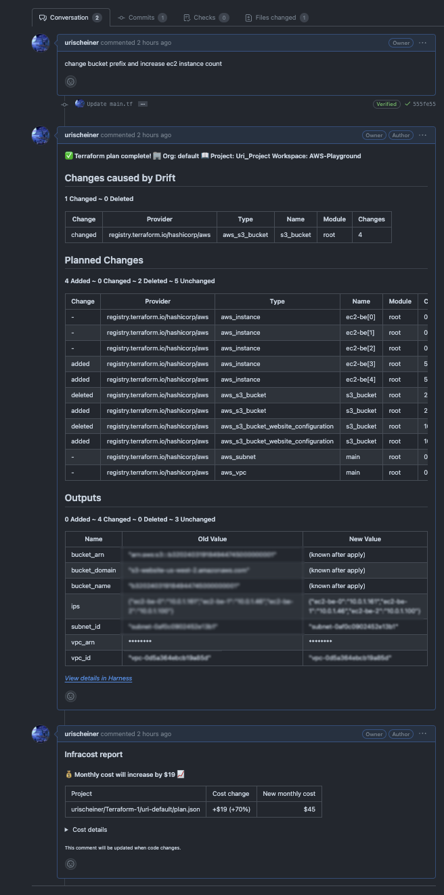

import Tabs from '@theme/Tabs';
import TabItem from '@theme/TabItem';

Harness IaCM supports reviewing infrastructure changes via pull request automation. 
This functionality allows developers to see the changes, such as the plan details, as comments in the PR, so they can see what the resource changes will be before applying the plan. Additionally, Harness IaCM also supports [Open Policy Agent (OPA)](https://developer.harness.io/docs/infra-as-code-management/project-setup/opa-workspace) for more advanced policy enforcement.  

Follow these steps to enable PR automation:

<Tabs>
<TabItem value="Create a PR pipeline">
Create a pipeline similar to the way described in the [provision workspace topic](https://developer.harness.io/docs/infra-as-code-management/pipelines/operations/provision-workspace), and select "Pull Request" as the operation

<iframe 
    src="https://app.tango.us/app/embed/58b67758-f36c-410c-8ea4-99236bb01235" 
    title="Create an IaCM PR pipeline" 
    style={{ minHeight: '640px' }}
    width="100%" 
    height="100%"
    referrerpolicy="strict-origin-when-cross-origin"
    frameborder="0"
    webkitallowfullscreen="true"
    mozallowfullscreen="true"
    allowfullscreen="true"
></iframe>
</TabItem>
<TabItem value="Create a pipeline trigger">
<iframe 
    src="https://app.tango.us/app/embed/d2e2b039-0fd6-46f3-b271-ba4d14c8b8a7" 
    title="Create a Pipeline trigger" 
    style={{ minHeight: '640px' }}
    width="100%" 
    height="100%"
    referrerpolicy="strict-origin-when-cross-origin"
    frameborder="0"
    webkitallowfullscreen="true"
    mozallowfullscreen="true"
    allowfullscreen="true"
></iframe>
</TabItem>
<TabItem value="Step-by-step">
To add a thing, follow these steps:

1. Sign in to [app.harness.io](https://app.harness.io) and select the **Infrastructure** module from the module pane.
2. Create a PR pipeline. Create a pipeline similar to the way described in the [provision workspace guide](https://developer.harness.io/docs/infra-as-code-management/pipelines/operations/provision-workspace/), and select "Pull Request" as the operation.
3. Create a trigger on a PR event.
   - After saving the pipeline, select **Trigger**, and then add a new trigger.
   - Select a **Webhook** trigger with the same connector as the workspace it is configured with.
   - Fill in the following details:
     - **Trigger name:** Add a name for the trigger.
     - **Connector**: Select the same one your workspaces are using.
     - **Event:** Select **Pull Request**.
     - **Actions:** Select **Any Actions** or specific actions from which you want the PR pipeline to be triggered.
     - Select **Continue**.
   - On the second page of the trigger editor, you can specify that the trigger should only be activated when files within a certain folder are changed, for example, the trigger activates only if the PR affects files in the `terratest/examples/` folder.
</TabItem>
</Tabs>
---

Once the trigger is defined, create a PR in your git repository. You will see the trigger activation on the **Trigger** tab:

You will see the plan as a comment in the PR:

:::info
As a security measure, comments will not be populated if the repository is public. To override it, add the Environment Variable `HARNESS_PASSWORD_API` with the git repository token/secret set as the value.
:::