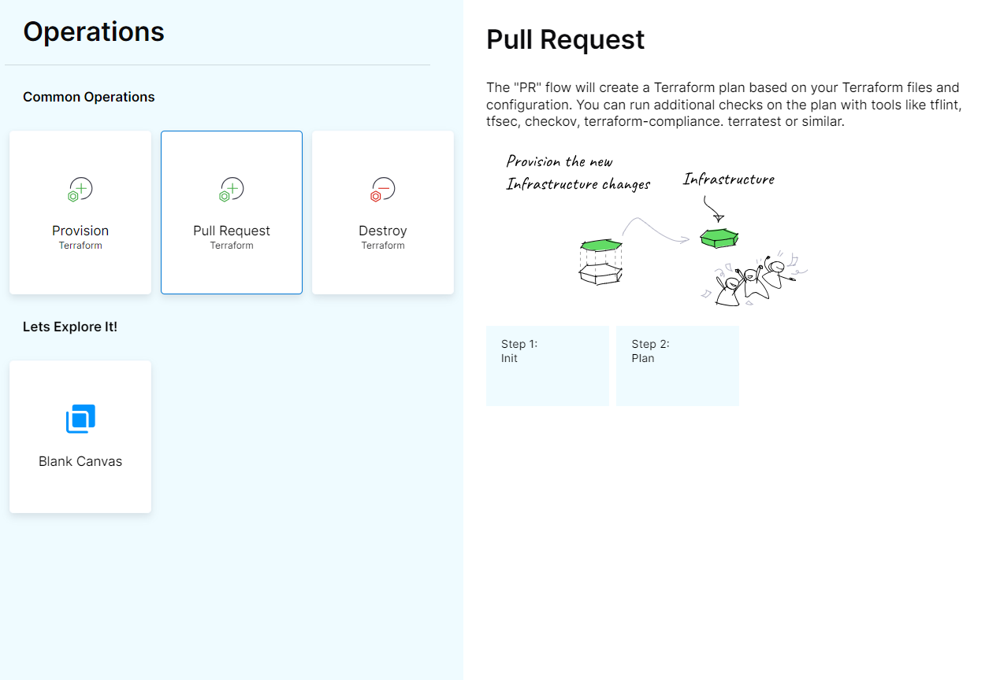
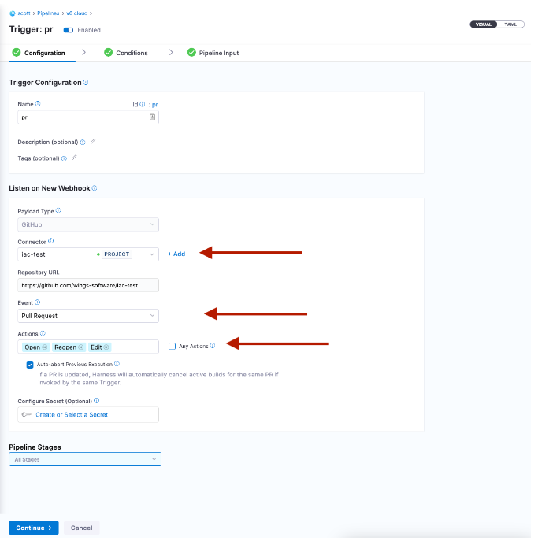
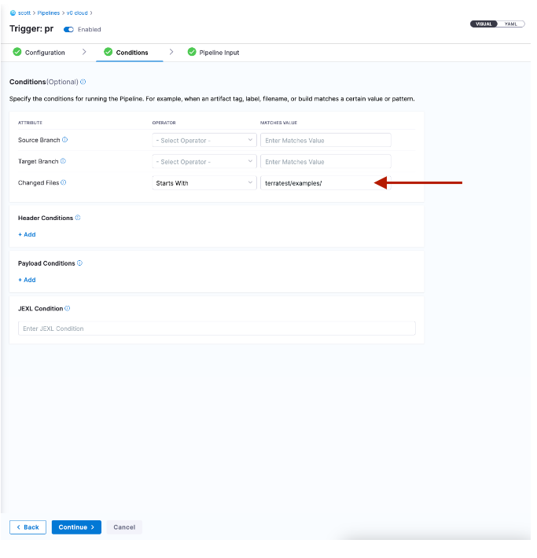

Harness IaCM supports reviewing infrastructure changes via pull request automation. 
This functionality allows developers to see the changes, such as the plan details, as comments in the PR, so they can see what will be the resource changes before applying the plan. Additionally, Harness IaCM also supports [Open Policy Agent (OPA)](https://developer.harness.io/docs/infra-as-code-management/project-setup/opa-workspace) for more advanced policy enforcement.

Follow these steps to enable PR automation:

1. Create a PR pipeline.
   Create a pipeline similar to the way described in the [provision workspace topic](https://developer.harness.io/docs/infra-as-code-management/pipelines/operations/provision-workspace), and select "Pull Request" as the operation
   
   
2. Create a trigger on a PR event.
   * After saving the pipeline, select **Trigger**, and then add a new trigger.
   * Select a **Webhook** trigger with the same connector as the workspace it is configured with.
   * Fill in the following details:
     * Trigger name: Add a name for the trigger. 'pr' in the example below)
     * Connector: Select the same one your workspaces are using).
     * Event: Select **Pull Request**.
     * Actions: Select **Any Actions** or specific actions from which you want the PR pipeline to be triggered.
     * Select **Continue**.
       
   

   On the second page of the trigger editor, you can specify that the trigger should only be activated when files within a certain folder are changed, for example, the trigger activates only if the PR affects files in the “terratest/examples/” folder.
   

3. One the trigger is defined, create a PR in your git repo. You will see the trigger activation on the **Trigger** tab:
   

   You will see the plan as a comment in the PR

   

:::info
As a security measure, comments will not be populated if the repository is public. To override it, add the Environment Variable `HARNESS_PASSWORD_API`  with the git repository token/secret set as the value.
:::