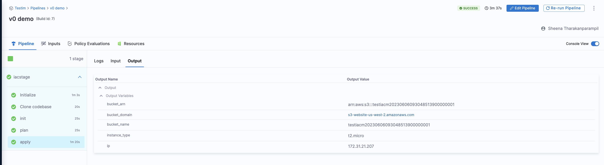
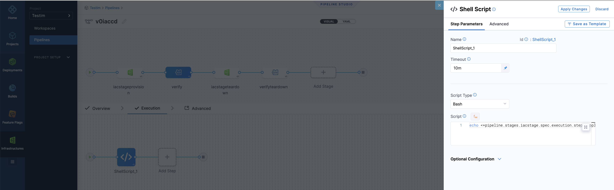

import { Troubleshoot } from '@site/src/components/AdaptiveAIContent';

Create a single pipeline to provision or update resources during deployment. This pattern combines IaCM and CD stages in a single pipeline, allowing you to provision infrastructure and then deploy applications that use those resources.

---

## Before you begin

- **Harness account with IaCM and CD enabled:** You need both **Infrastructure as Code Management** and **Continuous Delivery** modules. For how to access or create a Harness account, see [Getting started with Harness Platform](/docs/platform/get-started/onboarding-guide).

    :::info Contact Harness support:

    If IaCM or CD does not appear, see [Get started with IaCM](/docs/infra-as-code-management/get-started) or contact your account administrator or [Harness Support](mailto:support@harness.io).

    :::

- **Pipeline permissions:** You need **View**, **Create/Edit**, and **Execute** for [Pipelines](/docs/platform/role-based-access-control/permissions-reference#pipelines). To get these, an administrator must assign you a role that includes them. See [RBAC in Harness](/docs/platform/role-based-access-control/rbac-in-harness) and [Manage roles](/docs/platform/role-based-access-control/add-manage-roles).
- **IaCM workspace configured:** You need an existing workspace with Terraform or OpenTofu configuration. Go to [Create a workspace](/docs/infra-as-code-management/workspaces/create-workspace) to set one up.

---

## Pipeline stages overview

A combined IaCM and CD pipeline includes two stages:

- **IaCM Stage:** This stage provisions or updates resources, setting the groundwork for your deployment.
- **CD Stage:** This stage uses the resources provisioned in the IaCM stage to deploy your application.

Go to [CD steps, stages, and strategies](/docs/continuous-delivery/x-platform-cd-features/executions/stages-steps-strategies.md) for information about **CD stages**.

---

## Pass variables between stages

You can pass [variables](/docs/platform/variables-and-expressions/add-a-variable.md) from an IaCM pipeline to a CD stage. For example, pass the Kubernetes namespace as a value.

After executing a pipeline, select the **Apply** step to view all [OpenTofu](https://opentofu.org/) or Terraform outputs as output expressions. Copy these for use in subsequent steps or stages, even across different pipelines.



### Example: Pass a variable

To use the "bucket_name" as an input, copy the current value or the path to the variables. This ensures the value is fetched at runtime:

```bash
<+pipeline.stages.iacstage.spec.execution.steps.apply.output.outputVariables.bucket_name>
```



---

## Troubleshooting

<Troubleshoot
  issue="IaCM stage output variables not available in CD stage"
  mode="docs"
  fallback="Ensure the Apply step completed successfully in the IaCM stage. Use the correct expression syntax: <+pipeline.stages.STAGE_ID.spec.execution.steps.apply.output.outputVariables.VARIABLE_NAME>"
/>

<Troubleshoot
  issue="CD stage fails to access infrastructure provisioned by IaCM stage"
  mode="docs"
  fallback="Verify that the IaCM Apply step completed and the resources were created. Check the IaCM stage logs and confirm the outputs are exported. Ensure the CD stage has the correct connector and credentials."
/>

<Troubleshoot
  issue="Output variable expression returns empty value in CD stage"
  mode="docs"
  fallback="Check that the Terraform or OpenTofu configuration defines the output block correctly. Outputs must be explicitly declared in the IaC code to appear as variables."
/>

---

## Next steps

You have successfully combined IaCM and CD stages in a single pipeline. You can now provision infrastructure and deploy applications in one workflow.

- Go to [Approval step](/docs/infra-as-code-management/pipelines/operations-overview) to add manual approval gates before applying infrastructure changes.
- Go to [OPA policies](/docs/infra-as-code-management/policies-governance/opa-workspace) to enforce governance rules during pipeline execution.
- Go to [Default pipelines](/docs/infra-as-code-management/pipelines/default-pipelines) to configure reusable pipeline templates.
