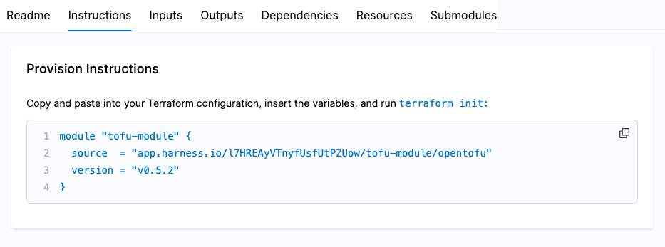

Once you have registered your Terraform/OpenTofu modules, Harness automatically parses the metadata from your connected repository, so your module information is readily available for reuse.

**Prerequisites:** A registered module. To register a new module, go to [Register a module](/docs/infra-as-code-management/registry/module-registry#register-a-module).

:::note information source
The Module Registry compiles information from various files when a repository adheres to the standard module structure.
:::

## Readme

The Readme tab directly reflects and renders the `README.md` file in your module's connected repository.

## Instructions

The Instructions tab provides a code snippet that you can copy and integrate into your Tofu/Terraform code. This allows you to seamlessly incorporate the infrastructure defined in your module into your environment once the code is applied.



## Inputs

The inputs tab is populated from the `variables.tf` file. Example:

```hcl
variable "aws-region" {
  description = "The AWS region to deploy resources"
  type        = string
  default     = "us-west-2"
}

variable "instance_type" {
  description = "EC2 instance type"
  type        = string
  default     = "t2.micro"
}
```

## Outputs

The outputs tab is populated from the `outputs.tf` file. Example:

```hcl
output "instance_id" {
  description = "The ID of the EC2 instance"
  value       = aws_instance.example.id
}

output "public_ip" {
  description = "The public IP address of the instance"
  value       = aws_instance.example.public_ip
}
```

## Dependencies

The dependencies tab is populated by your `versions.tf` file. Example:

```hcl
terraform {
  required_providers {
    aws = {
      source  = "hashicorp/aws"
      version = "~> 3.0"
    }
  }
  required_version = ">= 0.12"
}
```

## Resources

Resources are defined within your Tofu/Terraform configuration files (for example `main.tf`). These resources are applied when you [run your provision pipelines](/docs/infra-as-code-management/workspaces/provision-workspace). Example:

```hcl
resource "aws_instance" "example" {
  ami           = "ami-0c55b159cbfafe1f0"
  instance_type = var.instance_type

  tags = {
    Name = "ExampleInstance"
  }
}
```

## Submodules

The metadata of the submodules is extracted from your `modules` folder.

**Use cases:**

- **Separation of concern:** Break down a module into submodules to isolate specific functionality (e.g., a Kubernetes module with submodules for cluster setup, worker nodes, network policies).
- **Versioning and dependency management:** Submodules let you version and manage dependencies independently.
- **Customization and flexibility:** Submodules can provide users with the flexibility to override or customize certain aspects.

## Top Level Overview

- **Module versions:** Select the version dropdown, which corresponds with the Git tags from your module's code repository. Select a version to reflect the module's state at the selected point in time.
- **Source code:** Select the `SOURCE CODE` link to navigate to the module's code repository.
- **Sync button:** The sync button fetches any new Git tags from the module's code repository and syncs them to the Harness IaCM registered module, making the tag/version available in the version dropdown.
