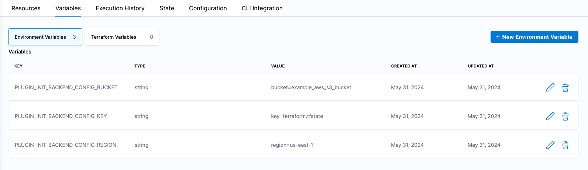
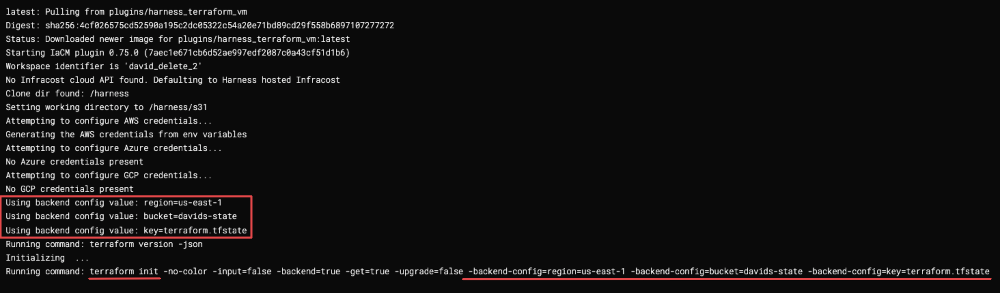

import Tabs from '@theme/Tabs';
import TabItem from '@theme/TabItem';

# Dynamic backend configuration

At the first step of most infrastructure provisioning pipelines, you prepare your working directory with the `terraform init` command. Part of this step includes setting up your backend environment for Terraform state management.
Harness enables the use of environment variables to dynamically update your backend configuration in Terraform. 

Generally, you have two approaches, [hardcoded backend configuration](https://developer.hashicorp.com/terraform/language/settings/backends/configuration), or partial configuration, where you specify an empty or partially configured backend block and populate the necessary values through environment variables.

## Apply environment variables
Using environment variables allows for a more dynamic and flexible backend configuration.

### Partial configuration example
```hcl
terraform {
  backend "s3" {}
}
```

In this example, the backend configuration is left empty, allowing us to supply the values using environment variables during the `terraform init` command.

### Set environment variables
You can set the environment variables used to configure the backend in various ways, such as directly in the terminal or through Infrastructure pipelines. Here are the variables corresponding to the partial configuration:

:::important
To set up an environment variable that populates the terraform backend configuration as part of the `terraform init -backend-config` command (for example: `terraform init -backend-config="bucket=sample_s3_bucket" -backend-config="key=terraform.tfstate" -backend-config="region=us-east-1"`), you must name your variables in the following format:

`PLUGIN_PLUGIN_INIT_BACKEND_CONFIG_` followed by a unique identifier to distinguish your variable.
:::

When initializing an AWS S3 bucket for example, and passing the `bucket`, `key`, and `region` parameters, Harness recommends naming your variables similar to the following:  

- `PLUGIN_INIT_BACKEND_CONFIG_BUCKET`
- `PLUGIN_INIT_BACKEND_CONFIG_KEY`
- `PLUGIN_INIT_BACKEND_CONFIG_REGION`

### Add new environment variables
To add new environment variables, follow these steps:

<Tabs>
<TabItem value="Interactive guide">
    <iframe 
      src="https://app.tango.us/app/embed/aa30519d-534a-4017-a0bb-8d0439f5258a" 
      title="Configure your Terraform backend config with Harness environment variables" 
      style={{minHeight:'640px'}}
      width="100%" 
      height="100%" 
      referrerpolicy="strict-origin-when-cross-origin" 
      frameborder="0" 
      webkitallowfullscreen="webkitallowfullscreen" 
      mozallowfullscreen="mozallowfullscreen" 
      allowfullscreen="allowfullscreen"></iframe>
  </TabItem>
  <TabItem value="Step-by-step">
    1. Navigate to the **Infrastructure** module.
    2. Select **Workspaces**, then select the **Variables** tab.
    3. Select **New Environment Variable**.
    4. Add your variables:
        - **Key**: PLUGIN_INIT_BACKEND_CONFIG_*IDENTIFIER*
        - **Value**: Parameter `key=value` pair, e.g. `region=us-east-1`

  
  </TabItem>
</Tabs>

## Review variable usage

Once your Terraform backend configuration environment variables are set and you have a provision pipeline, run the pipeline and review the console log during the `init` step to confirm your variable values match what is used in the pipeline.  



Notice the list of backend config values, shortly followed by the generated `terraform init` command including the `-backend-config` label with accompanying parameters, populated with your environment variable values.

## Conclusion
Using environment variables for backend configuration in Terraform provides a flexible and dynamic approach, making it easier to manage different environments and improve security. By following the steps outlined in this topic, you can set up and use environment variables to configure your Terraform backend dynamically.  

Go to [Terraform documentation on partial configuration](https://developer.hashicorp.com/terraform/language/settings/backends/configuration#partial-configuration) for more information on supported backend configurations.