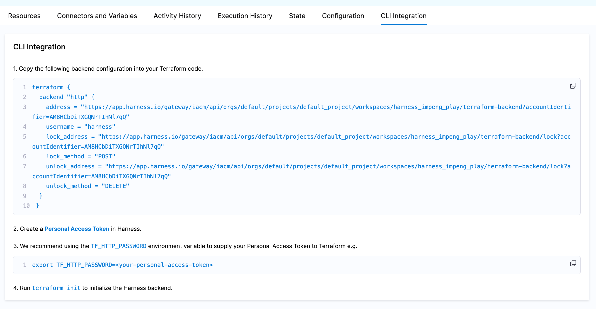

When using Harness Infrastructure as Code Management (IaCM), one of its benefits is automatic state storage for your <Tooltip id="iacm.workspace">workspace</Tooltip>. Harness state will automatically be used when no backend code block is configured in your OpenTofu/Terraform code. Additionally, you can leverage the Harness-stored state locally or in other workflows by using an HTTP backend block configured based on your workspace location and identifier.

If you currently use a 3rd party state storage you can [continue to use this as configured](/docs/infra-as-code-management/remote-backends/use-backends) with Harness IaCM, but if you wish to migrate your state to Harness you can do so via one of the methods described below.

## Local CLI

Migrate your state files to Harness IaCM by configuring your OpenTofu/Terraform codebase locally as follows:

- Set authentication for your existing backend configuration and successfully initialize your project with a `tofu init`

:::info Terraform Cloud

TFC dosnt support a direct `tofu init -migrate-state` conversion to third-party backends (such as Harness IaCM). As such you will need to pull your TFC state locally and then reinitalize your backed to use this local state before continuing.

Make sure you initalized your TF project successfully using your TFC remote state.

Then pull your state locally with `tofu state pull > terraform.tfstate`.

Now you can remove the TFC backend block, delete your current TF settings by removing the `.terraform` directory, and re-initalizing your project with `tofu init`.

At this point you are now using a local backend which has the content of your current TFC state
:::

- Modify your existing backend configuration to point at the Harness IaCM state for your target workspace

:::info Harness IaCM Backend Block

You will now need to make sure you have a workspace defined in Harness for the current Tofu project. If one has not been created, [do so now](/docs/infra-as-code-management/workspaces/create-workspace). When viewing the created workspace, navigate to the `CLI Integration` tab where you can view the HTTP backend block for leveraging the workspace state locally. Copy this backend block into your Tofu code and remove the existing backend.



To authenticate to the IaCM backend you will need to set `TF_HTTP_PASSWORD` to a Harness API key with `State:Access` permissions on the workspace we are migrating to. 
:::

- With the new backend configured, the old removed, and authentication set, you should be able to execute `tofu init -migrate-state` which will execute automatic migration of your state from your existing backend to IaCM.

You can validate the state in Harness has been populated by viewing the `State` tab in the workspace ui.

At this point you should be able to completely remove the backend block from your codebase to prepare the code for execution in IaCM. You can also keep the IaCM HTTP backend block in a local file that is in your `.gitignore` file so you can use the IaCM state locally going forward.

## Harness Pipeline

Another strategy for migrating state to Harness storage is to run a successful `tofu apply` in an IaCM pipeline **with your existing backend configuration set**. During an apply Harness will take a snapshot of your state into Harness (to enable the resources and state tab in the workspace).

To do this, [configure your workspace](/docs/infra-as-code-management/workspaces/create-workspace) with all necessary configuration to do an `apply` while also authenticating to the existing backend. After the `apply`, you can validate that the state has been copied to Harness by viewing the `State` tab in the target workspace. 

Once you have validated the state exists in Harness, you can remove the existing backend block from the Tofu code. The next time the Tofu is executed by IaCM, Harness will see that no backend has been configured and automatically load the Harness-stored state.

## Harness API

You can use the Harness API to directly load an existing state file into an existing workspace. You will need a Workspace created in Harness before you attemt the following API call.

Given an existing `terraform.tfstate` file in the current directory:

:::info
A handy command to pull your remote state locally is `tofu state pull > terraform.tfstate`
:::

```shell
HARNESS_ACCOUNT_ID=some_account_id
HARNESS_PLATFORM_API_KEY=some_api_token
HARNESS_ORG_ID=some_org
HARNESS_PROJECT_ID=some_project
HARNESS_WORKSPACE_ID=some_workspace

curl -isX POST --fail-with-body \
  "https://app.harness.io/gateway/iacm/api/orgs/${HARNESS_ORG_ID}/projects/${HARNESS_PROJECT_ID}/workspaces/${HARNESS_WORKSPACE_ID}/terraform-backend?accountIdentifier=${HARNESS_ACCOUNT_ID}" \
  -H "x-api-key: ${HARNESS_PLATFORM_API_KEY}" \
  -d "@terraform.tfstate"
```
