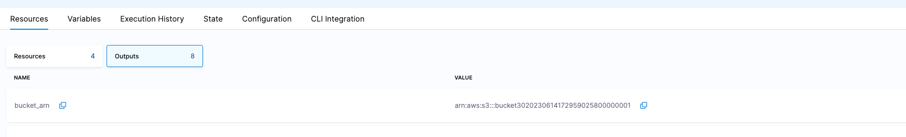

Terraform allows the declaration of output values, which will be returned after the 'apply' step has been completed. An example of a terraform output value can be found here:

```json
output "instance_ip_addr" {
  value = aws_instance.server.private_ip
}
```

Each output generated in the latest provisioning will be stored and managed in the Workspace. You can see the Output in the "Outputs" tab, under "Resources". 

These output values can be then used as input in any pipeline that is being created in the scope of the project where the Workspace is defined. This spares the user from running commands against the Terraform state to fetch the outputs.
To use an output as an input, use the following syntax: \<+workspace.WorkspaceID.outputName> 
In the UI, you can also copy the path for each Output, by clicking on the "Copy" button next to the Output name:



When using the path as an input, IaCM will resolve the current value of the output at run time and that would be used in a given execution. 
Note that there is no guarantee for the value to be consistent between different pipeline executions, as the value can change in the Workspace. If you are interested in a fixed value, you can copy the current value of the output and use it as a value in any field

Note that you don't need to use the Workspace as part of the pipeline, in an "Infrastructure" stage. If you do that, these outputs are available as Stage outputs as well.
