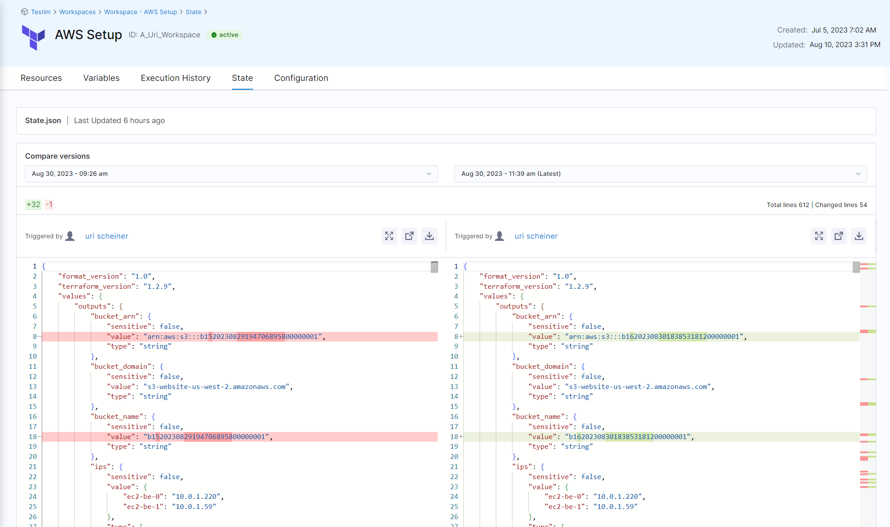

It is likely that you'd like to see the result and impact of the Terraform plan before applying it against the resources. In order to do that, you can add an Approval step to you flow. 
The Approval step will present the following information:
1. The Resources that were added
2. The Resources that were deleted
3. The Resources that were changed
4. Cost estimation **[coming soon]**
5. OPA rules that were evaluated so far in the flow **[coming soon]**

Once you've reviewed the plan and are confident in the proposed changes, you can approve it. Approving the plan acknowledges that you understand the modifications that will be made to your infrastructure.

To use the approval step, perform the following steps:
1. Go to the pipeline, where you have the Infrastructure stage that you would like to add the approval step to
2. Edit the stage and go to the "Execution" tab
3. Click on "add step", when hovering Between the "Plan" and "Apply" steps
4. From the "Step Library", select "IaCM Approval"

1. Navigate to the workspace you created, and then select the **Resource** tab. You can see the following details:

    * All the resources. Selecting each resource shows you the attributes of that resource. 

    * All the output variables that were generated and the values.

    

2. Select the **State** tab, where you can see the state file and compare the differences between former revisions. This can be very useful if you want to track changes of resources.

    

3. Select the **Execution History** tab, where you can see the execution details of the pipeline and the status of the provision.

Once you've reviewed the plan and are confident in the proposed changes, you can approve it. Approving the plan acknowledges that you understand the modifications that will be made to your infrastructure.

Timeout of 1 hour
