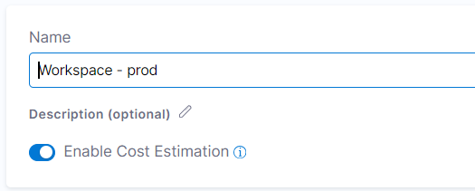
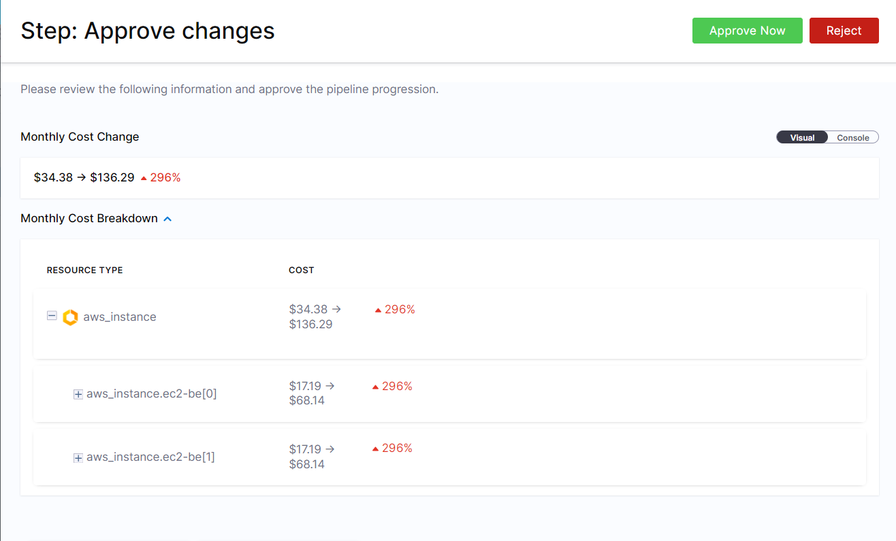
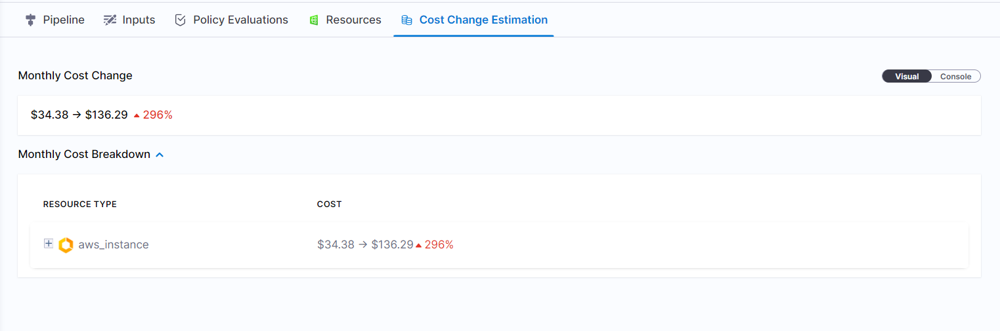

Harness IaCM supports getting cost estimates as part of the infrastructure flow. This can help you to understand if your cloud spending is going to increase as part of updating or provisioning resources. Please note that the data shown is just an estimation of the cost change and the actual cost might be different depending on your agreement with your cloud provider. 

To use this feature, go to the **Configuration** tab of the Workspace and toggle **Enable Cost Estimation**.

Once enabled, the cost estimate is shown in the following places in the pipeline, as long as a 'terraform plan' is used:

* Approval step: users can see cost estimates in addition to the resource changes.
    
* The **Cost Change Estimation** tab: For a complete audit, Harness keeps the cost estimation in the pipeline execution.
    

To use cost estimation, Harness utilizes [infracost](https://www.infracost.io/). Users who have a license to Infracost Cloud can use the API key by setting the following environment variable in the workspace: INFRACOST_API_KEY = "API Key Value"
