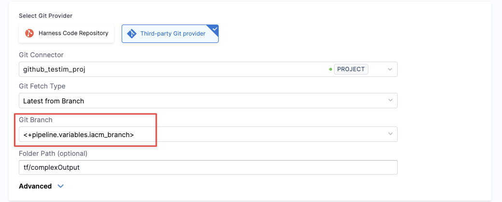
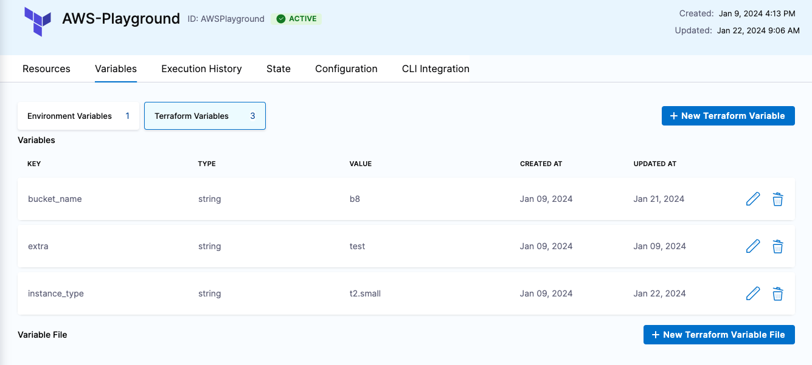

import Tabs from '@theme/Tabs';
import TabItem from '@theme/TabItem';

A workspace is a named environment that stores Terraform configurations, variables, states, and other resources necessary to manage infrastructure. Each workspace is mapped to a single state, and you can define a single Terraform configuration with multiple workspaces to enforce the same desired configuration across independent lifecycles.

---

## Before you begin

- **IaCM module access:** Your Harness account must have the IaCM module enabled.
- **Workspace permissions:** You need Create or Edit permissions on workspaces. Go to [Workspace RBAC](/docs/infra-as-code-management/workspaces/workspace-rbac) to configure roles.
- **Git repository:** A Git repository (GitHub, GitLab, Bitbucket, or Harness Code) containing your Terraform or OpenTofu configuration.
- **Cloud provider connector:** A configured connector for your cloud provider or backend system. Go to [Connectors](/docs/category/connectors) to set one up.

---

## Workspace statuses

A workspace can have one of the following statuses:

- **Active:** Successfully deployed and running.
- **Inactive:** Successfully destroyed or was not provisioned.
- **Drifted:** Drift was detected.
- **Provisioning:** Currently being provisioned.
- **Destroying:** Currently being destroyed.
- **Failed:** Errors were encountered during provisioning or destroying.
- **Apply_Needed:** Apply is required to bring the infrastructure in sync with the workspace configuration.
- **Unknown:** Changes were made outside the product.

Go to [Workspace statuses](/docs/infra-as-code-management/workspaces/workspace-statuses) to filter workspaces by status.

---

## Create a new workspace

<Tabs queryString="create-workspace">
<TabItem value="Interactive guide">
<DocVideo src="https://app.tango.us/app/embed/cfb68b54-eb46-42af-a622-5b76c9270598?skipCover=false&defaultListView=false&skipBranding=false&makeViewOnly=true&hideAuthorAndDetails=true" title="Create a IaCM Workspace in Harness" />
</TabItem>
<TabItem value="Step-by-step">

To create a new workspace, follow these steps:

1. Sign in to [app.harness.io](https://app.harness.io).
2. In the module pane, select **Infrastructures as Code Management**.
3. Select **Workspaces**, then select **+New Workspace**, then select **Start from scratch**.

### Step 1: About workspace

- Enter a name for your workspace. This name will appear in your workspace list.
- (Optional) Add a description to clarify the purpose of the workspace.
- (Optional) Add tags for easier filtering and organization.
- Click **Next**.

### Step 2: Configure repository details

- Select a git provider: choose either Harness Code Repository or a third-party git provider (for example, GitHub, GitLab, or Bitbucket).
- Select a git connector: choose an existing connector or create a new one.
- Choose a git fetch type:

  - Latest from Branch is selected by default.
  - Enter the git branch name you want to fetch from.

  :::tip Branch with JEXL
  You can configure the workspace branch to be a [JEXL expression](/docs/platform/variables-and-expressions/harness-variables/) that references a pipeline variable, and then set the pipeline variable as a runtime input.

  

  Set your branch variable as a runtime input in the pipeline:

  ```yaml
  variables:
   - name: iacm_branch
     type: String
     description: ""
     required: true
     value: <+input>.default(main)
   ```
  :::

  - (Optional) Enter a folder path: if your IaC code resides in a subdirectory, specify the folder path.
  - Click **Next**.

### Step 3: Provisioner

- Select a **Connector:** choose the connector for the cloud provider or backend system (for example, `aws-oidc`).
- Set **Scope:** confirm the scope for the connector (for example, Account, Project, or Organization).
- Choose **Workspace Type:** select OpenTofu or Terraform based on your IaC framework.
- Select the **Version** of OpenTofu or Terraform to use (for example, `1.12.5`).

:::info Pending release
Cloud Cost Management Integration is currently **pending release**. Contact [Harness Support](mailto:support@harness.io) to request access.
:::

Under **Cloud Cost Integration**, toggle the cost features you want to enable for this workspace:

- **Cloud Cost Estimation:** Runs Infracost during each Terraform or OpenTofu plan and shows estimated cost changes in approval steps and the Cost Change Estimation tab.
- **Cloud Cost Management Integration:** Pulls actual infrastructure costs and optimization recommendations from the Harness CCM module and displays them on the workspace Overview tab.


Go to [Cost estimation](/docs/infra-as-code-management/workspaces/cost-estimation) for details on each option.

Click **Create** to finalize and create the workspace.
</TabItem>
</Tabs>

---

If you need to use either environment or Terraform variables during execution, select the **Variables** tab to define the variables.

- **Environment Variables:** can be either String, [Secret](/docs/category/secrets), or a reference to another variable using a [JEXL expression](/docs/platform/variables-and-expressions/harness-variables/) (it can be in the same or a different workspace or from the pipeline).
- **Terraform Variables:** can be provided in the following ways:
- **Inline:** you can define Terraform variables within the workspace. Variables can be either String, [hcl](https://developer.hashicorp.com/terraform/language/syntax/configuration), [Secret](/docs/category/secrets), or a reference to another variable, using a [JEXL expression](/docs/platform/variables-and-expressions/harness-variables/) (can be in the same or a different workspace, or from the pipeline).
- **From Git Repo (Implicit):** you can store `.tfvar` files in the same folder as the Terraform code for the workspace.
- **From Git Repo (Explicit):** you can define a specific folder for `.tfvar` files (which can be different from the Terraform code's location). These files can be in the same or different repository as the Terraform code.

:::info Tfvar JEXL support
[JEXL expressions](/docs/platform/variables-and-expressions/harness-variables/) cannot be used to reference `tfvar` files.
:::

The values defined inline with the workspace take precedence over the git configuration.



---

## Clone a workspace

Harness supports workspace cloning for quick setup of new workspaces with the same or similar configuration as existing workspaces.

<Tabs queryString="clone-workspace">
<TabItem value="Interactive guide">
<DocVideo src="https://app.tango.us/app/embed/64cc1d48-a7c5-451e-aaa8-98d3888027d4?skipCover=false&defaultListView=false&skipBranding=false&makeViewOnly=true&hideAuthorAndDetails=true" title="Clone your workspace" />
</TabItem>
<TabItem value="Step-by-step">
   1. In your IaCM project, go to **Workspaces**.
   2. Select the option icon (vertical ellipsis) beside the workspace you want to clone.
   3. Select **Clone**.
   4. Name your new workspace.
      - The default placeholder name will be "*cloned_workspace_name*-clone".
   5. Select **Clone**.

Review your new workspace and make any amendments in the Configuration tab if necessary.
</TabItem>
</Tabs>

---

## Workspace templates

Create reusable workspace templates to standardize your workspace configurations across projects. Go to [Workspace templates](/docs/infra-as-code-management/workspaces/workspace-templates) to learn how to create and manage workspace templates.

---

## Next steps

Once you have created your workspace by creating a new workspace from scratch, cloning, or using a template, you can [provision](/docs/infra-as-code-management/workspaces/provision-workspace) it to apply your OpenTofu or Terraform state.
