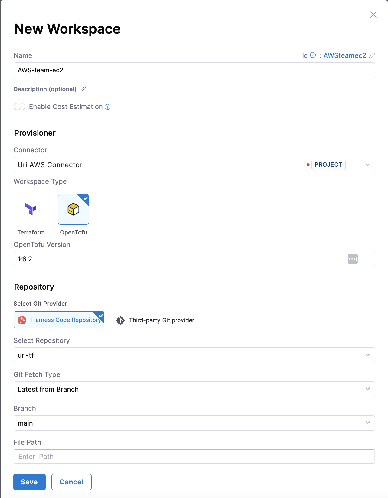

A workspace is a named environment that stores Terraform configurations, variables, states, and other resources necessary to manage infrastructure. Each workspace is mapped to a single state.

Users can define a Terraform configuration with multiple workspaces to enforce the same desired configuration. Each workspace creates a different state from the configuration and independent lifecycle. 

For example, you can have a single configuration of a Kubernetes cluster and create multiple workspaces out of it, each leading to different clusters. The configuration is unique to each workspace and can be managed through environment or Terraform variables.

A workspace may have one of the following statuses:

* Active: Sucessfully deployed and running. 

* Inactive: Successfully destroyed or was not provisioned.

* Drift - Drift was detected. 

* Provisioning: Currently being provisioned. 

* Destroying: Currently being destroyed. 

* Failed: Errors were encountered during provisioning or destroying. 

* Unknown: Changes were made outside of the product. 

To create a new workspace, follow these steps:

1. Sign in to app.harness.io.

2. In the module pane, select **Infrastructures**. 

3. Select an existing project or create a new project. 

4. Select **Workspaces**, and then select **+New Workspace**.

    

5. Complete the fields as follows:

    * **Name** - Type a unique name to identify the workspace. 
    * **Description** - Type an optional description to help you identify the workspace. 
    * **Connector** - Select the Harness connector to use during provisioning. This should provide the cloud credentials for Harness to use during execution. AWS and GCP are supported out of the box. Azure needs to be complemented with environment variables.
    * **Terraform Version** - Specify the Terraform version the configuration supports. This version is used to determine which version of Terraform to use during execution.
    * **Repository** - Specify the Git configuration for the Terraform configuration files. You should specify the Harness Git connector, repository branch, and file path to the configuration files in the repository.

        

6. Select **Save**. 

7. If you need to use either environment or Terraform variables during execution, select the **Variables** tab to define the variables. If Terraform variables are defined and set in Git, then values defined in the workspace take precedence. 
  A good best practice is to avoid managing Terraform variables in Git, and set them in the workspace instead. This keeps the Git configuration clean and allows you to use the same Git definitions for multiple workspaces. 

    

    Skip the other tabs for now. They are not relevant until after the workspace has been provisioned. 

Now that you have a workspace, you can provision it. 
