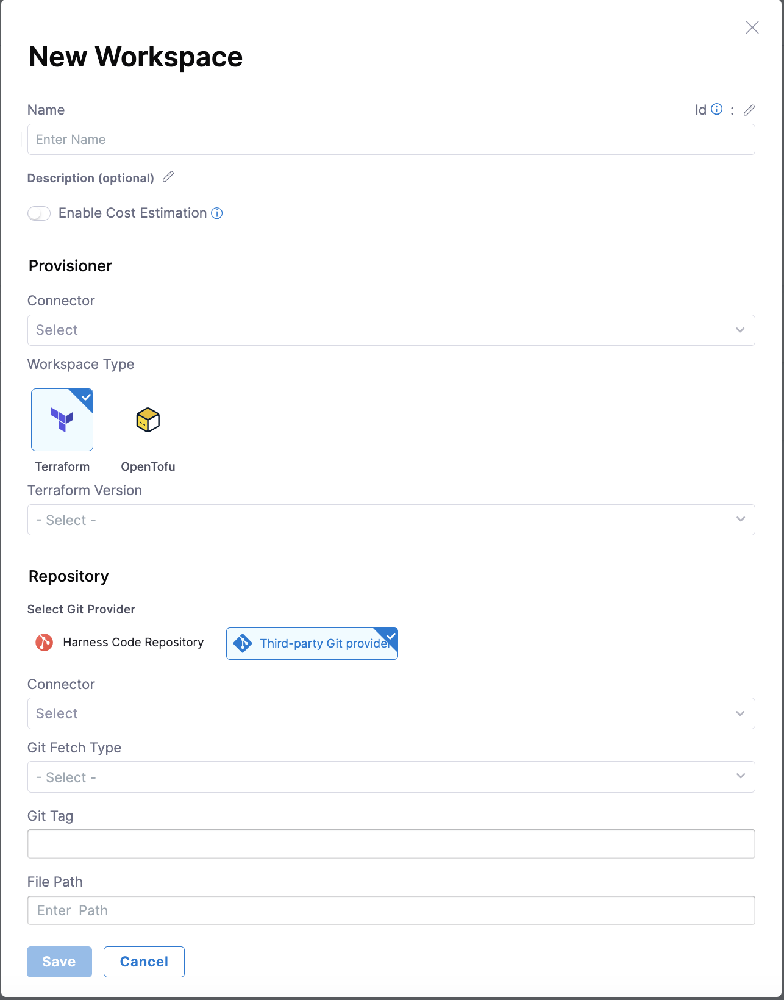

import Tabs from '@theme/Tabs';
import TabItem from '@theme/TabItem';

A workspace is a named environment that stores Terraform configurations, variables, states, and other resources necessary to manage infrastructure. Each Workspace is mapped to a single state.

Users can define a Terraform configuration with multiple workspaces to enforce the same desired configuration. Each workspace creates a different state with its own independent lifecycle.

For example, you can have a single configuration of a Kubernetes cluster and create multiple workspaces out of it, each leading to different clusters. The configuration is unique to each workspace and can be managed through environment or Terraform variables.

## Workspace statuses
A workspace can have one of the following statuses:

* **Active:** Successfully deployed and running.
* **Inactive:** Successfully destroyed or was not provisioned.
* **Drifted:** Drift was detected.
* **Provisioning:** Currently being provisioned.
* **Destroying:** Currently being destroyed.
* **Failed:** Errors were encountered during provisioning or destroying.
* **Unknown:** Changes were made outside the product.

## Create a new workspace
To create a new workspace, follow these steps:
1. Sign in to [app.harness.io](https://app.harness.io).
2. In the module pane, select **Infrastructures**.
3. Select an existing project or create a new project.
4. Select **Workspaces**, and then select **+New Workspace**.

   

5. Complete the fields as follows:
   * **Name** - Type a unique name to identify the workspace.
   * **Description** - Type an optional description to help identify the workspace.
   * **Connector** - Select the Harness connector to use during provisioning. This should provide the cloud credentials for Harness to use during execution. AWS and GCP are supported out of the box. Azure needs to be complemented with environment variables.
   * **Workspace Type** - Select the IaC type you would like to use. IaCM currently supports Terraform and [OpenTofu](https://opentofu.org/)
   * **Terraform Version** - Specify the OpenTofu/Terraform version the configuration supports. This version determines which version of Terraform to use during execution. Currently, Harness IaCM only supports the open-source versions of Terraform (all versions below 1.5.x).
   * **Repository** - Specify the Git configuration for the Terraform configuration files. You should specify the Harness Git connector, repository branch, and file path to the configuration files in the repository.

   

6. Select **Save**.
7. If you need to use either environment or Terraform variables during execution, select the **Variables** tab to define the variables.
   * **Environment Variables** can be either String, [Secret](/docs/category/secrets), or a reference to another variable using [JEXL expression](https://developer.harness.io/docs/platform/variables-and-expressions/harness-variables/) (it can be in the same or a different workspace or from the pipeline).
   * **Terraform Variables** Can be provided in the following ways:
      * **Inline** Users can define Terraform variables within the workspace. Variables can be either String, [hcl](https://developer.hashicorp.com/terraform/language/syntax/configuration), [Secret](/docs/category/secrets), or a reference to another variable, using [JEXL expression](https://developer.harness.io/docs/platform/variables-and-expressions/harness-variables/) (can be in the same or a different workspace, or from the pipeline).
      * **From Git Repo (Implicit)** Users can store ``.tfvar`` in the same folder as the Terraform code for the workspace.
      * **From Git Repo (Explicit)** Users can define a specific folder for ``.tfvar`` files (which can be different from the Terraform code's location). These files can be in the same or different repository as the Terraform code.

   The values defined in line with the workspace will take precedence over the git configuration.

   

## Clone a workspace
Harness supports workspace cloning for quick setup of new workspaces with the same or similar configuration as existing workspaces.

<Tabs>
<TabItem value="Interactive guide">
<iframe 
    src="https://app.tango.us/app/embed/64cc1d48-a7c5-451e-aaa8-98d3888027d4" 
    title="Harness: Cloning workspaces in Infrastructure as Code Management" 
    style={{ minHeight: '640px' }}
    width="100%" 
    height="100%"
    referrerpolicy="strict-origin-when-cross-origin"
    frameborder="0"
    webkitallowfullscreen="true"
    mozallowfullscreen="true"
    allowfullscreen="true"
></iframe>
</TabItem>
<TabItem value="Step-by-step">
   1. Navigate to your IaCM workspaces
   2. Select the option icon (vertical ellipsis) beside the workspace you want to clone.
   3. Select **Clone**.
   4. Name your new workspace
      - The default placeholder name will be "*cloned_workspace_name*-clone".
   5. Select **Clone**.

   Review your new workspace and make any amendments in the Configuration tab if necessary.
</TabItem>
</Tabs>

Go to [provision workspace](https://developer.harness.io/docs/infra-as-code-management/use-iacm/provision-workspace) to learn how to provision workspaces.