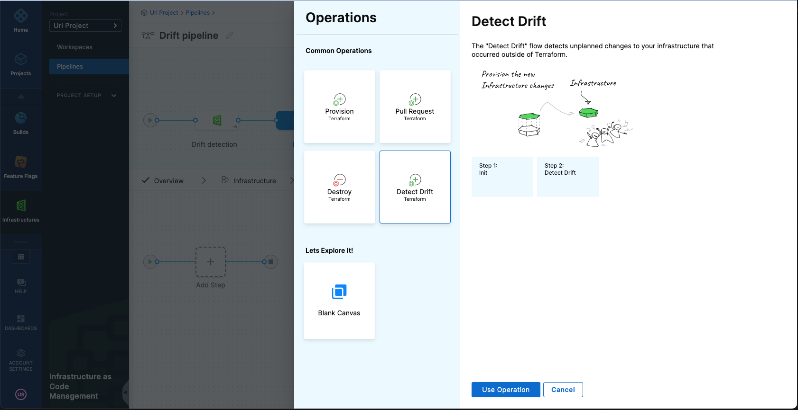
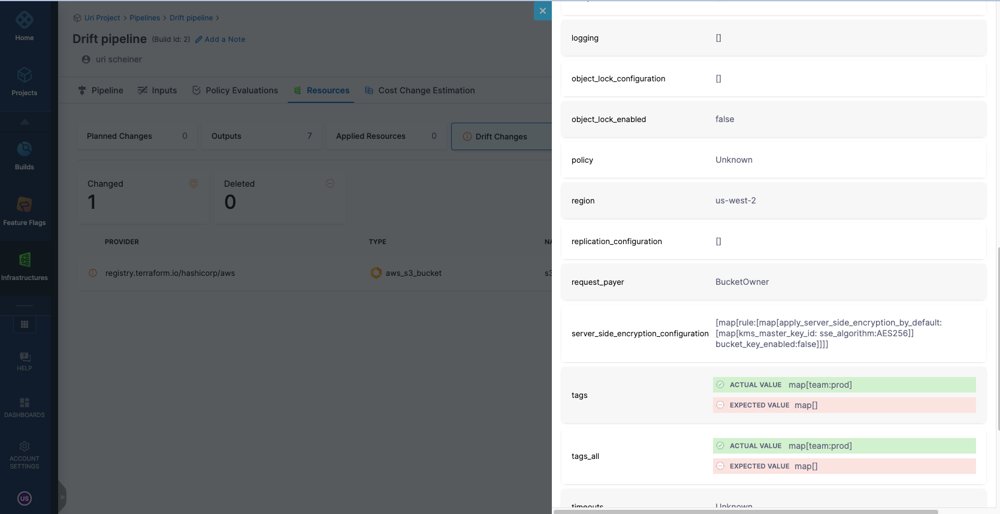
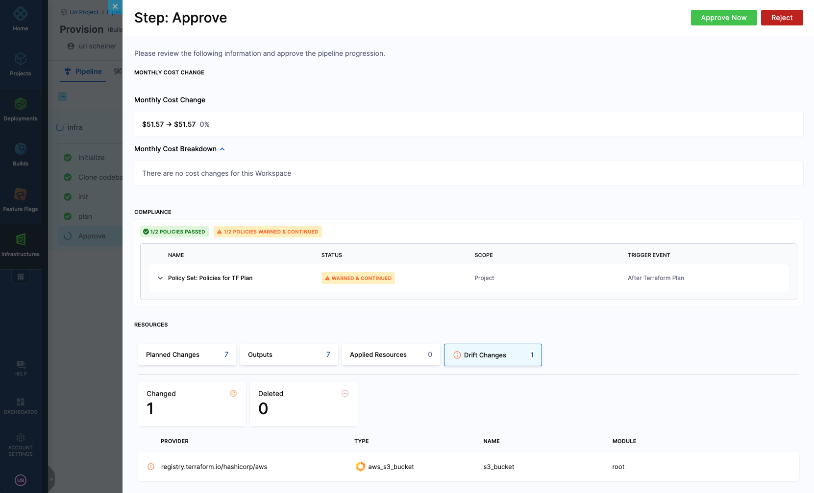

Drift is when the resources in the target environment differ from those in the Terraform state file. This can happen if a manual change occurred (for example - a user changed a resource directly in the cloud and not via Terraform). 
Harness IaCM helps to detect drift and simplifies the process of reconciling - usually using a provisioning pipeline that will ensure that the configuration in git is applied correctly and ensure no discrepancies between the git configuration, the state file, and the resources in the target environment. 

To detect drift, you will have to follow these steps:

1. Create a Pipeline with Infrastructure stage, as described [here](https://developer.harness.io/docs/infra-as-code-management/workspaces/provision-workspace)
2. Set the Workspace as either runtime input or fix a specific Workspace
3. As the operation, select "Detect Drift"

4. To schedule drift detection regularly, define a [cron trigger for the pipeline](https://developer.harness.io/docs/platform/triggers/schedule-pipelines-using-cron-triggers/)

When executed, the pipeline will fail if a drift is detected, and you will be able to see the drift in the following areas:

**In the pipeline** If you go to the "Resources" tab, the "Drift Changes" section will outline all the resources where the drift was detected. Clicking on each resource will highlight which attribute caused the drift

 

**In the Workspace** When a drift is detected, the resources will go into a "Drifted" mode 
Under the "Resources" tab, you will be able to see which resources caused the drift

 

Clicking on each resource will highlight which attribute caused the drift

 

## Drift detection during resource provisioning 
Harness IaCM can also detect drift during provisioning operation. If during that flow, IaCM will identify a drift, it will be populated in the Approval step and "Resources" Tab

 