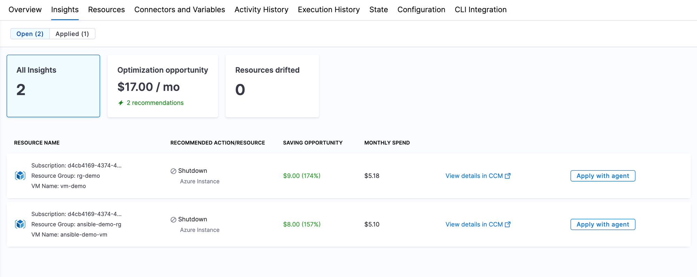
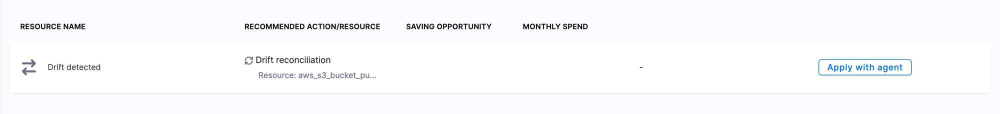

:::warning Beta
The Insights tab is currently **pending release**. Contact [Harness Support](mailto:support@harness.io) to request access.
:::

The **Insights** tab consolidates the actionable findings for a workspace in one place. It surfaces resources that have drifted from your OpenTofu or Terraform configuration and, when Cloud Cost Management is connected, cost optimization opportunities for the resources in that workspace. From each insight, you can generate a remediation pull request with the [IaCM Remediation Agent](/docs/infra-as-code-management/workspaces/remediation-agent).

---

## What you will learn from this topic

- How to open the Insights tab and read its summary cards.
- The difference between open and applied insights.
- How drift insights and cost optimization insights appear.
- How to start a fix with the **Apply with agent** button.

---

## Before you begin

- **A provisioned workspace:** The Insights tab appears on an existing workspace. Go to [Create a workspace](/docs/infra-as-code-management/workspaces/create-workspace) to create one.
- **Cloud Cost Management Integration (optional):** Cost optimization insights appear only when Cloud Cost Management is connected to the workspace. Go to [Workspace Overview](/docs/infra-as-code-management/workspaces/workspace-overview) to enable the **Cloud Cost Management Integration** toggle in your workspace configuration.

---

## Open the Insights tab

Navigate to your workspace and select the **Insights** tab. The tab opens on the **Open** insights, with a count of open and applied insights shown at the top.

- **Open:** Insights that have been detected but not yet remediated.
- **Applied:** Insights that have been remediated. After you run the Remediation Agent against an open insight, it moves from **Open** to **Applied**.

---

## Insight summary cards

The cards at the top of the tab summarize the current insights for the workspace.

- **All Insights:** The total number of insights detected for the workspace.
- **Optimization opportunity:** The estimated monthly savings across all cost recommendations, with the number of recommendations that contribute to it.
- **Resources drifted:** The number of resources that have drifted from your configuration.

---

## Insight details

Each row in the insights list represents one finding. The columns describe the resource and the recommended fix.

- **Resource Name:** The affected resource. For drift, this shows **Drift detected**.
- **Recommended Action/Resource:** The suggested fix, such as **Drift reconciliation** for a drifted resource, along with the resource identifier.
- **Saving Opportunity:** The estimated monthly savings for a cost recommendation. This is empty for drift insights.
- **Monthly Spend:** The current monthly spend for the resource, when cost data is available.

### Drift insights

When a resource drifts from your OpenTofu or Terraform configuration, it appears as a **Drift detected** row with a **Drift reconciliation** recommended action. Click **Apply with agent** to generate a remediation pull request with the [IaCM Remediation Agent](/docs/infra-as-code-management/workspaces/remediation-agent).

Go to [Drift detection](/docs/infra-as-code-management/pipelines/operations/drift-detection) to understand how Harness IaCM detects drift.

### Cost optimization insights

If you have enabled the **Cloud Cost Management Integration** for your workspace, the Insights tab also surfaces cost optimization recommendations for the workspace resources, such as the estimated saving opportunity and current monthly spend. Click **View details in CCM** to open the recommendation in the Cloud Cost Management module.

---

## Apply with agent

Each open insight includes an **Apply with agent** button. Click it to generate a remediation pull request with the IaCM Remediation Agent. Harness opens the **Run Pipeline** panel with the remediation pipeline and the affected insight preselected, so you can run remediation for that specific resource. **Apply with agent** does not directly modify your infrastructure. It generates a pull request with recommended changes for you to review and merge.

Go to [IaCM Remediation Agent](/docs/infra-as-code-management/workspaces/remediation-agent) to review the full remediation flow.

---

## Next steps

The Insights tab gives you a single view of what needs attention in a workspace and a one-click path to remediate it.

- Go to [IaCM Remediation Agent](/docs/infra-as-code-management/workspaces/remediation-agent) to remediate drift with the agent.
- Go to [Drift detection](/docs/infra-as-code-management/pipelines/operations/drift-detection) to configure drift detection.
- Go to [Workspace Overview](/docs/infra-as-code-management/workspaces/workspace-overview) to connect Cloud Cost Management to your workspace.
