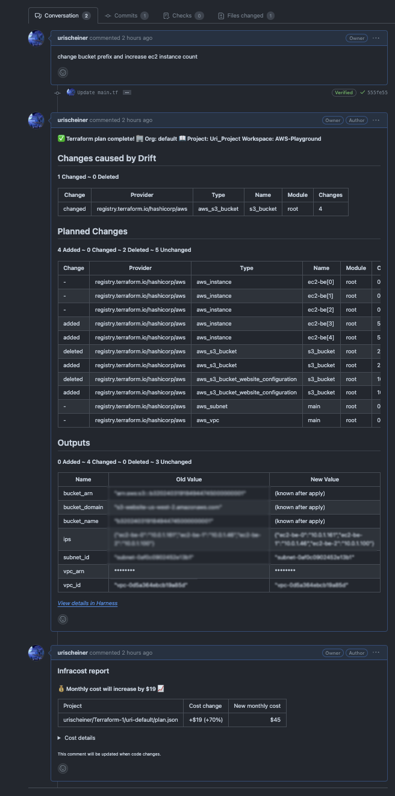

Harness IaCM support reviewing infrastructure change via Pull Request automation. 
This functionality allows developers to see the changes (such as the plan details) as comments in the PR, so they can see what will be the resource changes before applying the plan

To enable PR automation, you should follow these steps:

1. Create a PR pipeline
   Create a pipeline similar to the way described, and select "Pull Request" as the operation
   
   
2. Create a trigger on a PR event
   * After saving the pipeline, click on "Triggers" and add a new trigger
   * Select "Webhook" trigger with the same connector as the workspace is configured with
   * Fill in the following details
     * Trigger name ('pr' in the example below)
     * Connector (select the same one that same one as your Workspaces are using)
     * Event - select 'Pull Request'
     * Actions - select "Any Actions" or specific actions that you'd like the PR pipeline to be triggered off
     * Click "Continue"
   

On the second page of the trigger editor, you can specify that the trigger should only be activated when files within a certain folder are changed e.g., in this case, the trigger activates only if the PR affects files in the “terratest/examples/” folder.

3. One the trigger is defined, create a PR in your git repo. You will see the trigger activation in the Trigger tab:

4. You will see the plan as a comment in the PR

