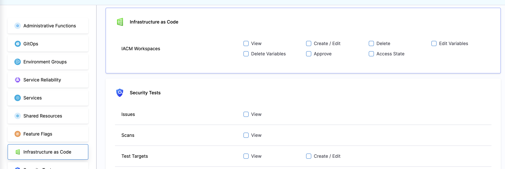

You can control who has different types of access to the Workspace in a project. Create/edit a Role, and select the "Infrastructure as Code Management" section

For each Role, you can define the following set of permissions:

1. **View** - Permitting users to view the Workspaces in the project
2. **Create/Edit** - Permitting users to create and edit Workspaces in the project
3. **Delete** - Permitting users to delete Workspaces in the project
4. **Edit Variables** - Permitting users to create and edit Environment and Terraform variables
5. **Delete Variables** - Permitting users to delete Environment and Terraform variables
6. **Approve** - Permitting users to approve the Infrastructure Stage (using the approval step)
7. **Access State** - Permitting users to view the state (including historical revisions)

## Using Resource Groups
You can utilize Resource Groups functionality to specify which users can access a specific Workspace. 
For this, create a resource group, add the specific (or all) Workspaces, and bind it to a specific user or user group. 

To learn more about Resource Groups, go to [this documentation](https://developer.harness.io/docs/platform/role-based-access-control/add-resource-groups/)